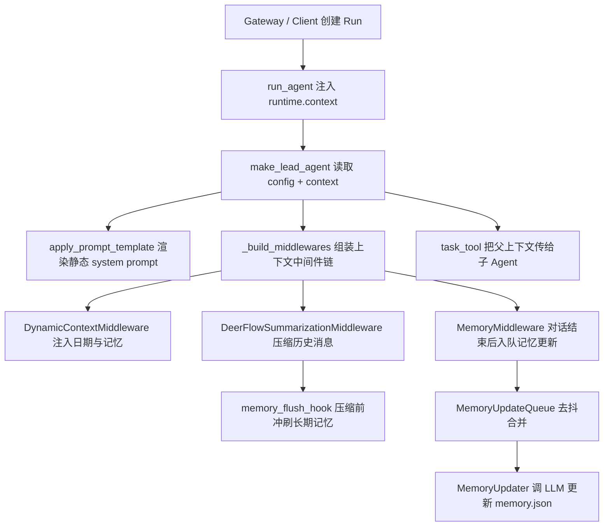

# DeerFlow 上下文工程阅读指南

本文用于从代码角度理解 DeerFlow 如何构造、注入、压缩、持久化和传递 Agent 上下文。这里的“上下文工程”不是单个模块，而是一条从请求入口到模型调用、再到长期记忆回写的流水线。

## 一句话总览

DeerFlow 把上下文拆成四层：

1. 静态系统提示：角色、技能、工具目录、工作区规则、子 Agent 编排规则。
2. 动态系统提醒：当前日期、长期记忆，作为隐藏 `HumanMessage` 注入。
3. 运行时上下文：`thread_id`、`run_id`、`app_config`、`agent_name` 等，通过 `runtime.context` 给中间件和工具读取。
4. 历史压缩与记忆回写：摘要中间件控制消息窗口，记忆中间件和摘要钩子把有价值的对话写入长期记忆。



## 第一层：运行时上下文入口

入口代码：

- [`_build_runtime_context`](../packages/harness/deerflow/runtime/runs/worker.py#L47)：构造 `{"thread_id", "run_id", ...}`，并合并调用方传入的 `config["context"]`。
- [`_install_runtime_context`](../packages/harness/deerflow/runtime/runs/worker.py#L103)：把运行时上下文写回 `config["context"]`。
- [`run_agent`](../packages/harness/deerflow/runtime/runs/worker.py#L143)：后台执行 Agent，手动创建 `Runtime(context=...)` 并写入 `configurable["__pregel_runtime"]`。

关键调用关系：

```text
run_agent()
  -> _build_runtime_context(thread_id, run_id, config["context"], app_config)
  -> _install_runtime_context(config, runtime_ctx)
  -> Runtime(context=runtime_ctx, store=store)
  -> config["configurable"]["__pregel_runtime"] = runtime
  -> agent_factory(config=runnable_config, app_config=ctx.app_config)
```

理解重点：

- `thread_id` 和 `run_id` 是所有线程级上下文的主键。
- `app_config` 被注入 `runtime.context`，工具和中间件可避免反复读取全局配置。
- Gateway 路径直接调用 `agent.astream(config=...)`，所以这里必须手动补上 LangGraph runtime。

## 第二层：Lead Agent 构造

入口代码：

- [`_get_runtime_config`](../packages/harness/deerflow/agents/lead_agent/agent.py#L101)：合并 `configurable` 和 `context`，后者覆盖前者。
- [`_make_lead_agent`](../packages/harness/deerflow/agents/lead_agent/agent.py#L638)：Lead Agent 的核心工厂。
- [`_build_middlewares`](../packages/harness/deerflow/agents/lead_agent/agent.py#L373)：按固定顺序组装上下文相关中间件。
- [`_assemble_deferred`](../packages/harness/deerflow/agents/lead_agent/agent.py#L498)：把 MCP 工具 schema 延迟到 `tool_search`，减少 system prompt 体积。

核心流程：

```text
_make_lead_agent(config)
  -> _get_runtime_config(config)
  -> load_agent_config(agent_name)
  -> _resolve_model_name(requested_model or agent_model)
  -> _load_enabled_skills_for_tool_policy()
  -> get_available_tools()
  -> filter_tools_by_skill_allowed_tools()
  -> _assemble_deferred()
  -> _build_middlewares()
  -> apply_prompt_template()
  -> create_agent(..., state_schema=ThreadState)
```

中间件顺序里和上下文工程关系最密切的是：

- `DynamicContextMiddleware`：把记忆和日期注入消息流。
- `DeerFlowSummarizationMiddleware`：压缩历史消息，控制上下文窗口。
- `MemoryMiddleware`：对话结束后异步更新长期记忆。
- `ViewImageMiddleware`：视觉模型才注入图片上下文。
- `DeferredToolFilterMiddleware`：延迟 MCP 工具 schema，降低模型绑定上下文。

## 第三层：静态 System Prompt

入口代码：

- [`apply_prompt_template`](../packages/harness/deerflow/agents/lead_agent/prompt.py#L866)：渲染完整静态系统提示。
- [`get_skills_prompt_section`](../packages/harness/deerflow/agents/lead_agent/prompt.py#L698)：生成可用技能清单。
- [`get_deferred_tools_prompt_section`](../packages/harness/deerflow/agents/lead_agent/prompt.py#L802)：只列延迟工具名，不注入 schema。
- [`_get_memory_context`](../packages/harness/deerflow/agents/lead_agent/prompt.py#L621)：加载长期记忆并格式化，但实际由动态上下文中间件调用。

设计重点：

- `SYSTEM_PROMPT_TEMPLATE` 尽量保持静态，便于模型前缀缓存复用。
- 技能、子 Agent、ACP、自定义挂载属于相对静态的能力上下文，可以放进 system prompt。
- 长期记忆和日期因用户/时间变化大，不直接放进 system prompt，而是动态注入。

调用关系：

```text
apply_prompt_template()
  -> get_agent_soul(agent_name)
  -> _build_self_update_section(agent_name)
  -> get_skills_prompt_section(available_skills)
  -> get_deferred_tools_prompt_section(deferred_names)
  -> _build_subagent_section(max_concurrent_subagents)
  -> _build_acp_section()
  -> _build_custom_mounts_section()
  -> SYSTEM_PROMPT_TEMPLATE.format(...)
```

## 第四层：动态上下文注入

入口代码：

- [`DynamicContextMiddleware`](../packages/harness/deerflow/agents/middlewares/dynamic_context_middleware.py#L60)：动态上下文中间件。
- [`_build_full_reminder`](../packages/harness/deerflow/agents/middlewares/dynamic_context_middleware.py#L87)：构建首轮完整提醒，包含记忆和日期。
- [`_inject`](../packages/harness/deerflow/agents/middlewares/dynamic_context_middleware.py#L145)：决定何时注入完整提醒或日期更新。

注入策略：

```text
before_agent()
  -> _inject(state)
     -> 未注入过：首条真实 HumanMessage 前插入隐藏 system-reminder
     -> 日期未变：不注入
     -> 跨午夜：当前轮用户消息前插入轻量日期提醒
```

隐藏消息大致形态：

```xml
<system-reminder>
<memory>
User Context:
- Work: ...

Facts:
- [preference | 0.95] ...
</memory>

<current_date>2026-06-19, Friday</current_date>
</system-reminder>
```

为什么这么做：

- 记忆是用户相关的，日期是时间相关的，都会破坏静态 prompt 缓存。
- 隐藏 `HumanMessage` 会进入模型上下文，但可通过 `hide_from_ui` 不展示给前端。
- 摘要中间件会识别这类消息，避免把动态提醒错误摘要掉。

## 第五层：长期记忆注入与格式化

入口代码：

- [`format_memory_for_injection`](../packages/harness/deerflow/agents/memory/prompt.py#L200)：把 `memory.json` 转成紧凑文本。
- [`FileMemoryStorage`](../packages/harness/deerflow/agents/memory/storage.py#L100)：基于 JSON 文件的记忆存储。
- [`_get_memory_file_path`](../packages/harness/deerflow/agents/memory/storage.py#L122)：按 `user_id` 和 `agent_name` 解析记忆文件路径。
- [`load`](../packages/harness/deerflow/agents/memory/storage.py#L162)：带 mtime 缓存的加载。
- [`save`](../packages/harness/deerflow/agents/memory/storage.py#L199)：原子写入并更新缓存。

记忆文件隔离规则：

```text
user_id=None, agent_name=None -> memory.json
user_id=u1,   agent_name=None -> users/u1/memory.json
user_id=None, agent_name=a1   -> agents/a1/memory.json
user_id=u1,   agent_name=a1   -> users/u1/agents/a1/memory.json
```

注入预算：

- `format_memory_for_injection()` 会先输出 `User Context` 和 `History`。
- `facts` 按置信度降序加入。
- 超过 `max_injection_tokens` 时停止追加事实，并做整体兜底截断。

## 第六层：历史摘要压缩

入口代码：

- [`_create_summarization_middleware`](../packages/harness/deerflow/agents/lead_agent/agent.py#L191)：读取配置并创建摘要中间件。
- [`DeerFlowSummarizationMiddleware`](../packages/harness/deerflow/agents/middlewares/summarization_middleware.py#L100)：DeerFlow 对 LangChain 摘要中间件的扩展。
- [`_maybe_summarize`](../packages/harness/deerflow/agents/middlewares/summarization_middleware.py#L131)：同步路径的摘要触发逻辑。
- [`_partition_with_skill_rescue`](../packages/harness/deerflow/agents/middlewares/summarization_middleware.py#L212)：划分要摘要和要保留的消息，并救回近期技能加载。
- [`_find_skill_bundles`](../packages/harness/deerflow/agents/middlewares/summarization_middleware.py#L268)：识别 `read_file` 读取技能文件的 AI/Tool 消息组合。

调用关系：

```text
before_model()
  -> _maybe_summarize(state, runtime)
     -> token_counter(messages)
     -> _should_summarize(messages, total_tokens)
     -> _determine_cutoff_index(messages)
     -> _partition_with_skill_rescue(messages, cutoff_index)
     -> _preserve_dynamic_context_reminders()
     -> _fire_hooks(...)
     -> _create_summary(messages_to_summarize)
     -> RemoveMessage(REMOVE_ALL_MESSAGES) + summary + preserved_messages
```

两个关键扩展：

- 动态提醒保护：`_preserve_dynamic_context_reminders()` 防止 `<system-reminder>` 被压缩到错误位置。
- 技能恢复：近期通过工具读取的技能文件内容不会因为摘要压缩而丢失。

## 第七层：长期记忆回写

入口代码：

- [`MemoryMiddleware`](../packages/harness/deerflow/agents/middlewares/memory_middleware.py#L49)：Agent 结束后把对话入队。
- [`after_agent`](../packages/harness/deerflow/agents/middlewares/memory_middleware.py#L73)：过滤消息并入队。
- [`memory_flush_hook`](../packages/harness/deerflow/agents/memory/summarization_hook.py#L13)：摘要删除消息前紧急冲刷。
- [`filter_messages_for_memory`](../packages/harness/deerflow/agents/memory/message_processing.py#L97)：只保留人类输入和最终 AI 回复。
- [`detect_correction`](../packages/harness/deerflow/agents/memory/message_processing.py#L163)：检测纠偏信号。
- [`detect_reinforcement`](../packages/harness/deerflow/agents/memory/message_processing.py#L197)：检测正向强化信号。

普通回写路径：

```text
MemoryMiddleware.after_agent()
  -> filter_messages_for_memory(state["messages"])
  -> detect_correction()
  -> detect_reinforcement()
  -> get_effective_user_id()
  -> MemoryUpdateQueue.add(...)
```

摘要前紧急回写路径：

```text
DeerFlowSummarizationMiddleware._fire_hooks()
  -> memory_flush_hook(event)
  -> filter_messages_for_memory(event.messages_to_summarize)
  -> MemoryUpdateQueue.add_nowait(...)
```

`add()` 和 `add_nowait()` 的区别：

- `add()`：对话结束后的常规更新，走去抖，降低 LLM 调用频率。
- `add_nowait()`：消息即将被摘要移除，立即处理，避免信息丢失。

## 第八层：记忆队列与 LLM 更新器

入口代码：

- [`MemoryUpdateQueue`](../packages/harness/deerflow/agents/memory/queue.py#L59)：带去抖的全局记忆队列。
- [`add`](../packages/harness/deerflow/agents/memory/queue.py#L82)：延迟处理并合并同一记忆目标。
- [`add_nowait`](../packages/harness/deerflow/agents/memory/queue.py#L138)：立即调度处理。
- [`_enqueue_locked`](../packages/harness/deerflow/agents/memory/queue.py#L165)：按 `(thread_id, user_id, agent_name)` 合并。
- [`_process_queue`](../packages/harness/deerflow/agents/memory/queue.py#L219)：调用 `MemoryUpdater`。
- [`MemoryUpdater`](../packages/harness/deerflow/agents/memory/updater.py#L457)：通过 LLM 更新长期记忆。
- [`_prepare_update_prompt`](../packages/harness/deerflow/agents/memory/updater.py#L499)：加载当前记忆并构造更新提示。
- [`format_conversation_for_update`](../packages/harness/deerflow/agents/memory/prompt.py#L372)：把消息格式化成纯文本对话。
- [`update_memory`](../packages/harness/deerflow/agents/memory/updater.py#L612)：同步更新入口。
- [`_finalize_update`](../packages/harness/deerflow/agents/memory/updater.py#L528)：解析 LLM 输出、应用更新并保存。
- [`_apply_updates`](../packages/harness/deerflow/agents/memory/updater.py#L671)：写入 user/history/facts。

完整回写流程：

```text
MemoryUpdateQueue._process_queue()
  -> MemoryUpdater.update_memory(messages, thread_id, agent_name, user_id)
     -> _prepare_update_prompt()
        -> get_memory_data()
        -> format_conversation_for_update()
        -> MEMORY_UPDATE_PROMPT.format(...)
     -> model.invoke(prompt)
     -> _finalize_update()
        -> _parse_memory_update_response()
        -> _apply_updates()
        -> _strip_upload_mentions_from_memory()
        -> get_memory_storage().save()
```

重要细节：

- 队列合并键是 `(thread_id, user_id, agent_name)`，同一用户同一 Agent 的同一线程会被去抖合并。
- `user_id` 必须在入队时捕获，因为 `threading.Timer` 切线程后不会继承 `ContextVar`。
- 上传文件信息会被清理，避免长期记忆引用未来不可访问的临时文件。
- 事实数量受 `max_facts` 限制，超限时保留高置信度事实。

## 第九层：子 Agent 上下文传递

入口代码：

- [`task_tool`](../packages/harness/deerflow/tools/builtins/task_tool.py#L313)：主 Agent 调用 `task()` 时进入。
- [`_get_runtime_app_config`](../packages/harness/deerflow/tools/builtins/task_tool.py#L271)：从父 runtime 取 `AppConfig`。
- [`_merge_skill_allowlists`](../packages/harness/deerflow/tools/builtins/task_tool.py#L285)：合并父子 Agent 技能白名单。

调用关系：

```text
主 Agent AIMessage(tool_call=task)
  -> task_tool(runtime, description, prompt, subagent_type, tool_call_id)
     -> runtime.state["sandbox"] / runtime.state["thread_data"]
     -> runtime.context["thread_id"]
     -> runtime.config["metadata"]["model_name" / "available_skills" / "tool_groups"]
     -> get_subagent_config(subagent_type)
     -> get_available_tools(subagent_enabled=False)
     -> SubagentExecutor(..., sandbox_state, thread_data, thread_id, trace_id)
     -> executor.execute_async(prompt, task_id=tool_call_id)
```

上下文传递规则：

- 子 Agent 共享父 Agent 的沙箱状态和线程目录，保证文件上下文连续。
- 子 Agent 继承父 Agent 的工具组限制，保持权限边界一致。
- 子 Agent 的技能白名单取父白名单和子配置的交集。
- `subagent_enabled=False` 防止子 Agent 继续递归创建孙 Agent。

## 第十层：线程状态 Reducer

入口代码：

- [`ThreadState`](../packages/harness/deerflow/agents/thread_state.py#L100)：DeerFlow 的 LangGraph 线程状态。
- [`merge_artifacts`](../packages/harness/deerflow/agents/thread_state.py#L33)：产物列表合并去重。
- [`merge_viewed_images`](../packages/harness/deerflow/agents/thread_state.py#L43)：图片上下文字典合并/清空。
- [`merge_promoted`](../packages/harness/deerflow/agents/thread_state.py#L79)：延迟工具提升集合按目录哈希合并。

为什么 Reducer 重要：

- LangGraph 节点返回的是局部状态更新，Reducer 决定新旧状态如何合并。
- `artifacts` 需要追加去重。
- `viewed_images` 需要支持空字典清空，避免图片上下文长期残留。
- `promoted` 需要带 `catalog_hash`，避免工具目录变化后误用旧的提升结果。

## 推荐阅读顺序

1. [`runtime/runs/worker.py`](../packages/harness/deerflow/runtime/runs/worker.py#L143)：先看 `runtime.context` 怎么进入 LangGraph。
2. [`lead_agent/agent.py`](../packages/harness/deerflow/agents/lead_agent/agent.py#L638)：看 Agent 如何解析配置、工具和中间件。
3. [`lead_agent/prompt.py`](../packages/harness/deerflow/agents/lead_agent/prompt.py#L866)：看静态 system prompt 怎么拼出来。
4. [`dynamic_context_middleware.py`](../packages/harness/deerflow/agents/middlewares/dynamic_context_middleware.py#L60)：看记忆和日期为什么作为隐藏消息注入。
5. [`summarization_middleware.py`](../packages/harness/deerflow/agents/middlewares/summarization_middleware.py#L100)：看历史消息如何压缩，以及技能上下文如何保留。
6. [`memory_middleware.py`](../packages/harness/deerflow/agents/middlewares/memory_middleware.py#L49)：看对话结束后的记忆入队。
7. [`memory/queue.py`](../packages/harness/deerflow/agents/memory/queue.py#L59)：看去抖合并。
8. [`memory/updater.py`](../packages/harness/deerflow/agents/memory/updater.py#L457)：看 LLM 如何更新长期记忆。
9. [`memory/prompt.py`](../packages/harness/deerflow/agents/memory/prompt.py#L200)：看记忆注入与记忆更新提示词。
10. [`task_tool.py`](../packages/harness/deerflow/tools/builtins/task_tool.py#L313)：看父子 Agent 上下文如何传递。
11. [`thread_state.py`](../packages/harness/deerflow/agents/thread_state.py#L100)：最后看状态字段和 Reducer。

## 调试观察点

- 如果模型没有看到记忆：检查 `memory.enabled`、`memory.injection_enabled`、`DynamicContextMiddleware._build_full_reminder()`。
- 如果记忆没有更新：检查 `MemoryMiddleware.after_agent()` 是否拿到 `thread_id`，以及 `MemoryUpdateQueue.pending_count`。
- 如果摘要后模型忘了技能：检查 `_partition_with_skill_rescue()` 是否识别了技能文件读取的 tool call。
- 如果 MCP 工具上下文过大：检查 `_assemble_deferred()` 和 `DeferredToolFilterMiddleware` 是否生效。
- 如果子 Agent 文件上下文断裂：检查 `task_tool()` 是否传入 `sandbox_state`、`thread_data` 和 `thread_id`。
