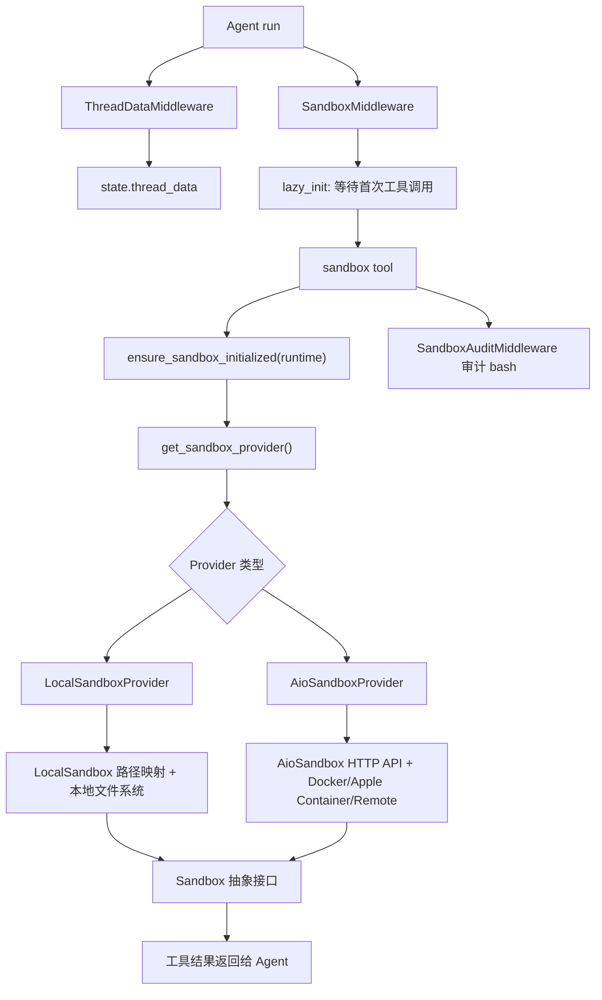

# DeerFlow 沙箱系统阅读指南

本文从代码角度解释 DeerFlow 的沙箱系统如何创建线程目录、获取沙箱、映射路径、执行工具、审计 bash 命令，并在本地与容器两种 provider 之间保持统一接口。

这里的“沙箱系统”不是单个类，而是一条从 Agent 运行时状态到工具执行环境的流水线。

## 一句话总览

DeerFlow 把沙箱系统拆成五层：

1. 线程数据目录：为每个 `thread_id` 准备 `workspace`、`uploads`、`outputs`。
2. 沙箱生命周期：通过 `SandboxProvider` 获取或复用线程级沙箱。
3. 统一沙箱接口：上层工具只依赖 `Sandbox` 抽象，不关心本地或容器实现。
4. 工具执行层：`bash`、`ls`、`glob`、`grep`、`read_file`、`write_file`、`str_replace` 统一走沙箱。
5. 安全与审计：本地路径校验、只读挂载、主机 bash 开关、bash 高危命令审计。



## 第一层：线程数据目录

入口代码：

- [`ThreadDataMiddleware`](../packages/harness/deerflow/agents/middlewares/thread_data_middleware.py#L21)：为线程准备工作目录状态。
- [`ThreadState`](../packages/harness/deerflow/agents/thread_state.py#L100)：保存 `thread_data` 和 `sandbox`。
- [`Paths.ensure_thread_dirs`](../packages/harness/deerflow/config/paths.py)：创建底层目录。

`ThreadDataMiddleware.before_agent()` 会从 `runtime.context["thread_id"]` 或 LangGraph `configurable.thread_id` 取线程 ID，然后把路径写入状态：

```python
{
  "thread_data": {
    "workspace_path": ".../user-data/workspace",
    "uploads_path": ".../user-data/uploads",
    "outputs_path": ".../user-data/outputs",
  }
}
```

这些主机路径在模型侧对应统一虚拟路径：

```text
/mnt/user-data/workspace
/mnt/user-data/uploads
/mnt/user-data/outputs
```

理解重点：

- `workspace` 是 Agent 临时工作目录。
- `uploads` 存放用户上传文件。
- `outputs` 存放最终交付物。
- `lazy_init=True` 时只计算路径，不立即创建目录；真正需要时再创建。
- 路径会按 `user_id` 隔离，避免不同用户的线程数据混在一起。

一句话：**ThreadDataMiddleware 先把线程级文件系统边界写入状态，后续沙箱和工具都围绕这三个目录工作。**

## 第二层：Sandbox 抽象接口

入口代码：

- [`Sandbox`](../packages/harness/deerflow/sandbox/sandbox.py#L10)：所有沙箱实现必须遵守的抽象基类。
- [`SandboxProvider`](../packages/harness/deerflow/sandbox/sandbox_provider.py#L15)：沙箱提供者抽象。
- [`get_sandbox_provider`](../packages/harness/deerflow/sandbox/sandbox_provider.py#L54)：按配置加载 provider 单例。

`Sandbox` 定义了上层工具能使用的统一能力：

```python
execute_command(command)
read_file(path)
download_file(path)
list_dir(path, max_depth=2)
write_file(path, content, append=False)
glob(path, pattern, ...)
grep(path, pattern, ...)
update_file(path, content)
```

`SandboxProvider` 定义生命周期：

```python
acquire(thread_id) -> sandbox_id
acquire_async(thread_id) -> sandbox_id
get(sandbox_id) -> Sandbox | None
release(sandbox_id)
reset()
```

Provider 通过配置加载：

```yaml
sandbox:
  use: deerflow.sandbox.local:LocalSandboxProvider
```

或：

```yaml
sandbox:
  use: deerflow.community.aio_sandbox:AioSandboxProvider
```

调用关系：

```text
get_sandbox_provider()
  -> get_app_config().sandbox.use
  -> resolve_class(..., SandboxProvider)
  -> provider 单例
```

一句话：**Sandbox 抽象屏蔽了执行环境差异，Provider 抽象负责按线程获取和管理具体沙箱实例。**

## 第三层：SandboxMiddleware 与懒加载

入口代码：

- [`SandboxMiddleware`](../packages/harness/deerflow/sandbox/middleware.py#L23)：把沙箱生命周期接入 Agent middleware。
- [`ensure_sandbox_initialized`](../packages/harness/deerflow/sandbox/tools.py#L1313)：工具调用时懒加载沙箱。
- [`ensure_sandbox_initialized_async`](../packages/harness/deerflow/sandbox/tools.py#L1413)：异步懒加载路径。

`SandboxMiddleware` 支持两种模式：

```text
lazy_init=True   -> before_agent 不获取沙箱，首次工具调用时获取
lazy_init=False  -> before_agent 立即获取沙箱
```

Lead Agent 构建链默认使用懒加载：

```text
ThreadDataMiddleware
UploadsMiddleware
SandboxMiddleware(lazy_init=True)
...
```

首次工具调用时，`ensure_sandbox_initialized(runtime)` 会：

```text
1. 检查 runtime.state["sandbox"] 是否已有 sandbox_id
2. 如果已有，provider.get(sandbox_id) 直接复用
3. 如果没有，从 runtime.context/configurable 读取 thread_id
4. 调用 provider.acquire(thread_id)
5. 写回 runtime.state["sandbox"] = {"sandbox_id": sandbox_id}
6. 写回 runtime.context["sandbox_id"] = sandbox_id
7. 返回 Sandbox 实例
```

伪代码：

```python
sandbox_state = runtime.state.get("sandbox")
if sandbox_state:
    return provider.get(sandbox_state["sandbox_id"])

thread_id = runtime.context["thread_id"]
sandbox_id = provider.acquire(thread_id)
runtime.state["sandbox"] = {"sandbox_id": sandbox_id}
runtime.context["sandbox_id"] = sandbox_id
return provider.get(sandbox_id)
```

一句话：**SandboxMiddleware 提供生命周期入口，真正的沙箱创建通常延迟到第一个工具调用发生时。**

## 第四层：LocalSandboxProvider

入口代码：

- [`LocalSandboxProvider`](../packages/harness/deerflow/sandbox/local/local_sandbox_provider.py#L40)：本地 provider。
- [`LocalSandbox`](../packages/harness/deerflow/sandbox/local/local_sandbox.py#L54)：本地沙箱实现。
- [`PathMapping`](../packages/harness/deerflow/sandbox/local/local_sandbox.py#L26)：虚拟路径到主机路径的映射。

`LocalSandboxProvider` 是主机文件系统模式。它不会启动容器，而是为每个 `thread_id` 构建一个 `LocalSandbox`，并把虚拟路径映射到主机目录。

线程级映射：

```text
/mnt/user-data
  -> {base_dir}/.../{thread_id}/user-data

/mnt/user-data/workspace
  -> {base_dir}/.../{thread_id}/user-data/workspace

/mnt/user-data/uploads
  -> {base_dir}/.../{thread_id}/user-data/uploads

/mnt/user-data/outputs
  -> {base_dir}/.../{thread_id}/user-data/outputs

/mnt/acp-workspace
  -> {base_dir}/.../{thread_id}/acp-workspace
```

静态映射：

```text
skills.container_path -> 本地 skills 目录，只读
sandbox.mounts        -> config.yaml 中配置的自定义挂载
```

`acquire(thread_id)` 的行为：

```text
thread_id=None  -> 返回旧式通用 sandbox，id = "local"
thread_id=t1    -> 返回线程级 sandbox，id = "local:t1"
```

Provider 内部使用 LRU 缓存：

```text
_thread_sandboxes: OrderedDict[str, LocalSandbox]
DEFAULT_MAX_CACHED_THREAD_SANDBOXES = 256
```

超过上限时淘汰最久未使用的线程沙箱。

理解重点：

- `LocalSandbox` 是便利模式，不是强安全边界。
- `LocalSandbox` 会把命令、读写路径里的 `/mnt/...` 转成主机路径。
- 输出中的主机路径会反向替换成 `/mnt/...`，避免泄露宿主机目录布局。
- skills 目录默认只读。
- 自定义挂载不能覆盖 `/mnt/user-data`、`/mnt/acp-workspace`、skills 路径。

一句话：**LocalSandboxProvider 用路径映射模拟容器视角，让本地文件系统看起来像统一的 `/mnt/...` 沙箱。**

## 第五层：LocalSandbox 的路径转换

入口代码：

- [`LocalSandbox._resolve_path_with_mapping`](../packages/harness/deerflow/sandbox/local/local_sandbox.py#L143)：容器路径转主机路径。
- [`LocalSandbox._reverse_resolve_path`](../packages/harness/deerflow/sandbox/local/local_sandbox.py#L191)：主机路径转虚拟路径。
- [`LocalSandbox._resolve_paths_in_command`](../packages/harness/deerflow/sandbox/local/local_sandbox.py#L252)：命令中的虚拟路径替换。
- [`LocalSandbox._reverse_resolve_paths_in_output`](../packages/harness/deerflow/sandbox/local/local_sandbox.py#L215)：输出脱敏。

路径解析逻辑：

```text
输入路径 /mnt/user-data/workspace/a.py
  -> 命中最长 container_path 前缀
  -> 拼接到对应 local_path
  -> Path.resolve()
  -> 校验没有逃逸 local_root
```

最长前缀匹配很重要。比如同时有：

```text
/mnt/user-data
/mnt/user-data/workspace
```

访问 `/mnt/user-data/workspace/a.py` 时必须命中更具体的 `/mnt/user-data/workspace`。

写入文件时：

```text
write_file(path, content)
  -> 解析 path
  -> 检查 read_only
  -> 创建父目录
  -> 把 content 中出现的虚拟路径转成主机路径
  -> 写入
  -> 记录 _agent_written_paths
```

读取文件时：

```text
read_file(path)
  -> 解析 path
  -> 读取内容
  -> 如果文件是 Agent 通过 write_file 写过的，再把内容里的主机路径反向转回虚拟路径
```

为什么只对 Agent 写过的文件做内容反向转换：

- 用户上传文件或外部工具输出不应被静默改写。
- Agent 自己生成的文件可能包含本地路径，需要对模型隐藏宿主机细节。

一句话：**LocalSandbox 的核心价值是双向路径虚拟化，同时用 resolve 校验阻止路径穿越。**

## 第六层：AioSandboxProvider

入口代码：

- [`AioSandboxProvider`](../packages/harness/deerflow/community/aio_sandbox/aio_sandbox_provider.py#L92)：容器/远程 provider。
- [`SandboxBackend`](../packages/harness/deerflow/community/aio_sandbox/backend.py#L83)：供应后端抽象。
- [`LocalContainerBackend`](../packages/harness/deerflow/community/aio_sandbox/local_backend.py#L205)：本地 Docker/Apple Container 后端。
- [`RemoteSandboxBackend`](../packages/harness/deerflow/community/aio_sandbox/remote_backend.py)：远程 provisioner 后端。
- [`AioSandbox`](../packages/harness/deerflow/community/aio_sandbox/aio_sandbox.py#L38)：HTTP API 客户端适配。

`AioSandboxProvider` 管的是运行中的 sandbox 服务。它通过后端创建或发现沙箱：

```text
配置 provisioner_url -> RemoteSandboxBackend
否则                 -> LocalContainerBackend
```

本地容器模式支持：

```text
Docker
Apple Container
```

在 macOS 上优先探测 Apple Container，不可用时回退 Docker。

`acquire(thread_id)` 的核心流程：

```text
1. 同进程缓存复用：_thread_sandboxes[thread_id]
2. 热池复用：_warm_pool
3. 基于 thread_id 生成确定性 sandbox_id
4. 跨进程文件锁串行化创建
5. backend.discover(sandbox_id) 查找其他进程已启动容器
6. backend.create(thread_id, sandbox_id, extra_mounts) 创建新容器
7. 注册到 _sandboxes / _sandbox_infos / _last_activity
```

确定性 ID：

```python
sha256(thread_id).hexdigest()[:8]
```

这让多个进程对同一个 `thread_id` 推导出同一个容器名，便于跨进程发现。

一句话：**AioSandboxProvider 是真正隔离执行的 provider，负责容器启动、复用、发现、热池、空闲回收和跨进程并发控制。**

## 第七层：容器后端与挂载

入口代码：

- [`AioSandboxProvider._get_thread_mounts`](../packages/harness/deerflow/community/aio_sandbox/aio_sandbox_provider.py#L354)：线程目录挂载。
- [`AioSandboxProvider._get_skills_mount`](../packages/harness/deerflow/community/aio_sandbox/aio_sandbox_provider.py#L321)：skills 只读挂载。
- [`LocalContainerBackend._start_container`](../packages/harness/deerflow/community/aio_sandbox/local_backend.py#L510)：拼装容器启动命令。
- [`wait_for_sandbox_ready`](../packages/harness/deerflow/community/aio_sandbox/backend.py#L18)：健康检查。

线程挂载：

```text
host_sandbox_work_dir    -> /mnt/user-data/workspace    read-write
host_sandbox_uploads_dir -> /mnt/user-data/uploads      read-write
host_sandbox_outputs_dir -> /mnt/user-data/outputs      read-write
host_acp_workspace_dir   -> /mnt/acp-workspace          read-only
```

skills 挂载：

```text
skills_path -> skills.container_path read-only
```

容器启动参数会包含：

```text
--rm
-d
-p <host>:<port>:8080
--name deer-flow-sandbox-<sandbox_id>
--mount type=bind,...
-e KEY=value
<image>
```

日志会对环境变量值脱敏，避免敏感信息出现在日志中。

容器创建后会轮询：

```text
GET {sandbox_url}/v1/sandbox
```

直到返回 200 或超时。

一句话：**容器后端把线程数据目录和 skills 目录真实挂进容器，使 Agent 在容器中也看到同样的 `/mnt/...` 路径。**

## 第八层：AioSandbox HTTP 适配

入口代码：

- [`AioSandbox`](../packages/harness/deerflow/community/aio_sandbox/aio_sandbox.py#L38)
- [`AioSandbox.execute_command`](../packages/harness/deerflow/community/aio_sandbox/aio_sandbox.py#L129)
- [`AioSandbox.read_file`](../packages/harness/deerflow/community/aio_sandbox/aio_sandbox.py#L170)
- [`AioSandbox.download_file`](../packages/harness/deerflow/community/aio_sandbox/aio_sandbox.py#L183)

`AioSandbox` 把 `Sandbox` 抽象转成 sandbox 容器 HTTP API：

```text
execute_command -> client.shell.exec_command(...)
read_file       -> client.file.read_file(...)
write_file      -> client.file.write_file(...)
download_file   -> client.file.download_file(...)
```

重要细节：

- `execute_command` 用 `threading.Lock` 串行化。
- 原因是 AIO 容器维护一个持久 shell 会话，并发命令会污染会话状态。
- 下载文件要求路径在 `/mnt/user-data` 下，并拒绝 `..` 路径穿越。
- 下载大小限制为 100MB。
- HTTP client 在 `close()` 中尽力释放底层 socket。

一句话：**AioSandbox 是容器 HTTP API 到 DeerFlow `Sandbox` 接口的适配层，并通过锁保护持久 shell 会话。**

## 第九层：沙箱工具层

入口代码：

- [`sandbox/tools.py`](../packages/harness/deerflow/sandbox/tools.py)：所有沙箱工具。
- [`bash_tool`](../packages/harness/deerflow/sandbox/tools.py#L1628)
- [`ls_tool`](../packages/harness/deerflow/sandbox/tools.py#L1685)
- [`glob_tool`](../packages/harness/deerflow/sandbox/tools.py#L1740)
- [`grep_tool`](../packages/harness/deerflow/sandbox/tools.py#L1813)
- [`read_file_tool`](../packages/harness/deerflow/sandbox/tools.py#L1910)
- [`write_file_tool`](../packages/harness/deerflow/sandbox/tools.py#L1979)
- [`str_replace_tool`](../packages/harness/deerflow/sandbox/tools.py#L2040)

每个工具的共通流程：

```text
tool(runtime, ...)
  -> ensure_sandbox_initialized(runtime)
  -> ensure_thread_directories_exist(runtime)
  -> 如果是 LocalSandbox：额外做本地路径校验与路径替换
  -> 调用 Sandbox 接口
  -> 截断过长输出
  -> 清洗错误或主机路径
  -> 返回文本给模型
```

`bash_tool` 的本地沙箱路径更严格：

```text
LocalSandbox
  -> 检查 sandbox.allow_host_bash
  -> validate_local_bash_command_paths(command, thread_data)
  -> replace_virtual_paths_in_command(command, thread_data)
  -> _apply_cwd_prefix(command, thread_data)
  -> sandbox.execute_command(command)
  -> mask_local_paths_in_output(...)
```

`read_file` / `ls` / `glob` / `grep` 在本地沙箱会先调用：

```python
validate_local_tool_path(path, thread_data, read_only=True)
```

`write_file` / `str_replace` 会调用：

```python
validate_local_tool_path(path, thread_data)
```

一句话：**工具层是模型真正触达沙箱的入口，它负责懒加载沙箱、路径校验、输出截断和错误脱敏。**

## 第十层：本地路径安全策略

入口代码：

- [`validate_local_tool_path`](../packages/harness/deerflow/sandbox/tools.py#L781)
- [`_resolve_and_validate_user_data_path`](../packages/harness/deerflow/sandbox/tools.py#L853)
- [`_reject_path_traversal`](../packages/harness/deerflow/sandbox/tools.py#L771)
- [`mask_local_paths_in_output`](../packages/harness/deerflow/sandbox/tools.py#L646)
- [`is_host_bash_allowed`](../packages/harness/deerflow/sandbox/security.py#L47)

本地沙箱允许访问的路径族：

```text
/mnt/user-data/*          读写
/mnt/skills/*             只读
/mnt/acp-workspace/*      只读
自定义 mount              按 mount.read_only 判断
```

拒绝规则：

```text
包含 .. 路径段              -> 拒绝
写入 /mnt/skills           -> 拒绝
写入 /mnt/acp-workspace    -> 拒绝
写入 read_only mount       -> 拒绝
访问非允许路径             -> 拒绝
```

主机 bash 默认关闭：

```yaml
sandbox:
  use: deerflow.sandbox.local:LocalSandboxProvider
  allow_host_bash: false
```

原因是 `LocalSandboxProvider` 不是真正安全边界。若需要隔离的 bash，推荐使用：

```yaml
sandbox:
  use: deerflow.community.aio_sandbox:AioSandboxProvider
```

一句话：**本地沙箱靠路径白名单和只读规则限制文件访问，但不把主机 bash 当作安全隔离能力。**

## 第十一层：SandboxAuditMiddleware

入口代码：

- [`SandboxAuditMiddleware`](../packages/harness/deerflow/agents/middlewares/sandbox_audit_middleware.py#L171)
- [`_classify_command`](../packages/harness/deerflow/agents/middlewares/sandbox_audit_middleware.py#L140)
- [`_pre_process`](../packages/harness/deerflow/agents/middlewares/sandbox_audit_middleware.py#L326)

它只拦截 `bash` 工具调用：

```python
if request.tool_call.get("name") != "bash":
    return handler(request)
```

审计流程：

```text
wrap_tool_call()
  -> 提取 command
  -> 基础校验：空命令、过长命令、null byte
  -> 正则 + shlex 分类
  -> 写结构化审计日志
  -> block：返回 ToolMessage(status="error")
  -> warn：执行工具，但在结果后追加警告
  -> pass：正常执行
```

高危命令直接阻断：

```text
rm -rf /
curl url | bash
dd if=...
LD_PRELOAD=...
/dev/tcp/
fork bomb
```

中危命令执行但警告：

```text
chmod 777
pip install
apt install
sudo
PATH=
```

审计日志形态：

```json
{
  "timestamp": "...",
  "thread_id": "thread-id",
  "command": "python script.py",
  "verdict": "pass"
}
```

一句话：**SandboxAuditMiddleware 是 bash 的确定性安全审计层，高危阻断，中危告警，所有 bash 调用都留结构化日志。**

## 第十二层：生命周期与回收

入口代码：

- [`AioSandboxProvider._idle_checker_loop`](../packages/harness/deerflow/community/aio_sandbox/aio_sandbox_provider.py#L336)
- [`AioSandboxProvider._cleanup_idle_sandboxes`](../packages/harness/deerflow/community/aio_sandbox/aio_sandbox_provider.py#L345)
- [`AioSandboxProvider._reconcile_orphans`](../packages/harness/deerflow/community/aio_sandbox/aio_sandbox_provider.py#L239)
- [`shutdown_sandbox_provider`](../packages/harness/deerflow/sandbox/sandbox_provider.py#L89)

`AioSandboxProvider` 有三类状态：

```text
_sandboxes         活动沙箱，sandbox_id -> AioSandbox
_thread_sandboxes 线程到 sandbox_id 的映射
_warm_pool        已释放但容器仍运行，可快速复用
```

空闲回收：

```text
idle_timeout > 0
  -> 启动后台 idle checker
  -> 定期检查 _last_activity 和 _warm_pool
  -> 超时后 backend.destroy(info)
```

启动协调：

```text
provider 初始化
  -> backend.list_running()
  -> 把旧进程遗留容器纳入 warm_pool
  -> 后续由 idle checker 回收
```

关闭：

```text
atexit.register(self.shutdown)
signal SIGTERM/SIGINT/SIGHUP -> shutdown()
shutdown_sandbox_provider()  -> provider.shutdown()
```

一句话：**容器沙箱通过确定性 ID、热池、空闲检查和启动协调解决复用、冷启动和孤儿容器问题。**

## 第十三层：配置参考

本地沙箱：

```yaml
sandbox:
  use: deerflow.sandbox.local:LocalSandboxProvider
  allow_host_bash: false
  read_file_output_max_chars: 50000
  ls_output_max_chars: 20000
  bash_output_max_chars: 20000
```

容器沙箱：

```yaml
sandbox:
  use: deerflow.community.aio_sandbox:AioSandboxProvider
  image: enterprise-public-cn-beijing.cr.volces.com/vefaas-public/all-in-one-sandbox:latest
  port: 8080
  replicas: 3
  container_prefix: deer-flow-sandbox
  idle_timeout: 600
  mounts:
    - host_path: /absolute/host/path
      container_path: /mnt/project
      read_only: false
  environment:
    API_KEY: $API_KEY
```

常见选择：

```text
只需要本地文件读写、无需隔离 bash -> LocalSandboxProvider
需要运行命令、安装包、执行不完全可信操作 -> AioSandboxProvider
需要 K8s / 外部 provisioner 管理 -> AioSandboxProvider + provisioner_url
```

一句话：**本地 provider 偏开发便利，AIO provider 偏隔离执行，配置项决定生命周期、挂载、输出预算和环境变量。**

## 推荐阅读顺序

1. [`thread_data_middleware.py`](../packages/harness/deerflow/agents/middlewares/thread_data_middleware.py#L21)：先看线程目录怎么进入 state。
2. [`sandbox.py`](../packages/harness/deerflow/sandbox/sandbox.py#L10)：看沙箱统一接口。
3. [`sandbox_provider.py`](../packages/harness/deerflow/sandbox/sandbox_provider.py#L15)：看 provider 单例和生命周期。
4. [`sandbox/middleware.py`](../packages/harness/deerflow/sandbox/middleware.py#L23)：看 Agent middleware 如何接入沙箱。
5. [`sandbox/tools.py`](../packages/harness/deerflow/sandbox/tools.py#L1313)：看工具调用如何懒加载沙箱。
6. [`local_sandbox_provider.py`](../packages/harness/deerflow/sandbox/local/local_sandbox_provider.py#L40)：看本地线程级路径映射。
7. [`local_sandbox.py`](../packages/harness/deerflow/sandbox/local/local_sandbox.py#L54)：看本地路径转换和读写实现。
8. [`aio_sandbox_provider.py`](../packages/harness/deerflow/community/aio_sandbox/aio_sandbox_provider.py#L92)：看容器生命周期。
9. [`local_backend.py`](../packages/harness/deerflow/community/aio_sandbox/local_backend.py#L205)：看 Docker/Apple Container 启动细节。
10. [`aio_sandbox.py`](../packages/harness/deerflow/community/aio_sandbox/aio_sandbox.py#L38)：看 HTTP API 适配。
11. [`sandbox_audit_middleware.py`](../packages/harness/deerflow/agents/middlewares/sandbox_audit_middleware.py#L171)：看 bash 审计。

## 调试观察点

- 工具报 `Thread ID not available`：检查 `runtime.context["thread_id"]` 是否在 `run_agent` 中正确注入。
- 工具报 `Thread data not available`：检查 `ThreadDataMiddleware` 是否在沙箱工具之前运行。
- 本地 bash 报禁用：检查 `sandbox.allow_host_bash`，或切换到 `AioSandboxProvider`。
- 本地路径越权：检查路径是否位于 `/mnt/user-data`、`/mnt/skills`、`/mnt/acp-workspace` 或配置挂载下。
- 容器启动慢：检查镜像是否已拉取、`port` 是否冲突、`wait_for_sandbox_ready` 是否超时。
- 容器遗留：检查 `container_prefix`、启动协调日志和 idle checker。
- 输出里出现主机路径：检查 `mask_local_paths_in_output` 或 `LocalSandbox._reverse_resolve_paths_in_output`。
- 子 Agent 文件上下文断裂：检查父 Agent 是否把 `sandbox_state`、`thread_data` 和 `thread_id` 传给 `SubagentExecutor`。

## 面试版总结

DeerFlow 的沙箱系统由 `ThreadDataMiddleware`、`SandboxProvider`、`Sandbox` 抽象和沙箱工具层组成。线程启动时先写入 `thread_data`，工具首次执行时通过 `ensure_sandbox_initialized()` 懒加载线程级沙箱并写回 `state["sandbox"]`。本地模式用 `LocalSandboxProvider` 做虚拟路径到主机路径的映射，适合开发便利但不是强安全边界；容器模式用 `AioSandboxProvider` 管理 Docker、Apple Container 或远程 provisioner，提供更真实的执行隔离。所有工具通过统一 `Sandbox` 接口执行，并在工具层做路径校验、输出截断和错误脱敏；bash 还会经过 `SandboxAuditMiddleware`，高危命令直接阻断，中危命令执行但追加警告。
