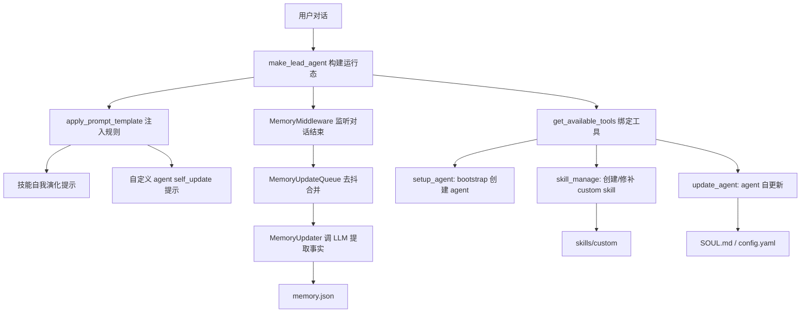

# DeerFlow 自进化源码学习文档

这份文档只整理当前代码里已经落地的“自进化”能力。这里的自进化不是让模型无限制修改系统，而是把一次任务中的可复用经验，受控地沉淀到 `Memory`、`Skill` 和自定义 `Agent` 配置里。

## 一句话理解

DeerFlow 的自进化由三条链路组成：

| 层级 | 解决的问题 | 主要入口 | 持久化位置 |
| --- | --- | --- | --- |
| Memory 自进化 | 用户偏好、纠偏、长期上下文沉淀 | `MemoryMiddleware` -> `MemoryUpdateQueue` -> `MemoryUpdater` | `.deer-flow/users/{user_id}/memory.json` 或 agent 级 memory |
| Skill 自进化 | 可复用工作流、踩坑经验、技能修补 | `skill_evolution.enabled` -> `skill_manage` | `skills/custom/{skill_name}/` |
| Agent 自更新 | 自定义 Agent 修改自己的身份、描述、技能和工具白名单 | 自定义 agent 会话内的 `update_agent` | `.deer-flow/users/{user_id}/agents/{agent_name}/` |

源码上最重要的结论：自进化能力不是一个独立 agent，而是由配置、系统提示、工具绑定、中间件和存储共同形成的受控闭环。

## 总体数据流



## 1. 配置开关：Skill 自进化默认关闭

入口文件：

- `backend/packages/harness/deerflow/config/skill_evolution_config.py`
- `config.example.yaml`
- `backend/packages/harness/deerflow/config/app_config.py`

`SkillEvolutionConfig` 只有两个字段：

```python
enabled: bool = False
moderation_model_name: str | None = None
```

含义：

- `enabled=false`：agent 不会拿到 `skill_manage` 工具，也不会在系统提示里看到技能自进化规则。
- `enabled=true`：允许 agent 在 `skills/custom` 下创建、修补、编辑或删除 custom skill。
- `moderation_model_name`：技能写入前的安全扫描模型；为空时使用默认 chat model。

`AppConfig` 把它挂在顶层配置字段 `skill_evolution` 上，所以运行时可以通过 `app_config.skill_evolution.enabled` 决定提示和工具是否开放。

## 2. Prompt 层：告诉 Agent 什么时候该沉淀 Skill

入口文件：

- `backend/packages/harness/deerflow/agents/lead_agent/prompt.py`

关键函数：

- `_build_skill_evolution_section(skill_evolution_enabled)`
- `get_skills_prompt_section(...)`
- `apply_prompt_template(...)`

当 `skill_evolution.enabled=true` 时，系统提示会加入“技能自我演化”规则。规则要求任务完成后，在这些情况下考虑创建或更新技能：

- 任务用了 5 次以上工具调用。
- 克服了非显而易见的错误或陷阱。
- 用户纠正了方法，且纠正后的版本有效。
- 发现非平凡、重复出现的工作流。
- 使用某个技能时发现技能没有覆盖当前问题。

同时有两个限制：

- 优先 patch 现有技能，不优先整体重写。
- 创建新技能前要先与用户确认。

这说明 DeerFlow 里的 Skill 自进化是“经验沉淀提示 + 受控工具写入”，不是后台自动训练模型。

## 3. Tool 层：`skill_manage` 负责写入 custom skill

入口文件：

- `backend/packages/harness/deerflow/tools/tools.py`
- `backend/packages/harness/deerflow/tools/skill_manage_tool.py`
- `backend/packages/harness/deerflow/skills/security_scanner.py`

绑定逻辑在 `get_available_tools()`：

```python
if config.skill_evolution.enabled:
    from deerflow.tools.skill_manage_tool import skill_manage_tool
    builtin_tools.append(skill_manage_tool)
```

`skill_manage` 支持的动作：

| action | 作用 |
| --- | --- |
| `create` | 创建 custom skill 的 `SKILL.md` |
| `patch` | 对 `SKILL.md` 做局部替换 |
| `edit` | 整体替换 `SKILL.md` |
| `delete` | 删除 custom skill |
| `write_file` | 写入技能辅助文件 |
| `remove_file` | 删除技能辅助文件 |

安全边界：

- 只能编辑 custom skill，不能直接 patch public built-in skill。
- `SkillStorage.validate_skill_name()` 校验技能名。
- `ensure_safe_support_path()` 防止辅助文件路径穿越。
- 写入前调用 `scan_skill_content()`，扫描 prompt injection、越权、数据外传和不安全可执行内容。
- 写入后调用 `refresh_skills_system_prompt_cache_async()` 刷新技能 prompt 缓存。
- 每次变更都会通过 `append_history()` 记录 action、thread_id、前后内容和 scanner 结果。

配套测试：

- `backend/tests/test_skill_manage_tool.py`
- `backend/tests/test_skills_custom_router.py`
- `backend/tests/test_security_scanner.py`

## 4. Agent 自更新：`update_agent` 只能在自定义 Agent 内出现

入口文件：

- `backend/packages/harness/deerflow/agents/lead_agent/agent.py`
- `backend/packages/harness/deerflow/agents/lead_agent/prompt.py`
- `backend/packages/harness/deerflow/tools/builtins/setup_agent_tool.py`
- `backend/packages/harness/deerflow/tools/builtins/update_agent_tool.py`

`make_lead_agent()` 有三种运行态：

| 运行态 | 条件 | 工具 | 说明 |
| --- | --- | --- | --- |
| 默认 agent | `agent_name=None` | 无 `update_agent` | 默认 agent 不能改自己 |
| bootstrap agent | `is_bootstrap=True` | `setup_agent` | 创建自定义 agent |
| 自定义 agent | `agent_name` 非空 | `update_agent` | 可以修改自己的配置和 SOUL |

关键绑定代码在 `_make_lead_agent()`：

```python
extra_tools = [update_agent] if agent_name else []
```

`update_agent` 可以更新：

- `soul`：完整替换 `SOUL.md`。
- `description`：更新 agent 描述。
- `skills`：更新技能白名单，`[]` 表示禁用所有技能，省略表示保持不变。
- `tool_groups`：更新工具组白名单。
- `model`：更新默认模型，但必须存在于 `config.yaml` 的 models 中。

落盘路径：

```text
{base_dir}/users/{user_id}/agents/{agent_name}/config.yaml
{base_dir}/users/{user_id}/agents/{agent_name}/SOUL.md
```

重要安全设计：

- `validate_agent_name()` 防止非法 agent 名。
- `resolve_runtime_user_id(runtime)` 优先使用运行时携带的认证用户，避免写到别人的 agent。
- 不允许更新 legacy shared layout 里的 agent，要求先迁移到 per-user layout。
- 对 `model` 做前置校验，未知模型不写入磁盘。
- 字符串 `"null"`、`"none"`、`"undefined"` 会被当成省略字段，防止模型把它们写进配置。
- 配置和 SOUL 先全部写到同目录临时文件，再逐个原子 replace；如果 staging 阶段失败，不会出现 config 已替换而 SOUL 没替换的半更新。

配套测试：

- `backend/tests/test_update_agent_tool.py`
- `backend/tests/test_update_agent_e2e_user_isolation.py`
- `backend/tests/test_setup_agent_tool.py`
- `backend/tests/test_setup_agent_e2e_user_isolation.py`

## 5. Memory 自进化：从对话中提取长期事实

入口文件：

- `backend/packages/harness/deerflow/agents/middlewares/memory_middleware.py`
- `backend/packages/harness/deerflow/agents/memory/queue.py`
- `backend/packages/harness/deerflow/agents/memory/updater.py`
- `backend/packages/harness/deerflow/agents/memory/prompt.py`
- `backend/packages/harness/deerflow/agents/memory/storage.py`

运行流程：

```text
Agent 完成一轮对话
  -> MemoryMiddleware.after_agent()
  -> filter_messages_for_memory()
  -> detect_correction() / detect_reinforcement()
  -> queue.add(thread_id, messages, user_id, agent_name)
  -> debounce_seconds 后批量处理
  -> MemoryUpdater.update_memory()
  -> LLM 输出结构化 JSON
  -> _apply_updates()
  -> memory.json
```

Memory 的重点不是记录一切，而是筛选值得长期保存的内容：

- 用户明确偏好。
- 用户纠偏。
- 长期项目背景。
- 被确认的工作方式。

它会跳过或清理：

- 工具调用中间过程。
- 没有一问一答的单边消息。
- 上传文件事件和 `/mnt/user-data/uploads/` 这类临时路径。
- 低置信度事实。

`MemoryUpdateQueue` 有两个关键设计：

- 去抖：同一 `(thread_id, user_id, agent_name)` 在窗口内多次入队只保留最新消息，减少 LLM 更新频率。
- 入队时捕获 `user_id`：因为后续 `threading.Timer` 会切到新线程，不能依赖 ContextVar 自动传播。

`MemoryUpdater` 的关键设计：

- 用 `MEMORY_UPDATE_PROMPT` 要求 LLM 输出结构化更新。
- 纠偏信号会提高 correction 类事实优先级。
- 正向强化信号会鼓励记录已确认的偏好或行为。
- 新事实需要达到 `fact_confidence_threshold`。
- 事实按内容归一化去重，并按置信度保留前 `max_facts`。
- 同步 LLM 调用与主 Agent 的异步连接池隔离，避免跨事件循环复用问题。

配套测试：

- `backend/tests/test_memory_updater.py`
- `backend/tests/test_memory_queue.py`
- `backend/tests/test_memory_prompt_injection.py`
- `backend/tests/test_memory_storage_user_isolation.py`
- `backend/tests/test_memory_updater_user_isolation.py`

## 6. Prompt 注入：记忆和技能怎样影响下一轮

入口文件：

- `backend/packages/harness/deerflow/agents/middlewares/dynamic_context_middleware.py`
- `backend/packages/harness/deerflow/agents/lead_agent/prompt.py`

设计上，DeerFlow 没把动态记忆直接塞进静态 system prompt，而是通过 `DynamicContextMiddleware` 在每条 HumanMessage 前注入动态提醒。这样做的目的：

- 静态 system prompt 更稳定，有利于模型前缀缓存复用。
- 记忆、日期、上传文件等动态信息每轮都可以刷新。
- 自定义 agent 可以按 `agent_name` 注入自己的 agent 级 memory。

`prompt.py` 里 `_get_memory_context(agent_name, app_config=...)` 会读取当前用户、当前 agent 的记忆，再格式化为 `<memory>` 段。

## 7. 学习源码时的推荐顺序

建议按这条路径看：

1. `config/skill_evolution_config.py`：先理解开关。
2. `agents/lead_agent/agent.py`：看 `make_lead_agent()` 如何按运行态绑定工具。
3. `agents/lead_agent/prompt.py`：看技能自进化规则和 self-update 提示怎样进入 prompt。
4. `tools/skill_manage_tool.py`：看 Skill 写入、patch、history 和安全扫描。
5. `tools/builtins/update_agent_tool.py`：看自定义 Agent 如何安全修改自己的文件。
6. `agents/middlewares/memory_middleware.py`：看对话结束后如何触发记忆更新。
7. `agents/memory/queue.py`：看去抖、合并和跨线程 user_id 捕获。
8. `agents/memory/updater.py`：看 LLM 如何把对话转成结构化 memory patch。
9. 对照 tests：用测试理解边界条件，而不是只看 happy path。

## 8. 常见面试讲法

可以这样概括：

> DeerFlow 的自进化不是模型直接改模型，而是 Harness 控制的经验沉淀闭环。Memory 层把用户偏好和纠偏写入长期记忆；Skill 层在配置开启后允许 agent 通过 `skill_manage` 创建或修补 `skills/custom` 下的技能，并经过安全扫描和历史记录；Agent 层只允许自定义 agent 通过 `update_agent` 修改自己的 `SOUL.md` 和 `config.yaml`。所有更新都有用户隔离、路径校验、模型校验、原子写入或安全扫描，避免把一次错误经验扩散成全局能力。

## 9. 关键边界

| 问题 | 当前设计 |
| --- | --- |
| 默认 agent 能不能改自己？ | 不能。`update_agent` 只在 `agent_name` 非空时绑定。 |
| Skill 自进化是不是默认开启？ | 不是。`skill_evolution.enabled` 默认 `false`。 |
| 能不能改 public skill？ | 不能直接改。`skill_manage` 要求 custom skill 可编辑。 |
| 能不能写任意路径？ | 不能。技能名和辅助文件路径都有校验。 |
| 记忆会不会记录临时上传文件？ | 设计上会清理上传事件和临时路径。 |
| 多用户会不会互相污染？ | agent 和 memory 都按 `user_id` 隔离。 |
| 更新失败会不会写坏文件？ | `update_agent` 先 staging，再原子 replace，并清理临时文件。 |

## 10. 可以继续深挖的问题

- `MemoryUpdater._apply_updates()` 的历史段更新逻辑值得单独核对测试覆盖。
- `skill_manage` 已有安全扫描和 history，但如果要产品化，还可以补 UI 级审核、版本 diff 和一键回滚。
- `skill_evolution.enabled` 开启后，是否需要更细粒度地控制哪些 agent 有写 skill 权限。
- Skill 质量可以接入 eval：记录 patch 前后任务成功率、工具调用次数、用户纠偏率。
