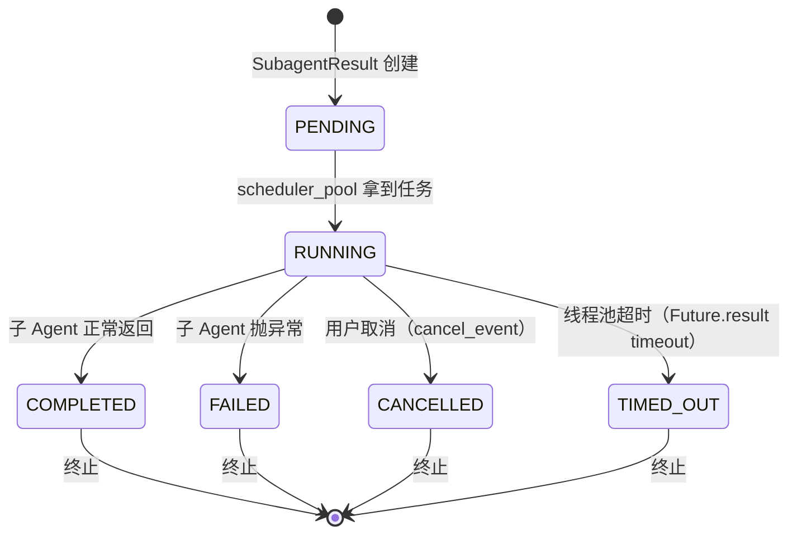

# 04 SubagentExecutor 异步执行引擎 — 持久 daemon loop 与协作式取消

> 面试口径：`SubagentExecutor` 是 DeerFlow 的"异步执行内核"。它解决三个工程级难题：① **如何在已有 async 上下文中安全跑另一个独立 Agent**（持久 daemon loop） ② **如何让长工具调用能被取消**（协作式 `threading.Event`） ③ **如何在多线程并发下保证状态切换的正确性**（`try_set_terminal` 加锁）。看完这一章你就能和面试官撕"为什么不用 `asyncio.run` 直接跑"。

**本章课程目标：**

- 理解 `SubagentStatus` / `SubagentResult` / `SubagentExecutor` 三个核心数据结构
- 掌握"持久 daemon event loop"的实现：为什么需要、怎么实现、什么时候用
- 吃透 `_aexecute` 主循环 200 行：状态构建 → 协作式取消 → 流式执行 → 结果提取
- 知道三种执行路径：`execute` / `execute_async` / `_execute_in_isolated_loop` 的差异

**学习建议：** 这章建议**带着问题读**：① "如果父 Agent 已经在 async 上下文里，怎么再跑一个独立 Agent？" ② "用户点取消后，子 Agent 在跑一个 60 秒的工具调用，怎么让它优雅退出？" ③ "5 个并发子 Agent 各自完成时，如何保证结果记录不被互相覆盖？" 答完这三题，章节就过了。

---

## 1、本章导读

`SubagentExecutor` 在源码 `subagents/executor.py` 中，全文 889 行。本章按以下结构展开：

```
executor.py (889 行)
│
├─ §2 状态枚举 SubagentStatus           (40-58)
│   PENDING → RUNNING → COMPLETED/FAILED/CANCELLED/TIMED_OUT
│
├─ §3 结果容器 SubagentResult           (61-143)
│   try_set_terminal() 的线程安全模型
│
├─ §4 持久 daemon loop（核心机制）       (147-261)
│   为什么需要 / 怎么实现 / 启动时序
│
├─ §5 工具过滤 _filter_tools             (264-291)
│   allowlist + denylist 双重过滤
│
├─ §6 SubagentExecutor 类                (294-815)
│   ├─ __init__ 配置存储
│   ├─ _create_agent 创建子图
│   ├─ _build_initial_state 初始 state
│   ├─ _aexecute 主异步循环（重点）
│   ├─ _execute_in_isolated_loop 隔离执行
│   ├─ execute 同步入口
│   └─ execute_async 后台启动
│
└─ §7 全局状态管理 (146-152, 818-888)
    _background_tasks dict + _scheduler_pool ThreadPool
    request_cancel / get_result / cleanup
```

---

## 2、状态枚举 SubagentStatus

### 2.1 状态机



### 2.2 源码

```python
class SubagentStatus(Enum):
    PENDING = "pending"
    RUNNING = "running"
    COMPLETED = "completed"
    FAILED = "failed"
    CANCELLED = "cancelled"
    TIMED_OUT = "timed_out"
    
    @property
    def is_terminal(self) -> bool:
        return self in {
            type(self).COMPLETED,
            type(self).FAILED,
            type(self).CANCELLED,
            type(self).TIMED_OUT,
        }
```

**关键点：**
- 6 个状态，4 个终止
- `is_terminal` 用 `type(self).XXX` 而不是 `SubagentStatus.XXX` —— 防止枚举类被替换 / 子类化时硬编码失效

### 2.3 状态转换的"单向"性

**核心约束：终止状态不可再转换。**

```python
def try_set_terminal(self, status, ...):
    if not status.is_terminal:
        raise ValueError(f"Status {status} is not terminal")
    
    with self._state_lock:
        if self.status.is_terminal:  # ← 已经终止，跳过
            return False
        ...
```

**为什么这么严？**

并发场景：
- 主线程：5 秒轮询发现超时 → 调用 `try_set_terminal(TIMED_OUT)`
- 后台子线程：刚好在这一刻完成 → 调用 `try_set_terminal(COMPLETED)`
- 谁先抢到锁谁的状态最终生效，另一个会拿到 `False` 静默放弃

**没有锁会怎样？**
- 状态可能被反复改写（先 TIMED_OUT → 再 COMPLETED → 再 CANCELLED）
- token_usage_records 可能被覆盖（COMPLETED 时记录被 CANCELLED 时空数据覆盖）
- 前端 SSE 推送的状态前后矛盾

---

## 3、结果容器 SubagentResult

### 3.1 完整结构

```python
@dataclass
class SubagentResult:
    task_id: str                      # 任务 ID（通常 = tool_call_id）
    trace_id: str                     # 分布式追踪 ID
    status: SubagentStatus            # 当前状态
    result: str | None = None         # 最终结果文本
    error: str | None = None          # 错误信息
    started_at: datetime | None = None
    completed_at: datetime | None = None
    ai_messages: list[dict] | None = None        # AI 消息列表（SSE 推送）
    token_usage_records: list[dict] = field(default_factory=list)
    usage_reported: bool = False                  # 防重复上报
    cancel_event: threading.Event = field(default_factory=threading.Event, repr=False)
    _state_lock: threading.Lock = field(default_factory=threading.Lock, init=False, repr=False)
```

### 3.2 字段三大类

| 类别 | 字段 | 作用 |
| --- | --- | --- |
| **标识** | `task_id` / `trace_id` | 唯一标识 / 日志关联 |
| **状态** | `status` / `result` / `error` / `started_at` / `completed_at` | 生命周期信息 |
| **数据** | `ai_messages` / `token_usage_records` / `usage_reported` | 实时数据流 |
| **同步** | `cancel_event` / `_state_lock` | 跨线程协作 |

### 3.3 `try_set_terminal` 的线程安全模型

```python
def try_set_terminal(self, status, *, result=None, error=None, ...) -> bool:
    if not status.is_terminal:
        raise ValueError(...)
    
    with self._state_lock:
        if self.status.is_terminal:
            return False  # 已经终止，让前一个赢
        
        # 只在转换发生时写字段（None 字段保持原值）
        if result is not None:
            self.result = result
        if error is not None:
            self.error = error
        if ai_messages is not None:
            self.ai_messages = ai_messages
        if token_usage_records is not None:
            self.token_usage_records = token_usage_records
        self.completed_at = completed_at or datetime.now()
        self.status = status
        return True
```

**面试可能追问：**

> Q: 为什么不用 `asyncio.Lock` 而用 `threading.Lock`？
> A: 因为状态可能被**多个不同事件循环 / 多个线程**修改：① 调度线程池的 `run_task` 内部 ② 持久 daemon loop 内部 ③ 主 Agent 的 `task_tool` 协程。`threading.Lock` 跨线程跨循环都能用，`asyncio.Lock` 只能在同一个 loop 内用。

---

## 4、持久 daemon event loop（核心机制）

### 4.1 问题来源

DeerFlow 的执行场景：
- 主 Agent 由 LangGraph 在 async 上下文中跑（`agent.astream(...)`）
- 主 Agent 调用 `task_tool` 时**已经在一个 event loop 里了**
- `task_tool` 内部要启动子 Agent，子 Agent 也要 async 跑（用 MCP 工具、httpx 等）

### 4.2 朴素方案的两个坑

**朴素方案 A：直接 `asyncio.run(子_aexecute())`**

```python
# 错误示范
result = asyncio.run(self._aexecute(task))
```

❌ 立即报错：`RuntimeError: asyncio.run() cannot be called from a running event loop`

**朴素方案 B：每次 `new_event_loop()`**

```python
# 错误示范
loop = asyncio.new_event_loop()
try:
    return loop.run_until_complete(self._aexecute(task))
finally:
    loop.close()
```

⚠️ 看似可行，但有两个致命问题：

1. **httpx 客户端绑定到 loop**：`httpx.AsyncClient` 创建时会绑定一个 loop，loop 关闭后客户端无法复用。子 Agent 调用一次 LLM API 就开关一次连接池 —— 性能崩盘。
2. **MCP 工具 stdio/sse 连接撕裂**：MCP 工具的 transport 也绑定 loop，loop 关闭 = transport 断开 = 工具调用失败。

### 4.3 DeerFlow 的方案：持久 daemon loop

**核心：全局一个 daemon 线程跑一个永不关闭的 event loop，所有子 Agent 共享。**

```python
# executor.py:156-160
_isolated_subagent_loop: asyncio.AbstractEventLoop | None = None
_isolated_subagent_loop_thread: threading.Thread | None = None
_isolated_subagent_loop_started: threading.Event | None = None
_isolated_subagent_loop_lock = threading.Lock()


def _run_isolated_subagent_loop(loop, started_event):
    """在 daemon 线程跑 loop.run_forever()."""
    asyncio.set_event_loop(loop)
    loop.call_soon(started_event.set)  # 通知主线程"我起来了"
    try:
        loop.run_forever()
    finally:
        started_event.clear()


def _get_isolated_subagent_loop() -> asyncio.AbstractEventLoop:
    """惰性创建持久 loop。"""
    global _isolated_subagent_loop, _isolated_subagent_loop_thread
    
    with _isolated_subagent_loop_lock:
        # 检查 loop 是否仍可用（未关闭、仍在运行、线程仍活）
        thread_is_alive = _isolated_subagent_loop_thread is not None \
            and _isolated_subagent_loop_thread.is_alive()
        loop_is_usable = (
            _isolated_subagent_loop is not None
            and not _isolated_subagent_loop.is_closed()
            and _isolated_subagent_loop.is_running()
            and thread_is_alive
        )
        
        if not loop_is_usable:
            # 创建新的 loop + daemon 线程
            loop = asyncio.new_event_loop()
            started_event = threading.Event()
            thread = threading.Thread(
                target=_run_isolated_subagent_loop,
                args=(loop, started_event),
                name="subagent-persistent-loop",
                daemon=True,  # ← 主进程退出时自动销毁
            )
            thread.start()
            
            if not started_event.wait(timeout=5):
                raise RuntimeError("Timed out starting isolated subagent event loop")
            
            _isolated_subagent_loop = loop
            _isolated_subagent_loop_thread = thread
            _isolated_subagent_loop_started = started_event
        
        return _isolated_subagent_loop
```

### 4.4 提交协程到 daemon loop

```python
def _submit_to_isolated_loop_in_context(context, coro_factory):
    """保留 ContextVar 的前提下，提交协程到隔离 loop."""
    return context.run(
        lambda: asyncio.run_coroutine_threadsafe(
            coro_factory(),
            _get_isolated_subagent_loop(),
        )
    )
```

**关键 API：`asyncio.run_coroutine_threadsafe`**
- 跨线程提交协程的官方方式
- 返回 `concurrent.futures.Future`（不是 `asyncio.Future`）—— 可以在调用线程 `.result(timeout=...)` 等

**为什么要 `context.run`？**
- ContextVar（如 trace_id、user_id）默认绑定到当前线程的 context
- 跨线程提交协程时，子协程拿不到父线程的 ContextVar
- `context.run` 把协程**在父 context 中执行**，保证 ContextVar 透传

### 4.5 关闭机制

```python
def _shutdown_isolated_subagent_loop():
    with _isolated_subagent_loop_lock:
        loop = _isolated_subagent_loop
        thread = _isolated_subagent_loop_thread
        ...
    
    if loop.is_running():
        loop.call_soon_threadsafe(loop.stop)  # 跨线程通知 loop 停
    
    if thread is not None and thread.is_alive() and thread is not threading.current_thread():
        thread.join(timeout=1)
    
    if not loop.is_closed():
        if thread_stopped and loop_stopped:
            loop.close()


atexit.register(_shutdown_isolated_subagent_loop)  # ← 进程退出时调用
```

**关键点：**
- `atexit.register` 保证 Python 解释器退出时关闭 loop
- `daemon=True` 也提供兜底（即使 atexit 没触发，daemon 线程会被强制退出）

---

## 5、`_aexecute` 主循环（核心代码逐段解析）

源码位置：`executor.py:474-668`，约 200 行。

### 5.1 入口：参数 + result_holder 处理

```python
async def _aexecute(self, task, result_holder=None):
    if result_holder is not None:
        # 后台执行模式：用预创建的 result（execute_async 路径）
        result = result_holder
    else:
        # 同步执行模式：新建 result（execute 路径）
        task_id = str(uuid.uuid4())[:8]
        result = SubagentResult(
            task_id=task_id,
            trace_id=self.trace_id,
            status=SubagentStatus.RUNNING,
            started_at=datetime.now(),
        )
    
    ai_messages = result.ai_messages
    if ai_messages is None:
        ai_messages = []
        result.ai_messages = ai_messages
```

**两种调用路径：**
- `execute_async` 在 scheduler_pool 里调用：传入 `result_holder`（已注册到 `_background_tasks`）
- `execute` 同步调用：自己创建 result（不进 `_background_tasks`，单元测试用）

### 5.2 构建初始 state 与子图

```python
collector: SubagentTokenCollector | None = None
try:
    state, filtered_tools = await self._build_initial_state(task)
    agent = self._create_agent(filtered_tools)
    
    collector_caller = f"subagent:{self.config.name}"
    collector = SubagentTokenCollector(caller=collector_caller)
    
    run_config: RunnableConfig = {
        "recursion_limit": self.config.max_turns,
        "callbacks": [collector],
        "tags": [collector_caller],
    }
    context: dict[str, Any] = {}
    if self.thread_id:
        run_config["configurable"] = {"thread_id": self.thread_id}
        context["thread_id"] = self.thread_id
    if self.app_config is not None:
        context["app_config"] = self.app_config
```

**关键点：**
- `_build_initial_state` 构造 state（system_prompt + 任务 + 共享 sandbox/thread_data）+ 过滤后的工具（按技能策略再过滤一次）
- `_create_agent` 用 `langchain.agents.create_agent` 创建独立的 LangGraph Agent（state_schema=ThreadState，和主 Agent 同 schema）
- **token collector 注入**：`tags=["subagent:general-purpose"]` —— RunJournal 通过这个 tag 把 token 归类到子 Agent 桶
- **recursion_limit = max_turns**：LangGraph 用这个限制最大轮转数，超过抛 `GraphRecursionError`

### 5.3 流式执行 + 协作式取消

```python
final_state = None

# 启动前预检：如果已经被取消就直接返回
if result.cancel_event.is_set():
    result.try_set_terminal(SubagentStatus.CANCELLED, error="Cancelled by user", ...)
    return result

async for chunk in agent.astream(state, config=run_config, context=context, stream_mode="values"):
    # ── 协作式取消检查（每个 chunk 边界） ──
    if result.cancel_event.is_set():
        result.try_set_terminal(SubagentStatus.CANCELLED, error="Cancelled by user", ...)
        return result
    
    final_state = chunk
    
    # ── 实时捕获 AI 消息（给 SSE 推送用） ──
    messages = chunk.get("messages", [])
    if messages:
        last_message = messages[-1]
        if isinstance(last_message, AIMessage):
            message_dict = last_message.model_dump()
            message_id = message_dict.get("id")
            
            # 去重：用 message id 或完整 dict 比对
            is_duplicate = False
            if message_id:
                is_duplicate = any(msg.get("id") == message_id for msg in ai_messages)
            else:
                is_duplicate = message_dict in ai_messages
            
            if not is_duplicate:
                ai_messages.append(message_dict)
```

**核心机制：协作式取消（cooperative cancellation）**

```python
if result.cancel_event.is_set():
    return result
```

为什么不用 `Future.cancel()`？

| 方式 | 能否中断长工具调用 | 能否清理资源 |
| --- | --- | --- |
| `Future.cancel()` | ❌ 不能 —— 工具函数已经在跑 sync 代码 | ❌ 不会调用 finally |
| `cancel_event.is_set()` 检查 | ✅ 在每个 chunk 边界检查 | ✅ 触发 try/finally / context exit |
| `asyncio.CancelledError` 抛出 | ✅ 但需要 await 边界 | ✅ 但可能撕裂 httpx 连接 |

DeerFlow 选了第 2 种 —— **每个 chunk 边界检查 cancel_event**。代价是延迟（最坏要等当前 chunk 跑完，可能几秒到几十秒），收益是干净退出。

### 5.4 提取最终结果

```python
token_usage_records = collector.snapshot_records()
final_result: str | None = None

if final_state is None:
    final_result = "No response generated"
else:
    messages = final_state.get("messages", [])
    
    # 反向找最后一条 AIMessage
    last_ai_message = None
    for msg in reversed(messages):
        if isinstance(msg, AIMessage):
            last_ai_message = msg
            break
    
    if last_ai_message is not None:
        content = last_ai_message.content
        if isinstance(content, str):
            final_result = content
        elif isinstance(content, list):
            # 处理 list-of-content-blocks（Claude / Gemini）
            text_parts = []
            pending_str_parts = []
            for block in content:
                if isinstance(block, str):
                    pending_str_parts.append(block)
                elif isinstance(block, dict):
                    if pending_str_parts:
                        text_parts.append("".join(pending_str_parts))
                        pending_str_parts.clear()
                    text_val = block.get("text")
                    if isinstance(text_val, str):
                        text_parts.append(text_val)
            if pending_str_parts:
                text_parts.append("".join(pending_str_parts))
            final_result = "\n".join(text_parts) if text_parts else "No text content in response"
        else:
            final_result = str(content)
```

**关键点：**
- **反向遍历**：找最后一条 AIMessage（中间可能有 ToolMessage 干扰）
- **content 三种形态**：
  - `str`：DeepSeek、OpenAI 等大部分模型
  - `list[dict]`：Claude 的 content blocks `[{"type": "text", "text": "..."}, ...]`
  - 其它：兜底 `str(content)`
- **分隔符规则**：连续字符串块直接拼接，不同类型块之间换行

### 5.5 状态终止 + 异常捕获

```python
    result.try_set_terminal(
        SubagentStatus.COMPLETED,
        result=final_result,
        token_usage_records=token_usage_records,
    )

except Exception as e:
    result.try_set_terminal(
        SubagentStatus.FAILED,
        error=str(e),
        token_usage_records=collector.snapshot_records() if collector is not None else None,
    )

return result
```

**关键点：**
- 即使 FAILED，也要带上已收集的 token —— 出错前的 LLM 调用也是要计费的
- `try_set_terminal` 返回的 bool 这里没用 —— 因为这是 happy path，前面已经检查过 cancel_event

---

## 6、三种执行入口对比

### 6.1 `execute(task)` — 同步入口

```python
def execute(self, task, result_holder=None):
    try:
        try:
            loop = asyncio.get_running_loop()
        except RuntimeError:
            loop = None
        
        if loop is not None and loop.is_running():
            # 父在 async 上下文里 → 走持久 daemon loop
            return self._execute_in_isolated_loop(task, result_holder)
        
        # 没有 running loop → 直接 asyncio.run（命令行 / 单元测试）
        return asyncio.run(self._aexecute(task, result_holder))
    except Exception as e:
        ...
        result.try_set_terminal(SubagentStatus.FAILED, error=str(e))
        return result
```

**用途：** 同步调用方（如 `await sync_executor.execute(task)`），主要是测试用。

### 6.2 `execute_async(task, task_id)` — 后台启动

```python
def execute_async(self, task, task_id=None):
    if task_id is None:
        task_id = str(uuid.uuid4())[:8]
    
    result = SubagentResult(
        task_id=task_id,
        trace_id=self.trace_id,
        status=SubagentStatus.PENDING,
    )
    with _background_tasks_lock:
        _background_tasks[task_id] = result
    
    parent_context = copy_context()
    
    def run_task():
        with _background_tasks_lock:
            _background_tasks[task_id].status = SubagentStatus.RUNNING
            result_holder = _background_tasks[task_id]
        
        try:
            execution_future = _submit_to_isolated_loop_in_context(
                parent_context,
                lambda: self._aexecute(task, result_holder),
            )
            try:
                execution_future.result(timeout=self.config.timeout_seconds)
            except FuturesTimeoutError:
                result_holder.cancel_event.set()
                result_holder.try_set_terminal(SubagentStatus.TIMED_OUT, error=f"Execution timed out after {self.config.timeout_seconds} seconds")
                execution_future.cancel()
        except Exception as e:
            with _background_tasks_lock:
                task_result = _background_tasks[task_id]
            task_result.try_set_terminal(SubagentStatus.FAILED, error=str(e))
    
    _scheduler_pool.submit(run_task)
    return task_id
```

**用途：** `task_tool` 调用的入口。立即返回 task_id，调用方自己轮询。

### 6.3 `_execute_in_isolated_loop(task)` — 隔离循环阻塞执行

```python
def _execute_in_isolated_loop(self, task, result_holder=None):
    future: Future | None = None
    parent_context = copy_context()
    try:
        future = _submit_to_isolated_loop_in_context(
            parent_context,
            lambda: self._aexecute(task, result_holder),
        )
        return future.result(timeout=self.config.timeout_seconds)
    except FuturesTimeoutError:
        if result_holder is not None:
            result_holder.cancel_event.set()
        if future is not None:
            future.cancel()
        raise
```

**用途：** 同步上下文 + 已有 running loop 的场景（极少见）。

### 6.4 三路对比表

| 入口 | 调用方上下文 | 阻塞？ | 用 daemon loop | 主要使用者 |
| --- | --- | --- | --- | --- |
| `execute` | 任意（自动判断） | 是 | 仅当父有 loop 时 | 测试 / 命令行 |
| `execute_async` | 任意 | 否（立即返回） | 是 | `task_tool`（生产路径） |
| `_execute_in_isolated_loop` | 同步 + 已有 loop | 是 | 是 | `execute` 内部分支 |

---

## 7、`_scheduler_pool` 与并发上限

```python
_scheduler_pool = ThreadPoolExecutor(max_workers=3, thread_name_prefix="subagent-scheduler-")
MAX_CONCURRENT_SUBAGENTS = 3
```

**为什么 max_workers=3？**

物理上限：进程内同时跑的子 Agent 不超过 3 个。原因：
1. **LLM API 限流**：大部分模型供应商对单 key 有 RPS 限制，3 个并发已经够呛
2. **下游工具压力**：MCP / httpx 连接池总数有限，过多并发反而拖慢
3. **观察成本**：5+ 子 Agent 同时跑前端展示混乱

**注意：** `max_workers=3` 是 scheduler **任务调度** 的上限。每个 task 在 daemon loop 里以协程跑，daemon loop 只有一个。所以实际是：
- 3 个 scheduler 线程同时调用 `asyncio.run_coroutine_threadsafe`
- 3 个协程在 daemon loop 里**并发**（不是并行）跑
- LLM 等待时让出控制权给其他协程

### 7.1 `_background_tasks` 全局字典

```python
_background_tasks: dict[str, SubagentResult] = {}
_background_tasks_lock = threading.Lock()
```

**所有读写都要加锁：**

```python
def request_cancel_background_task(task_id):
    with _background_tasks_lock:
        result = _background_tasks.get(task_id)
        if result is not None:
            result.cancel_event.set()


def get_background_task_result(task_id):
    with _background_tasks_lock:
        return _background_tasks.get(task_id)


def cleanup_background_task(task_id):
    with _background_tasks_lock:
        result = _background_tasks.get(task_id)
        if result is None:
            return
        if result.status.is_terminal or result.completed_at is not None:
            del _background_tasks[task_id]
```

**关键设计：** `cleanup_background_task` 只在终止状态才真正删除 —— 避免清理掉还在跑的任务。

---

## 8、本章 ❓→💡 问答

### Q1：daemon loop 为什么用 `loop.run_forever()` 不用 `loop.run_until_complete`？

**A：** 因为我们要**反复提交协程**给同一个 loop。`run_until_complete(coro)` 跑完 coro 就停 —— 那等于每次都得起新 loop。`run_forever` 让 loop 永远活着，然后用 `run_coroutine_threadsafe` 不断喂协程。

### Q2：daemon 线程异常退出怎么办？

**A：** `_get_isolated_subagent_loop` 每次都做健康检查：

```python
loop_is_usable = (
    _isolated_subagent_loop is not None
    and not _isolated_subagent_loop.is_closed()
    and _isolated_subagent_loop.is_running()
    and thread_is_alive
)
if not loop_is_usable:
    # 重建
    ...
```

任意条件不满足都会**重建 loop + thread**。所以即使 daemon 线程因为 OOM / 异常死掉，下次提交协程时会自动恢复。

### Q3：`copy_context()` 在子线程里到底做了什么？

**A：** Python 的 `contextvars.ContextVar` 是**线程局部 + 协程局部**的。父协程里设置的 `trace_id` ContextVar 在子线程里默认看不到。

`copy_context()` 复制当前 context（含所有 ContextVar）；`context.run(callable)` 在该 context 中执行 callable。组合起来就是：**子线程跑的协程能看到父协程的 ContextVar**。

DeerFlow 用它确保 trace_id / user_id 在子 Agent 里仍然可见，日志能正确关联。

### Q4：如果子 Agent 抛出 `KeyboardInterrupt`，会发生什么？

**A：** `KeyboardInterrupt` 不继承 `Exception`，`except Exception` 不会捕获。所以：
- daemon loop 内的协程被中断
- `try_set_terminal` 不会被调用 —— 状态永远停留在 RUNNING
- 主 Agent 轮询会一直拿到 RUNNING，直到轮询超时（兜底机制）

实际生产中 KeyboardInterrupt 由用户 Ctrl+C 触发，整个进程都要退出，所以这个 case 不需要专门处理。

---

## 9、本章总结

**SubagentExecutor 的三大武器：**

| 武器 | 解决问题 | 关键 API |
| --- | --- | --- |
| 持久 daemon loop | 父 Agent 已在 async 上下文中再跑独立 Agent | `run_coroutine_threadsafe` + `daemon=True` thread |
| 协作式取消 | 长工具调用的优雅退出 | `threading.Event` + `astream` chunk 边界检查 |
| `try_set_terminal` 加锁 | 多线程状态切换原子性 | `threading.Lock` + `is_terminal` 单向校验 |

**记忆口诀：**
> 持久 loop 不关 daemon 跑，协作 cancel 边界检；状态切换 lock 原子，结果回收按 id 找。

下一章（第 5 章 配置与注册表）会拆 `SubagentConfig` 和 `registry.py` 的三层覆盖逻辑 —— 重点是搞清楚 `model="inherit"` 和技能白名单怎么解析。
