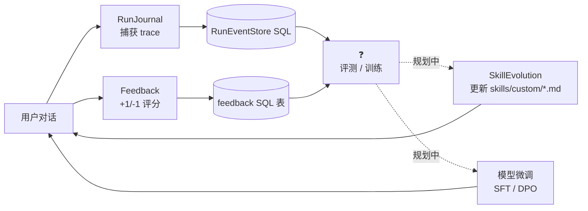
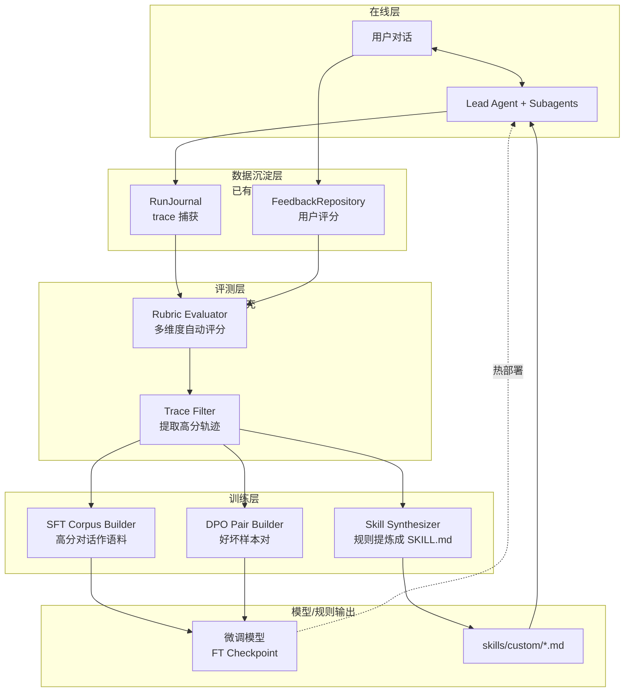

# 11 数据飞轮 — 从用户反馈到模型进化的闭环

> 面试口径：DeerFlow 当前**有"飞轮的零件"但没有"完整的飞轮"**：① `RunJournal` 全量捕获 trace（messages / token / errors）② `feedback` 表存用户 +1/-1 评分 ③ `skill_evolution` 允许 Agent 自演化技能。但**没有 Rubric 评测器、SFT 语料生成、DPO 偏好对生成、奖励模型** —— 这些是 Anthropic / OpenAI / DeepSeek 等大厂数据飞轮的核心。本章前半讲 DeerFlow 现状（基础设施零件），后半按大厂做法**模拟**完整飞轮设计。**面试时一定要诚实区分"已实现 vs 规划中"**，否则被追问代码会露馅。

**本章课程目标：**

- 看清楚 DeerFlow 三个飞轮零件的现状（FeedbackRepository / RunJournal / SkillEvolution）
- 理解为什么"零件齐全 ≠ 飞轮转起来"—— 缺失环节是什么
- 学会按大厂做法（Constitutional AI / RLHF / DPO / GRPO）补全缺失环节
- 知道如何在面试里**诚实地讲出"哪些是已实现 / 哪些是规划"**

**学习建议：** 这章是**最容易踩坑的章节**。面试官问"数据飞轮怎么做的"，如果你说"我们做了 SFT + DPO"但代码里没有，深度面会立刻崩。**正确的策略是：先讲已有基础设施，再讲"基于现有零件可以这样扩展，参考 X 大厂做法"**。这种"诚实 + 系统设计"组合反而是加分项。

---

## 1、本章导读

### 1.1 什么是"Agent 数据飞轮"

数据飞轮 (Data Flywheel) 在 LLM Agent 项目里通常指：

```
用户使用 Agent
        ↓
真实交互数据沉淀（traces / 用户反馈 / 错误日志）
        ↓
质量评测（自动 + 人工）
        ↓
高质量样本 → SFT 语料；好坏样本对 → DPO/RM 训练数据
        ↓
模型微调（SFT → DPO/PPO/GRPO）
        ↓
新模型上线 → 替代旧 LLM 调用
        ↓
用户体验提升 → 用户使用更多 → 数据沉淀更多
        ↓ ↻ 飞轮加速
```

**核心命题：** 用得越多 → 数据越多 → 模型越好 → 用户越多。这是相对于"prompt engineering 边际效益递减"的根本进阶路径。

### 1.2 大厂做法的演进

| 时期 | 代表方法 | 核心思想 | 典型公司 |
| --- | --- | --- | --- |
| 2022-2023 | RLHF (PPO) | 奖励模型 + 人类反馈强化学习 | OpenAI ChatGPT / Anthropic Claude |
| 2023-2024 | DPO | 直接偏好优化，跳过 RM 训练 | Meta Llama / Mistral |
| 2024 | Constitutional AI / RLAIF | AI 自评 + 章程引导 | Anthropic Claude 3 |
| 2024-2025 | GRPO / Verifiable Rewards | 可验证奖励 + 群体相对偏好 | DeepSeek V3 / R1、字节豆包 |
| 2025+ | Process Reward (PRM) | 步骤级奖励 + Chain-of-Thought 评分 | OpenAI o1 / Qwen 2.5-Math |

DeerFlow 作为开源 Agent 框架，**飞轮的"模型训练"这一段可能不在框架内**（用户自己训），但**数据沉淀 + 评测 + 偏好对生成**这些环节框架应该提供。

---

## 2、DeerFlow 现状：三个飞轮零件

### 2.1 零件 1：RunJournal —— 全量 Trace 捕获

**位置：** `runtime/journal.py:39-690`

**它捕获什么：**

```python
class RunJournal(BaseCallbackHandler):
    def __init__(self, run_id, thread_id, event_store, ...):
        # Token 累加器（按 caller 分桶）
        self._lead_agent_tokens = 0
        self._subagent_tokens = 0
        self._middleware_tokens = 0
        # LLM 调用追踪
        self._llm_call_count = 0
        self._llm_call_index = 0
        # 第一条 user 消息 + 最后一条 AI 消息
        self._first_human_msg: str | None = None
        self._last_ai_msg: str | None = None
        # 错误回退记录
        self._had_llm_error_fallback = False
```

**全量事件类型：**

| 事件 | 钩子 | 数据 |
| --- | --- | --- |
| chain_start / chain_end | LangGraph 图节点进入/退出 | 节点名、输入、输出、duration |
| chat_model_start / llm_end | 每次 LLM 调用 | prompt、response、tokens、latency |
| llm_error | LLM 异常 | error message、retry info |
| tool_start / tool_end | 工具调用 | tool name、args、result |
| middleware:* | 中间件状态变更 | tag、name、hook、changes |

**这一切写到哪？**

```python
self._store = event_store  # RunEventStore（基于 SQL 持久化）
```

**数据用途（当前 + 潜在）：**

| 当前 | 潜在 |
| --- | --- |
| 前端展示对话流 | SFT 语料（高分 trace 提取 message 序列） |
| Token 计费 | 强化学习的轨迹 (trajectory) |
| 错误监控 | 错误模式聚类 → 找薄弱环节 |
| Langfuse 同步 | 偏好对生成（同 prompt 不同 response 对比） |

### 2.2 零件 2：FeedbackRepository —— 用户评分

**位置：** `persistence/feedback/model.py + sql.py`

**ORM 模型：**

```python
class FeedbackRow(Base):
    __tablename__ = "feedback"
    
    feedback_id: Mapped[str]      # UUID
    run_id: Mapped[str]           # 关联 RunJournal
    thread_id: Mapped[str]
    user_id: Mapped[str | None]   # 多租户隔离
    message_id: Mapped[str | None] # 可选：精确到某条消息
    
    rating: Mapped[int]           # +1（赞）或 -1（踩）
    comment: Mapped[str | None]   # 用户文字反馈
    created_at: Mapped[datetime]
    
    __table_args__ = (UniqueConstraint("thread_id", "run_id", "user_id", ...),)
```

**关键设计：**
- 一个 (thread, run, user) 三元组**只能有一条 feedback** —— 用户改主意覆盖前一条
- `message_id` 可选：用户可以对单条消息打分，也可以对整个 run 打分
- `rating ∈ {+1, -1}`：二元，没有 5 星制 —— **强制简单**（避免"3 星 vs 4 星"的无效噪声）

**收集 API（伪代码）：**

```python
@app.post("/api/feedback")
async def submit_feedback(
    run_id: str,
    thread_id: str,
    rating: int,
    comment: str | None = None,
    message_id: str | None = None,
):
    feedback_repo.create(
        run_id=run_id,
        thread_id=thread_id,
        rating=rating,
        comment=comment,
        message_id=message_id,
    )
```

**飞轮价值：** 这是**最珍贵的人类信号** —— 用户说"这个回答好"或"这个回答差"。后续偏好对生成的 ground truth 就靠它。

### 2.3 零件 3：SkillEvolution —— 自演化技能

**位置：** `config/skill_evolution_config.py`

```python
class SkillEvolutionConfig(BaseModel):
    enabled: bool = Field(
        default=False,
        description="是否允许 agent 在 skills/custom 目录下创建与修改技能。",
    )
    moderation_model_name: str | None = Field(
        default=None,
        description="用于技能安全审核的可选模型名；缺省时使用主 chat 模型。",
    )
```

**它做什么：**
- 启用后，Agent 可以调用工具在 `skills/custom/` 目录下**新建 / 修改 SKILL.md 文件**
- 通过 `moderation_model_name` 配置审核模型 → 在写入前调用一次"安全 LLM"检查
- 写入后下次会话自动加载新技能

**飞轮价值（独特点）：**

这不是"模型训练"路线，而是 **"in-context learning at the framework level"**：

```
用户多次抱怨"对比表格不好看"
        ↓
Agent 学会一个技能：写对比题时要用"特性矩阵+权重表"格式
        ↓
SKILL.md 写到 skills/custom/comparison_format.md
        ↓
下次任意子 Agent 跑对比题时，自动加载这个 skill
        ↓
输出质量提升（无需重训模型）
```

**对比 RLHF：**

| 维度 | RLHF / DPO | Skill 自演化 |
| --- | --- | --- |
| 学习介质 | 模型权重 | Markdown 文档 |
| 训练成本 | 高（需要 GPU、几小时到几天） | 零（写文件） |
| 见效速度 | 慢（一次训练一个版本） | 即时 |
| 可解释性 | 差 | 强（文档可审计） |
| 适用场景 | 通用能力提升 | 用户个性化 / 团队规范沉淀 |

**Anthropic Skills 是 DeerFlow 这套设计的灵感来源**（见 `claude.com/blog/agent-skills`）。

### 2.4 三零件的关系



中间这块 **❓评测 / 训练 / 偏好对生成** 是 DeerFlow **当前没实现**的部分，下一节按大厂做法补全。

---

## 3、模拟设计：完整数据飞轮（参考大厂做法）

### 3.1 完整飞轮架构



### 3.2 评测层：Rubric Evaluator（参考 Anthropic Constitutional AI）

**思路：** 用一个评测 LLM 对 trace 多维度打分。

**评分维度示例（Agent 项目通用）：**

```python
RUBRIC_DIMENSIONS = {
    "task_completion": "任务是否完成？(0-5)",
    "tool_usage": "工具使用是否高效？(0-5)",
    "factual_accuracy": "事实是否准确？(0-5)",
    "subagent_decomposition": "子任务拆解是否合理？(0-5)",
    "token_efficiency": "Token 消耗 vs 价值比例 (0-5)",
    "safety": "是否有安全风险？(0=有 / 1=无)",
}
```

**实现伪代码：**

```python
# 假设新增 deerflow/evaluation/rubric_evaluator.py
class RubricEvaluator:
    def __init__(self, eval_model: str, rubric: dict[str, str]):
        self.model = create_chat_model(name=eval_model)
        self.rubric = rubric
    
    async def evaluate(self, trace: dict) -> dict:
        """对一个完整 trace 评分."""
        prompt = self._build_eval_prompt(trace)
        response = await self.model.ainvoke(prompt)
        scores = json.loads(response.content)  # {"task_completion": 4, ...}
        
        # 注入 user feedback（如果有）
        if trace.get("user_rating"):
            scores["user_signal"] = trace["user_rating"]
        
        # 计算总分（加权）
        total = self._weighted_sum(scores)
        return {"scores": scores, "total": total}
    
    def _build_eval_prompt(self, trace: dict) -> str:
        return f"""<rubric>
{json.dumps(self.rubric, ensure_ascii=False, indent=2)}
</rubric>

<trace>
User: {trace["first_human_msg"]}
Agent steps:
{format_steps(trace["events"])}
Final answer: {trace["last_ai_msg"]}
</trace>

请按 rubric 每个维度打分，输出 JSON：
{{"task_completion": int, "tool_usage": int, ...}}
"""
```

**调用时机：**

| 时机 | 优点 | 缺点 |
| --- | --- | --- |
| 在线（每个 run 完成后即时） | 实时质量监控 | 增加延迟 / 成本 |
| 离线批处理（每天扫描）| 不影响在线性能 | 反馈周期长 |
| 混合（采样 1% 在线 + 全量离线） | 平衡 | 实现复杂 |

DeerFlow 推荐：**离线批处理** —— 不增加在线复杂度。

**与大厂做法对比：**

| 公司 | 方法 | 评测者 |
| --- | --- | --- |
| Anthropic Constitutional AI | 用 LLM 按章程（Constitution）打分 | Claude 自己 |
| OpenAI o1 | Process Reward Model（PRM） | 专门训练的小模型 |
| DeepSeek R1 | Verifiable Reward（数学题答案匹配） | 规则匹配 |
| **DeerFlow 推荐** | LLM-as-judge（成本低，无需训练 RM） | GPT-4 / Claude 评测 |

### 3.3 训练层 A：SFT 语料生成

**思路：** 把高分 trace（rubric 总分 ≥ 阈值 + user_rating=+1）的 message 序列提取为 SFT 训练语料。

**伪代码：**

```python
# deerflow/training/sft_corpus_builder.py
class SFTCorpusBuilder:
    def __init__(self, score_threshold: float = 4.0):
        self.threshold = score_threshold
    
    async def build_corpus(self, traces: list[dict]) -> list[dict]:
        """从高分 trace 构建 SFT 语料."""
        corpus = []
        for trace in traces:
            if trace["rubric_score"] < self.threshold:
                continue
            if trace.get("user_rating") == -1:
                continue  # 用户负反馈过滤
            
            # 提取 conversation 格式
            conversation = self._extract_conversation(trace)
            corpus.append({
                "messages": conversation,
                "score": trace["rubric_score"],
                "source_run_id": trace["run_id"],
            })
        return corpus
    
    def _extract_conversation(self, trace: dict) -> list[dict]:
        """把 events 转成 ChatML 格式."""
        messages = []
        for event in trace["events"]:
            if event["type"] == "human":
                messages.append({"role": "user", "content": event["content"]})
            elif event["type"] == "ai":
                messages.append({
                    "role": "assistant",
                    "content": event["content"],
                    "tool_calls": event.get("tool_calls", []),
                })
            elif event["type"] == "tool":
                messages.append({
                    "role": "tool",
                    "content": event["content"],
                    "tool_call_id": event["tool_call_id"],
                })
        return messages
```

**输出格式（HuggingFace ChatML 兼容）：**

```jsonl
{"messages": [{"role": "user", "content": "对比 5 家云厂商"}, {"role": "assistant", "content": "...", "tool_calls": [...]}, ...], "score": 4.5}
{"messages": [...], "score": 4.2}
```

**用途：** 喂给 LLaMA-Factory / Axolotl / TRL 做 SFT 训练。

### 3.4 训练层 B：DPO 偏好对生成

**思路：** DPO 需要 (chosen, rejected) 偏好对。从 trace 中找**同一类问题的高分 vs 低分回答**。

**伪代码：**

```python
# deerflow/training/dpo_pair_builder.py
class DPOPairBuilder:
    def __init__(self, similarity_model: str):
        self.embedder = create_embedding_model(similarity_model)
    
    async def build_pairs(self, traces: list[dict]) -> list[dict]:
        """构建 DPO 偏好对."""
        # 1. 按 prompt 聚类
        clusters = await self._cluster_by_prompt(traces)
        
        pairs = []
        for cluster in clusters:
            high = [t for t in cluster if t["rubric_score"] >= 4.0]
            low = [t for t in cluster if t["rubric_score"] <= 2.0]
            
            for h in high:
                for l in low:
                    pairs.append({
                        "prompt": h["first_human_msg"],
                        "chosen": h["last_ai_msg"],
                        "rejected": l["last_ai_msg"],
                        "score_diff": h["rubric_score"] - l["rubric_score"],
                    })
        
        return pairs
    
    async def _cluster_by_prompt(self, traces):
        """用 embedding 把语义相似的 prompt 归到同一 cluster."""
        embeddings = await self.embedder.embed_batch([t["first_human_msg"] for t in traces])
        # 用 KMeans / DBSCAN 聚类
        from sklearn.cluster import DBSCAN
        clusters = DBSCAN(eps=0.3, min_samples=2).fit_predict(embeddings)
        return self._group_by_label(traces, clusters)
```

**输出格式（TRL 库 DPO 标准）：**

```jsonl
{"prompt": "对比 5 家云厂商", "chosen": "AWS / Azure / GCP / 阿里 / Oracle 各...", "rejected": "云厂商有很多家..."}
```

**用途：** 喂给 TRL / OpenRLHF 做 DPO 训练。

**为什么不直接用 user_rating ±1 的对？**

可以但不充分：
- ✅ 必要的：user +1 vs user -1 必然是偏好对
- ⚠️ 不够的：很多 trace 没有 user_rating（用户不评分）

加上 rubric 评分能扩大数据规模 —— 这就是为什么大厂普遍用"用户反馈 + AI 评分"组合（RLHF + RLAIF 混合）。

### 3.5 训练层 C：Skill Synthesizer（DeerFlow 独有）

**思路：** 不训练模型，把模式提炼成 SKILL.md 文件。

**伪代码：**

```python
# deerflow/training/skill_synthesizer.py
class SkillSynthesizer:
    def __init__(self, model: str):
        self.model = create_chat_model(name=model)
    
    async def synthesize(self, traces: list[dict]) -> list[dict]:
        """从高分 trace 提炼出可复用的技能."""
        # 1. 按主题聚类高分 trace
        themes = await self._extract_themes(traces)
        
        skills = []
        for theme in themes:
            # 2. 让 LLM 总结成 SKILL.md
            skill_md = await self._generate_skill_md(theme)
            skills.append({
                "name": theme["name"],
                "content": skill_md,
                "source_traces": theme["trace_ids"],
                "confidence": theme["confidence"],
            })
        return skills
    
    async def _generate_skill_md(self, theme):
        prompt = f"""分析以下高分对话，提炼出可复用的"做对题"模式。
输出 SKILL.md 格式：
---
name: {theme['name']}
description: ...
---
# When to use
...
# How to do it
...
# Examples
...

高分对话样本：
{format_examples(theme['examples'])}
"""
        response = await self.model.ainvoke(prompt)
        return response.content
```

**审核环节：**

```python
# 利用现有的 SkillEvolutionConfig.moderation_model_name
async def write_skill_with_moderation(skill_md: str, config: SkillEvolutionConfig):
    moderator = create_chat_model(name=config.moderation_model_name)
    review = await moderator.ainvoke(f"审核以下 skill，检查安全风险 / 错误信息 / 隐私泄露：\n{skill_md}")
    if "REJECTED" in review.content:
        return False
    
    # 写入 skills/custom/
    write_to_disk(f"skills/custom/{skill_name}/SKILL.md", skill_md)
    return True
```

**为什么这种方式独特：**

| 维度 | SFT/DPO 模型微调 | Skill 自演化 |
| --- | --- | --- |
| 看得见 | ❌ 模型权重不可读 | ✅ Markdown 可审计 |
| 改得快 | ❌ 训练几小时 | ✅ 写文件即时生效 |
| 用户参与 | ❌ 训练不让用户改 | ✅ 用户可以编辑 SKILL.md |
| 多租户 | ❌ 一个模型服务所有用户 | ✅ 每个团队 / 用户自己的 skills |

### 3.6 完整数据流

```python
# 假设新增 deerflow/training/flywheel_pipeline.py
async def run_flywheel_iteration():
    """一次飞轮迭代（建议每天 / 每周跑一次）."""
    
    # ── Step 1: 拉取最近 N 天的 trace 和 feedback ──
    traces = await trace_store.fetch_recent(days=7)
    feedbacks = await feedback_repo.fetch_recent(days=7)
    
    # 关联 trace 和 feedback
    for trace in traces:
        fb = next((f for f in feedbacks if f["run_id"] == trace["run_id"]), None)
        if fb:
            trace["user_rating"] = fb["rating"]
            trace["user_comment"] = fb["comment"]
    
    # ── Step 2: Rubric 评测 ──
    evaluator = RubricEvaluator(eval_model="claude-sonnet-4", rubric=DEFAULT_RUBRIC)
    for trace in traces:
        result = await evaluator.evaluate(trace)
        trace["rubric_score"] = result["total"]
        trace["rubric_breakdown"] = result["scores"]
        await trace_store.update(trace)
    
    # ── Step 3: 三路输出 ──
    sft_builder = SFTCorpusBuilder(score_threshold=4.0)
    dpo_builder = DPOPairBuilder(similarity_model="text-embedding-3-small")
    skill_synth = SkillSynthesizer(model="claude-sonnet-4")
    
    sft_corpus = await sft_builder.build_corpus(traces)
    dpo_pairs = await dpo_builder.build_pairs(traces)
    new_skills = await skill_synth.synthesize(traces)
    
    # ── Step 4: 持久化 ──
    save_jsonl("data/sft_corpus.jsonl", sft_corpus)
    save_jsonl("data/dpo_pairs.jsonl", dpo_pairs)
    
    for skill in new_skills:
        await write_skill_with_moderation(skill["content"], skill_evolution_config)
    
    # ── Step 5: 触发模型训练 (可选) ──
    if len(sft_corpus) >= TRAINING_THRESHOLD:
        await trigger_external_training_job(
            sft_path="data/sft_corpus.jsonl",
            dpo_path="data/dpo_pairs.jsonl",
            base_model="qwen-2.5-7b",
            output_dir="checkpoints/v_next",
        )
    
    # ── Step 6: 报告 ──
    report = {
        "traces_analyzed": len(traces),
        "high_score_count": len([t for t in traces if t["rubric_score"] >= 4.0]),
        "sft_samples": len(sft_corpus),
        "dpo_pairs": len(dpo_pairs),
        "new_skills": len(new_skills),
    }
    await send_slack_alert(report)
```

---

## 4、各大厂飞轮实现速览

### 4.1 Anthropic Claude（Constitutional AI + RLAIF）

**路线：**
1. 写一份 Constitution（章程）：~70 条原则，如"不输出 PII"、"鼓励诚实"
2. 训练一个 critic 模型按章程批评 / 修订回答
3. critic 的修订版作为 SFT 语料
4. 让 critic 标偏好对（chosen=遵守章程的, rejected=违反的）→ DPO

**特点：** 几乎不依赖人类标注，**RLAIF (RL from AI Feedback)** 占主导。

**对 DeerFlow 启示：** 写 `RUBRIC_DIMENSIONS` 等价于"项目专属章程"。

### 4.2 OpenAI o1 / o3（Process Reward）

**路线：**
1. 训练专门的 PRM (Process Reward Model)：步骤级评分（不只评最终答案）
2. 在 CoT 推理过程中：每步打分 → 高分路径继续，低分路径剪枝
3. 用 GRPO / PPO 强化"高分步骤"的概率

**特点：** **过程奖励**而不只是结果奖励，更适合多步推理任务。

**对 DeerFlow 启示：** Agent 本身就是"多步过程"，可以引入 step-level rubric（不只评最终回答，每个 tool_call 也评）。

### 4.3 DeepSeek V3 / R1（Verifiable Rewards + GRPO）

**路线：**
1. 选**可验证的任务**：数学题（答案匹配）、代码（单测通过）
2. 用规则匹配作为奖励信号（不需要训练 RM）
3. GRPO（Group Relative Policy Optimization）：同一个 prompt 采样 N 次，组内相对排序

**特点：** **可验证奖励** —— 在能验证答案对错的领域里飞轮转得最快。

**对 DeerFlow 启示：** Agent 的"可验证维度"包括：
- 工具调用是否成功（`ToolMessage.status != "error"`）
- Token 用量是否 <= 预算
- 任务是否在 max_turns 内完成

这些都是 0/1 奖励信号，可以直接用 GRPO 训练。

### 4.4 字节跳动豆包 / Doubao（混合策略）

**路线：**
1. **离线**：用户对话 → human label + LLM-as-judge 双重评测 → SFT/DPO 数据
2. **在线**：A/B 测试不同策略 → 用户留存 / 用户满意度作为信号
3. **场景化**：每个垂直领域（教育 / 客服 / 创作）独立飞轮

**特点：** **多源信号融合 + 在线 A/B**。

**对 DeerFlow 启示：** 当 DeerFlow 部署成 SaaS 后，可以加 A/B 框架（同一 prompt 走两个 Agent 版本，对比 user_rating）。

### 4.5 横向对比

| 公司 | 评测信号源 | 训练方法 | 飞轮节奏 |
| --- | --- | --- | --- |
| Anthropic | AI 章程 (RLAIF) | DPO + Constitutional | 月级 |
| OpenAI o1 | PRM 步骤奖励 | GRPO + RL | 周级 |
| DeepSeek | 可验证奖励 | GRPO | 天级（数学 / 代码） |
| 字节豆包 | 用户行为 + LLM 评测 | SFT + DPO + A/B | 天级 |
| **DeerFlow（推荐）** | LLM-as-judge + user feedback | SFT + DPO + Skill 演化 | 周级 |

---

## 5、面试时怎么讲（重要）

### 5.1 诚实分层

被问"你们项目的数据飞轮怎么做的？"时，**正确的讲法**：

```
"DeerFlow 当前实现了飞轮的'数据沉淀'环节：
  - RunJournal 全量捕获 trace 写入 RunEventStore
  - feedback 表存用户 ±1 评分 + 评论
  - SkillEvolution 允许 Agent 写 SKILL.md 实现 in-context 自演化

但完整的'评测 + 训练'闭环还在规划中，准备按以下方案补：
  - 评测：用 LLM-as-judge 跑 Rubric（参考 Anthropic Constitutional AI 思路）
  - SFT 语料：高 rubric 分 + user +1 的 trace 提取成 ChatML 格式
  - DPO 对：同 prompt cluster 内的高分 vs 低分回答配对（参考 Meta DPO 论文）
  - Skill 自动合成：从高分 trace 提炼模式写成 SKILL.md，用 moderation_model 审核

技术选型上为什么这么设计：
  - 不做 RM + PPO（成本高、不稳定）→ 直接 DPO
  - 不只做 SFT（容易遗忘）→ 配合 DPO 做偏好对齐
  - 加 Skill 演化（Anthropic Skills 思路）→ 不重训也能持续提升"
```

### 5.2 被追问"代码呢"

如果面试官追问"代码在哪"：

❌ 错误回答："在 deerflow/training 目录下"（说谎被现场看代码会崩）

✅ 正确回答："数据沉淀层（RunJournal / FeedbackRepository）已经在 `runtime/journal.py` 和 `persistence/feedback/` 实现了。评测和训练层是基于这些数据**正在设计的扩展模块**，预计放在 `deerflow/evaluation/` 和 `deerflow/training/` 下。我可以白板写一下评测器的 sketch。"

然后白板画 Rubric Evaluator 的 sketch（本章 §3.2 伪代码）—— 这种"已实现 + 系统设计"组合反而是加分项。

### 5.3 高频追问应对

| 追问 | 回答 |
| --- | --- |
| 为什么不用 RLHF？ | 训练 RM 需要 50k+ 人类标注，成本太高。DPO 直接用偏好对，规避 RM 训练。最近研究（Llama 3 / Mistral）都证明 DPO 效果不输 PPO + RM。 |
| Skill 演化和 RAG 有什么区别？ | RAG 是检索时拼接，每次都要算相似度。Skill 是 system prompt 静态注入，命中后零延迟。Skill 适合"必然适用"的规则，RAG 适合"按需查找"的事实。 |
| 用户反馈数据稀疏怎么办？ | ① 加引导（"觉得有用吗？"按钮）② 用 LLM-as-judge 自动评分扩大规模（参考 RLAIF）③ 用错误信号（任务失败 / token 超预算）作为隐式负反馈 |
| 飞轮跑多久能见效？ | 看任务复杂度。简单任务（如格式化）几百条数据 + 一次 SFT 就能见效（小时级）。复杂 Agent 行为（多步推理）可能要几千到几万条 + DPO（周级）。 |
| 怎么防止飞轮"自我强化偏见"？ | ① 多样化采样（不只用高分，也要 sample 中分数据）② 定期人工 review 一批 ③ 加入 hold-out evaluation 集（不参与训练，只用于监控） |

---

## 6、本章 ❓→💡 问答

### Q1：为什么 DeerFlow 选 LLM-as-judge 不选训练专门的 RM？

**A：** 三个理由：
1. **成本**：训练 RM 需要 50k+ 偏好对人类标注 + GPU 训练成本，框架级项目难承担
2. **灵活性**：rubric 维度可以随时调整（改 prompt 即可），RM 改维度要重训
3. **效果对比**：研究显示 GPT-4 / Claude 作为 judge 在大部分任务上和专门 RM 性能相当（[paper: LLM-as-judge survey 2024]）

**代价：** 评测成本（每个 trace 一次额外 LLM 调用）。在离线场景能接受。

### Q2：DPO 偏好对来自 user feedback 已经够了，为什么还要 LLM-as-judge？

**A：** 两个原因：
- **数据稀疏**：实际产品中用户评分率通常 <10%，光靠 user feedback 数据规模太小
- **维度单一**：user 评分只反映"我喜欢"，不区分"事实准确" / "格式优秀" / "效率高"。Rubric 多维评分能生成更细粒度的偏好对（"准确性的 chosen vs rejected"、"效率的 chosen vs rejected"）

**最佳实践：** user feedback 是 ground truth（强信号），LLM-as-judge 是规模扩充（弱信号）。两者加权组合。

### Q3：Skill 自演化会不会出现"AI 写错 skill 让自己更差"的死循环？

**A：** 三层防护：
1. **moderation_model** 审核（已实现）：在写入前用安全模型审一道
2. **来源过滤**：只从高 rubric 分 + user +1 的 trace 提炼 —— 输入是高分行为
3. **A/B 验证（建议加）**：新 skill 灰度上线（10% 用户用），比较有/无 skill 的 user_rating，差就回滚

理论上仍有风险（rubric 评测器自己跑偏），所以**不能完全无人值守** —— 建议每周人工 review 一次自动生成的 skill diff。

### Q4：飞轮能取代 prompt engineering 吗？

**A：** **不能完全取代**，是互补关系：

| 阶段 | 主要靠什么 |
| --- | --- |
| 项目 0-1 | Prompt engineering（调 system prompt） |
| 数据 < 1k | Few-shot prompting + Skill 演化 |
| 数据 1k-100k | SFT + DPO（飞轮关键阶段） |
| 数据 > 100k | RLHF / GRPO（大厂级） |

DeerFlow 这个层级（开源框架）建议精力分配：**70% prompt + 20% skill 演化 + 10% 飞轮基础设施**。等用户量起来（数据有了）再启动训练飞轮。

### Q5：RunJournal 数据量大了怎么办？

**A：** 几个策略：
1. **分层存储**：热数据（最近 7 天）SQL，冷数据（30 天前）压缩到 S3 / parquet
2. **采样**：飞轮分析时不需要全量，按 user_rating 优先（有反馈的全保留，无反馈的随机采样 10%）
3. **归档前评测**：trace 一过来就跑 rubric，只存评分结果 + summary（不存全量 messages）

**容量估算（粗）：** 单 trace ≈ 10KB，每天 1k traces ≈ 10MB，一年 3.6GB。SQL 完全扛得住，无需分布式。

---

## 7、本章总结

**DeerFlow 飞轮"现状 + 规划"对照：**

| 环节 | 现状 | 规划（按大厂做法补） |
| --- | --- | --- |
| Trace 捕获 | ✅ RunJournal | — |
| 用户反馈 | ✅ FeedbackRepository | 加 implicit signal（任务失败 / token 超预算） |
| 评测 | ❌ 无 | LLM-as-judge + Rubric（Constitutional AI 风格） |
| SFT 语料 | ❌ 无 | 高分 trace → ChatML 格式 |
| DPO 偏好对 | ❌ 无 | prompt 聚类 + 高低分配对 |
| Skill 自演化 | ⚠️ 框架开关已有，但无自动合成 | 高分 trace → SkillSynthesizer → SKILL.md（带 moderation） |
| 模型微调 | ❌ 无 | 调外部 training job（LLaMA-Factory / TRL） |
| 在线 A/B | ❌ 无 | 灰度发布 + user_rating 对比 |

**记忆口诀：**
> 飞轮三层零件：trace 捕、反馈存、技能演；
> 大厂三种路线：SFT 学语料、DPO 调偏好、GRPO 拼可验；
> DeerFlow 推荐路：LLM 当 judge、Skill 当杠杆、定期跑 pipeline。

**面试核心：**
> "**已实现的诚实讲，未实现的按系统设计讲，引用大厂论文撑腰**"——这种表达方式比"全部 假装已实现"赢面大得多。

---

## 8、附录：飞轮工程师的"必读论文清单"

如果面试官问"你看过哪些飞轮相关论文"，下面 5 篇说一篇就够：

| 论文 | 一句话总结 | 对 DeerFlow 启示 |
| --- | --- | --- |
| InstructGPT (OpenAI 2022) | RLHF 三步走：SFT → RM → PPO | 飞轮的范式起点 |
| Constitutional AI (Anthropic 2022) | 用 AI 章程替代人类标注 | LLM-as-judge 的理论基础 |
| DPO (Stanford 2023) | 直接偏好优化，不需要 RM | 中小规模项目的首选训练方法 |
| Llama 3 Tech Report (Meta 2024) | SFT + DPO + 拒绝采样的工程实战 | DPO 实操参考 |
| DeepSeek V3 (DeepSeek 2024) | GRPO + 可验证奖励 | 怎么用规则做奖励信号 |
| Anthropic Skills (Anthropic 2024 blog) | Skill = 用 Markdown 教 AI 学新技能 | DeerFlow Skill 自演化的灵感来源 |

读完这章 + 至少 1 篇论文，面试时讲飞轮就能从"现象描述"升级到"工程取舍" —— 后者才是大厂面试官真正想听的。
