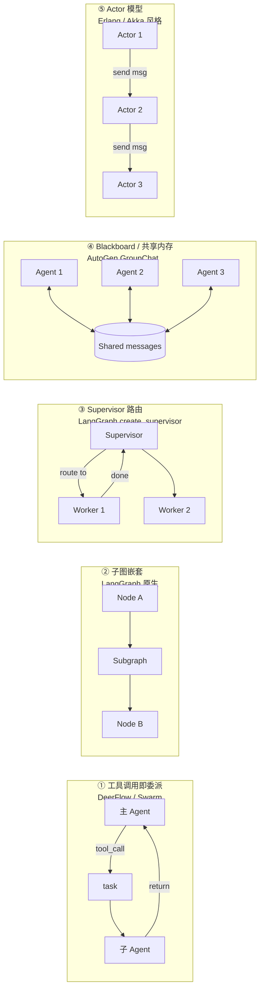

# 12 横向对比 — DeerFlow vs 其他主流 Agent 方案

> 面试口径：DeerFlow 不是孤岛，它在 Multi-Agent / Agent 编排领域有大量竞品。这一章做**6 个维度**的横向对比 —— ① 多 Agent 框架（CrewAI / AutoGen / LangGraph / Swarm / MetaGPT 等）② 通信范式（工具委派 / 子图 / Supervisor / Actor / Blackboard）③ 并发调度（ThreadPool / Ray / Temporal / Celery）④ 可观测性（Langfuse / LangSmith / Helicone / 自建 RunJournal）⑤ 记忆方案（LangChain Memory / Mem0 / Letta / DeerFlow Skills）⑥ 决策矩阵：**什么场景选什么**。这章面试有用 —— 当面试官问"为什么不用 X" 你能直接给出技术理由。

**本章课程目标：**

- 把 DeerFlow 在主流 Agent 框架里的"坐标"找清楚
- 知道每个竞品的强项 + 弱项 + 典型场景
- 掌握 6 个维度的对比表格（背 1 个表能撑面试 5 分钟）
- 学会"按场景选型"的决策框架

**学习建议：** 这章建议**对照实物体验** —— 至少跑过 2-3 个其他框架的 hello-world（比如 CrewAI 的 `pip install crewai` + 跑个 demo），对比时才有体感。光看表格不动手，对比会停留在"知识点"层级，下面到"工程取舍"层级要靠手感。

---

## 1、本章导读

### 1.1 为什么要做横向对比

面试场景：

> 面试官："你们用 LangGraph 做主子智能体通信。我们项目用的是 CrewAI，你觉得有什么差异？"
>
> 不会对比的回答："CrewAI 我没用过，所以不太清楚..."  → 减分
>
> 会对比的回答："CrewAI 是基于角色（Role）+ 任务（Task）的预定义编排，子 Agent 数量编译期就定。DeerFlow 用工具调用即委派模式，fork 数量由 LLM 运行时决定。简单分工型任务 CrewAI 更简洁，但需要按用户问题动态拆解的场景 DeerFlow 灵活性强..."  → 加分

**对比的本质：让你的方案选择有"被否决的可能"** —— 这反而是技术深度的体现。

### 1.2 本章 6 个对比维度

```
DeerFlow ⟷ 业界主流 Agent 方案
│
├─ §2 多 Agent 框架对比（CrewAI / AutoGen / Swarm / MetaGPT / DeepFlow / OpenManus）
├─ §3 通信范式对比（5 种模式横向）
├─ §4 并发调度对比（ThreadPool / Ray / Temporal / Celery）
├─ §5 可观测性对比（Langfuse / LangSmith / Helicone / 自建）
├─ §6 记忆方案对比（LangChain Memory / Mem0 / Letta / Skills）
└─ §7 决策矩阵（按场景选型）
```

---

## 2、多 Agent 框架对比

### 2.1 全景表

| 框架 | 核心范式 | fork 时机 | 编程语言 | 学习曲线 | 适合场景 |
| --- | --- | --- | --- | --- | --- |
| **DeerFlow** | 工具调用即委派 | LLM 运行时决定 | Python | 中（要懂 LangGraph） | 用户问题驱动的动态拆解 |
| CrewAI | Role + Task 预定义 | 编译期定义 | Python | 低 | 预定义流水线（写作/研究/营销） |
| AutoGen (Microsoft) | 多 Agent 对话（GroupChat） | 运行时（Manager 决定） | Python | 中 | 角色扮演协作（PM / Dev / QA） |
| OpenAI Swarm | 函数级 handoff | 运行时（return Agent） | Python | 极低 | 简单路由（实验性） |
| MetaGPT | SOP 流水线 | 编译期 + 运行时混合 | Python | 高 | 软件开发（PRD → Code） |
| LangGraph 原生 | StateGraph 节点 | 编译期 | Python/JS | 中 | 强 typed 工作流 |
| LlamaIndex Agent | ReAct + Workflow | 运行时 | Python/TS | 低 | RAG-heavy 场景 |
| DSPy | 程序式优化 | 编译期 | Python | 高 | 研究 / 自动 prompt 优化 |
| AutoGPT / BabyAGI | 自驱循环 | 运行时（"下一步"） | Python | 极低 | 玩具 / 概念验证 |

### 2.2 详细对比

#### CrewAI vs DeerFlow

```python
# CrewAI 写法
from crewai import Agent, Task, Crew

researcher = Agent(role="Researcher", goal="...", tools=[search])
writer = Agent(role="Writer", goal="...", tools=[])

task1 = Task(description="搜索资料", agent=researcher)
task2 = Task(description="写报告", agent=writer)

crew = Crew(agents=[researcher, writer], tasks=[task1, task2])
result = crew.kickoff()
```

```python
# DeerFlow 写法（伪代码）
# 主 Agent 自己决定何时调 task
# 用户问"分析腾讯财报"
# LLM 输出: task(prompt="搜索财报", subagent_type="general-purpose")
# task_tool 后台启动子 Agent → 回流结果 → LLM 继续推理
```

**核心差异：**

| 维度 | CrewAI | DeerFlow |
| --- | --- | --- |
| Agent 定义 | 显式定义角色（researcher / writer） | 单一 lead_agent + 动态 fork |
| 任务拆解 | 开发者预先定义 task1 → task2 | LLM 看到用户问题自己决定 |
| 灵活性 | 任务流固定，新任务要改代码 | 任意问题都能动态处理 |
| 复杂度 | 简单（拖个 YAML） | 高（要懂 LangGraph + 中间件） |

**典型场景：**
- ✅ CrewAI 适合：写作流水线（搜资料 → 写大纲 → 写正文 → 校对）—— 流程固定
- ✅ DeerFlow 适合：通用研究 Agent（用户什么问题都能问，无法预知）

#### AutoGen vs DeerFlow

AutoGen 的核心是 **GroupChat**：多个 Agent 在共享消息队列里轮流发言，Manager Agent 决定下一轮谁说。

```python
# AutoGen
from autogen import AssistantAgent, UserProxyAgent, GroupChat, GroupChatManager

pm = AssistantAgent(name="PM", system_message="你是产品经理")
dev = AssistantAgent(name="Dev", system_message="你是工程师")
qa = AssistantAgent(name="QA", system_message="你是测试")

groupchat = GroupChat(agents=[pm, dev, qa], messages=[])
manager = GroupChatManager(groupchat=groupchat)

user = UserProxyAgent(name="user")
user.initiate_chat(manager, message="设计一个登录系统")
```

**关键差异：**

| 维度 | AutoGen | DeerFlow |
| --- | --- | --- |
| 通信方式 | 消息共享（GroupChat） | 工具调用隔离 |
| 上下文 | 所有 Agent 看同一消息流 | 子 Agent 独立消息历史 |
| token 消耗 | 高（每个 Agent 都看全部历史） | 低（子 Agent 只看自己任务） |
| 适合 | 多角色对话 / 头脑风暴 | 任务委派 / 并行研究 |

**为什么 DeerFlow 不选 AutoGen 模式？**
- token 爆炸：5 个 Agent × 100k context = 500k 输入 token / 轮
- 调试困难：消息流交错，trace 难还原
- 非并行：必须按"轮"发言

#### OpenAI Swarm vs DeerFlow

Swarm 是 OpenAI 开源的极简 Agent 框架：

```python
from swarm import Swarm, Agent

def transfer_to_specialist():
    return specialist_agent  # ← 返回一个 Agent，自动 handoff

triage = Agent(
    name="Triage",
    instructions="...",
    functions=[transfer_to_specialist],
)
specialist = Agent(name="Specialist", ...)

client = Swarm()
result = client.run(agent=triage, messages=[...])
```

**核心机制：函数返回 Agent 即触发 handoff** —— 极简但功能有限。

**对比：**

| 维度 | Swarm | DeerFlow |
| --- | --- | --- |
| 复杂度 | 极低（300 行核心代码） | 高（万行级） |
| 状态管理 | 共享 context_variables | 独立 state + 共享 sandbox |
| 并发 | 串行 handoff | 并发 fork（max 3） |
| token 追踪 | 无 | 双链路（消息 + 审计） |
| 生产可用 | ❌ 实验性 | ✅ 工程级 |
| 适合 | 学习 / Demo | 生产部署 |

#### MetaGPT vs DeerFlow

MetaGPT 模拟软件公司 SOP（Standard Operating Procedure）：

```
用户需求
  ↓
ProductManager 写 PRD
  ↓
Architect 出系统设计
  ↓
ProjectManager 拆 task
  ↓
Engineer 写代码
  ↓
QA 写测试
```

**特点：**
- 每个 Agent 是固定职能（PM / 架构师 / 工程师 / QA）
- 流程像企业 SOP，强 schema 规范输出（PRD / API doc / Code）
- 适合软件开发，**不通用**

**对比：**

| 维度 | MetaGPT | DeerFlow |
| --- | --- | --- |
| 定位 | 垂直（软件开发） | 通用 |
| Agent 数 | 5-7 个固定 | 1 个 lead + 动态 N 个 sub |
| 输出格式 | 强结构（PRD / Code） | 灵活（看子 Agent 需求） |
| 协作模式 | SOP 串行 | 工具调用并行 |

**典型选择：**
- 写代码项目 → MetaGPT
- 通用研究 / 客服 / 分析 → DeerFlow

### 2.3 国内开源生态补充

| 框架 | 特点 | 对比 DeerFlow |
| --- | --- | --- |
| **字节 Coze / 扣子** | 低代码可视化编排 | DeerFlow 是代码级框架，灵活但门槛高 |
| **阿里 ModelScope-Agent** | 中文优先 + 国产模型适配 | DeerFlow 模型无关（OpenAI / Claude / DeepSeek 都可） |
| **百度 AppBuilder** | 企业 SaaS + 文心绑定 | DeerFlow 开源 + 自部署 |
| **OpenManus** | DeerFlow 同代，开源 Agent 框架 | 设计哲学接近，OpenManus 重沙箱执行，DeerFlow 重通信架构 |

---

## 3、通信范式对比（5 种模式）

### 3.1 五种范式速查



### 3.2 详细对比

| 范式 | 代表实现 | 通信介质 | 共享状态 | 解耦程度 | 调试难度 |
| --- | --- | --- | --- | --- | --- |
| ① 工具调用即委派 | **DeerFlow**, Swarm | 函数返回值（ToolMessage）| 引用传递 sandbox | 高 | 中（trace 清晰） |
| ② 子图嵌套 | LangGraph StateGraph | state dict（图层传递）| 完全共享 | 低（紧耦合） | 中 |
| ③ Supervisor 路由 | LangGraph create_supervisor | 路由字段（next） | 完全共享 | 中 | 低 |
| ④ Blackboard | AutoGen GroupChat | 共享消息队列 | 完全共享 | 极低 | 高（消息交错） |
| ⑤ Actor 模型 | Erlang/OTP, Akka | 异步消息 | 无共享（隔离） | 极高 | 高（异步死锁） |

### 3.3 选型决策

```
任务能拆成"主 Agent + N 个独立子任务"？
├─ Yes：用 ① 工具调用（DeerFlow）—— 灵活并行
└─ No：流程固定？
        ├─ Yes，分支多：用 ② 子图（LangGraph）—— 强 typed
        └─ Yes，路由型：用 ③ Supervisor —— 简洁
        └─ No，多角色辩论：用 ④ Blackboard（AutoGen）—— 但小心 token
        └─ No，超大规模异步：用 ⑤ Actor —— 但工程复杂度高
```

### 3.4 为什么 DeerFlow 不选其他模式

| 没选 ② 子图 | 因为子任务数量要 LLM 运行时决定，不能编译期固定 |
| --- | --- |
| 没选 ③ Supervisor | 因为 Supervisor 是预定义路由，DeerFlow 要让 LLM 自己决定 fork 几个 |
| 没选 ④ Blackboard | 因为 token 爆炸 + 消息交错难调试 |
| 没选 ⑤ Actor | 因为同进程多线程已够用，Actor 工程复杂度不值得 |

---

## 4、并发调度对比

### 4.1 四种调度方案

| 方案 | DeerFlow（ThreadPool） | Ray Serve | Temporal | Celery |
| --- | --- | --- | --- | --- |
| 部署 | 单进程 | 集群 | 集群 + Temporal Server | 集群 + Broker |
| 状态共享 | 进程内引用 | 序列化 | 序列化 + DB 持久化 | 序列化 + 队列 |
| 故障恢复 | ❌ 进程挂 = 全丢 | ⚠️ Actor 重启 | ✅ 完整 replay | ✅ 任务重试 |
| 任务持久化 | ❌ in-memory | ⚠️ 部分 | ✅ 完整 | ⚠️ 可选 |
| 长任务支持 | 900s timeout | 无限 | 无限 + 历史 replay | 无限 |
| 复杂度 | 低 | 中 | 高 | 中 |
| 适合规模 | 单机几十 RPS | 集群千级 RPS | 长流程业务 | 异步任务 |

### 4.2 为什么 DeerFlow 选 ThreadPool

**当前规模假设：** 单机部署，几十 RPS，短任务（<15 分钟）。

```python
# subagents/executor.py:151
_scheduler_pool = ThreadPoolExecutor(max_workers=3, ...)
```

**简单换来什么：**
- 实现成本极低（标准库一行）
- 调试容易（单进程，print / pdb 都好用）
- 部署简单（一个 docker 镜像就完事）

**代价：**
- 单点故障：进程挂 = 所有 in-flight task 丢失
- 横向扩展难：多 worker 不能跨实例 fork

**升级路径：** 当规模上来时，可以**逐层替换**而不重写：
1. 把 `_scheduler_pool` 换成 Ray Actor pool（中间件无感）
2. 把 `_background_tasks` 换成 Redis（多实例共享状态）
3. 把 `task_tool` 改为提交到 Temporal workflow（持久化任务）

### 4.3 Ray vs ThreadPool

```python
# Ray 写法
import ray

@ray.remote
class SubagentActor:
    def __init__(self, config):
        self.config = config
    
    async def execute(self, task):
        # ... 子 Agent 逻辑
        return result

actors = [SubagentActor.remote(config) for _ in range(10)]
futures = [actor.execute.remote(task) for actor in actors]
results = ray.get(futures)  # 并行结果
```

**优势：**
- 跨节点 / 跨进程
- Actor 可以有内部状态（不是无状态函数）
- 故障恢复（Actor 挂了自动重建）

**何时换 Ray：**
- 单机已经吃满（>50 RPS）
- 需要 GPU 隔离（每个 Actor 独占一张卡）
- 需要 Python-only 解决方案（不想引入 Temporal Server 这种重量级依赖）

### 4.4 Temporal vs ThreadPool

Temporal 是工作流引擎，**最大特点是 replay**：

```python
@workflow.defn
class SubagentWorkflow:
    @workflow.run
    async def run(self, task: str) -> str:
        # 这段代码会被持久化每一步状态
        result1 = await workflow.execute_activity(call_llm, task, ...)
        result2 = await workflow.execute_activity(call_tool, result1, ...)
        return result2
```

**关键能力：进程挂了重启后，从挂点继续跑**（基于事件日志 replay）。

**何时选 Temporal：**
- 子 Agent 任务跑数小时（如批量数据分析）
- 不能容忍 task 丢失（财务相关）
- 需要可视化工作流监控

**何时不选：**
- 任务都是短的（<15 分钟）—— Temporal Server 部署成本不划算
- 团队没用过 Temporal —— 学习曲线陡

### 4.5 选型矩阵

```
任务时长 / 状态需求矩阵：

       短任务 (<15min)          长任务 (>1hr)
       ┌─────────────────────┬─────────────────────┐
无状态 │ ThreadPool          │ Celery              │
       │ ✅ DeerFlow 当前    │                     │
       ├─────────────────────┼─────────────────────┤
有状态 │ Ray Actor           │ Temporal            │
       │                     │                     │
       └─────────────────────┴─────────────────────┘
```

DeerFlow 当前在左上格 —— 短任务、状态在 dataclass 里。

---

## 5、可观测性对比

### 5.1 四种方案

| 方案 | DeerFlow RunJournal | LangSmith | Langfuse | Helicone |
| --- | --- | --- | --- | --- |
| 部署 | 自建（嵌入 SQL） | LangChain 官方 SaaS | 开源 + SaaS | SaaS / 自托管 |
| 数据存储 | RunEventStore（自建 SQL） | LangChain 服务器 | Postgres | ClickHouse |
| Trace 完整度 | ✅ 全量（messages / tools / token） | ✅ 全量（仅 LangChain 生态） | ✅ 全量 + score | ✅ 全量 |
| 评测能力 | ❌ 需自己写 | ✅ Eval 内置 | ✅ Eval + Score | ⚠️ 简单 |
| Token 桶分类 | ✅ caller 桶（lead/sub/middleware） | ⚠️ tags 自定义 | ✅ tags + cost | ✅ user/model |
| 可定制 | ✅ 完全可改 | ❌ 黑盒 | ✅ 开源可改 | ⚠️ 部分 |
| 成本 | 自己机器（几乎免费） | 按用量付费 | 自托管免费 / SaaS 付费 | 按 token 付费 |
| 多租户隔离 | ✅ 按 user_id | ⚠️ project 级 | ✅ project + user | ⚠️ user 级 |

### 5.2 为什么 DeerFlow 自建 RunJournal

**理由：**
1. **Token 三层合并**：第三方平台不知道 DeerFlow 的"父子合并语义"，需要自己实现
2. **多租户绑定**：`user_id` 隔离要在框架层强制执行，不能依赖外部
3. **审计要求**：企业部署可能要求 trace 不出公司
4. **零成本**：开源框架不绑订阅服务

**LangSmith / Langfuse 仍能用吗？** 能，作为**额外的回调**：

```python
# agents/lead_agent/agent.py：可以同时挂多个 callback
config["callbacks"] = [
    run_journal,           # DeerFlow 自建
    langfuse_handler,      # 同时上报 Langfuse（额外）
    langsmith_handler,     # 同时上报 LangSmith
]
```

每个回调独立处理，不冲突 —— **DeerFlow 的设计是兼容的**。

### 5.3 何时选哪个

| 场景 | 推荐 |
| --- | --- |
| 完全自部署 + 数据不出公司 | DeerFlow RunJournal |
| 需要快速可视化看 trace | + Langfuse（自托管） |
| 全 LangChain 生态 + 能付费 | + LangSmith |
| 只关心 token 成本 | Helicone |
| 全都不要，只看日志 | python logging（Loki / Elasticsearch） |

---

## 6、记忆方案对比

### 6.1 四种记忆方案

| 维度 | LangChain Memory | Mem0 | Letta (MemGPT) | DeerFlow Skills |
| --- | --- | --- | --- | --- |
| 介质 | conversation buffer / vector | 向量 + KV | 内存层级（context / archive） | Markdown 文件 |
| 写入时机 | 自动（每轮） | 自动（提取事实） | Agent 自决（write_memory） | 手动 / Agent 自演化 |
| 读取时机 | 拼到 prompt | 检索 top-k 拼 prompt | 按层级动态加载 | 静态加载到 system prompt |
| 可读性 | 差（内嵌 prompt） | 中（有 fact） | 中 | ✅ 极强（人类可编辑） |
| 多租户 | ⚠️ 自己组装 | ✅ user_id | ✅ Agent ID | ✅ 路径隔离 |
| 模型独立 | ✅ | ✅ | ⚠️（LM 偏 GPT-4） | ✅ |

### 6.2 LangChain Memory（旧版）

```python
from langchain.memory import ConversationBufferMemory

memory = ConversationBufferMemory(memory_key="chat_history")
chain = LLMChain(llm=llm, prompt=prompt, memory=memory)
```

**问题：**
- 简单 buffer：会爆 token
- ConversationSummaryMemory：摘要损失信息
- VectorStoreMemory：检索质量看 embedding

**已被 LangGraph 的 checkpointer + state 机制替代。**

### 6.3 Mem0 — 最近热门

Mem0 (mem0.ai) 是专门做"Agent 长期记忆"的开源库：

```python
from mem0 import Memory

m = Memory()
m.add("用户喜欢简洁回答，不要过多解释", user_id="user_123")

# 后续对话
relevant = m.search(query="...", user_id="user_123")  # → 检索相关记忆
```

**特点：**
- 自动从对话提取"事实"（基于 LLM）
- 向量 + 元数据双存储
- 多租户隔离

**对比 DeerFlow Skills：**

| 维度 | Mem0 | DeerFlow Skills |
| --- | --- | --- |
| 存储 | 向量 DB | Markdown 文件 |
| 召回 | 语义检索 | 全部加载（按 SKILL.md 数量） |
| 用途 | 用户偏好 / 历史事实 | 团队规范 / 操作手册 |
| 修改 | 调 API | 直接编辑 .md 文件 |

**典型组合：** Mem0 做"用户偏好记忆"，Skills 做"团队规范" —— 互补。

### 6.4 Letta (MemGPT) — 论文驱动

Letta 实现了 MemGPT 论文的 OS 层级记忆：

```
┌─────────────────────────┐
│  Main Context (LLM 看)  │ ← 8k token
├─────────────────────────┤
│  Working Memory (KV)    │ ← Agent 自己 swap in/out
├─────────────────────────┤
│  Archival Storage       │ ← 向量 DB（无限容量）
└─────────────────────────┘
```

**特点：**
- Agent 通过工具 `archival_memory_insert` / `core_memory_replace` 主动管理记忆
- 支持"主题切换"（Agent 自己换 context）

**对比 DeerFlow：**
- DeerFlow 没有"动态 context swap"概念，靠 Summarization 中间件被动压缩
- Letta 更适合"客服机器人"这种长会话场景
- DeerFlow 更适合"任务执行"这种短会话场景

### 6.5 DeerFlow Skills 独特价值

```
skills/
├── builtin/
│   └── citation_format/SKILL.md
├── custom/                          # ← 自演化目录
│   └── comparison_table_format/SKILL.md   ← 用户/Agent 自动生成
└── ...
```

**SKILL.md 示例：**

```markdown
---
name: comparison_table_format
description: 多对象对比时使用统一的特性矩阵格式
---

# When to use
当用户要求对比 ≥ 3 个实体时

# How to do it
1. 列出对比维度（最多 5 个）
2. 用 Markdown 表格输出
3. 每个维度配一句简短的 trade-off 评论

# Example
...
```

**为什么这种方式有独特价值：**

| 场景 | 传统方案 | Skill 方案 |
| --- | --- | --- |
| 用户说"以后对比都用表格" | 改 system prompt（影响所有任务） | 加 SKILL.md（按需触发） |
| 团队约定文档规范 | 培训 / 文档 | 加 SKILL.md（Agent 自动遵守） |
| 用户偏好记录 | 存 DB + 拼 prompt | 直接 .md 文件 |

**关键差异：Skills 是"被加载"的，不是"被检索"的** —— 所以零延迟、强可解释。

---

## 7、决策矩阵：按场景选型

### 7.1 三个核心维度

```
       任务复杂度（单任务步数）
          ↑
    高    │
          │  ┌──────────────────┐
          │  │ DeerFlow         │
          │  │ MetaGPT          │
          │  │ AutoGen GroupChat│
          │  └──────────────────┘
          │
          │  ┌──────────────────┐
          │  │ LangGraph 子图    │
          │  │ DSPy             │
          │  └──────────────────┘
          │
          │  ┌──────────────────┐
    低    │  │ Swarm / 直接调 LLM│
          │  │ LangChain Agent   │
          │  └──────────────────┘
          └────────────────────────→
                              并发需求（同时跑几个 Agent）
                       低                      高
```

### 7.2 完整决策树

```
1. 单一任务还是多任务并行？
   ├─ 单一 → 用 LangChain Agent / 直接 LLM 调用
   └─ 多任务 → 进入 2

2. 任务流程固定还是动态？
   ├─ 固定 SOP → MetaGPT（软件开发）/ CrewAI（写作流水线）
   └─ 动态 → 进入 3

3. 子任务能完全独立吗？
   ├─ 否，需要协作辩论 → AutoGen GroupChat
   └─ 是，可隔离 → 进入 4

4. 需要复杂状态共享吗？
   ├─ 是 → LangGraph 子图（强 typed）
   └─ 否 → DeerFlow（最灵活）
```

### 7.3 实际场景对应

| 场景 | 推荐框架 | 理由 |
| --- | --- | --- |
| 多源资料研究 Agent | **DeerFlow** | 子任务独立、并行、动态数量 |
| 客服机器人（长会话） | Letta + LangGraph | 需要长期记忆 + 状态机 |
| 写作流水线（搜资料 → 大纲 → 正文） | CrewAI | 流程固定、Role 清晰 |
| 软件开发助手（PRD → Code） | MetaGPT | 强结构输出、SOP 模拟 |
| 多人对话模拟（PM/Dev/QA） | AutoGen | 共享消息流 |
| 简单分类路由 | OpenAI Swarm | 函数级 handoff 够用 |
| 数据分析 / SQL 查询 | LangChain Agent + ReAct | 单 Agent 单工具 |
| 通用研究 + 代码 + 数据 | **DeerFlow** + Skills | 灵活拆解 + 用户规范沉淀 |

### 7.4 大厂内部用什么

公开信息可查的：

| 公司 | 项目 | 用什么 |
| --- | --- | --- |
| Anthropic | Claude Code | 自研（基于 Anthropic SDK + Skills） |
| OpenAI | ChatGPT | 自研 + Function Calling 直接 |
| Microsoft | Copilot | 自研 + AutoGen 内核 |
| Google | Gemini Code Assist | 自研 |
| 字节 | 豆包 / Trae | 自研 |
| 美团 / 阿里 | 内部 Agent 平台 | 多数自研，部分基于 LangGraph |

**结论：** 大厂在 Agent 编排这一层基本都是**自研**，因为 ① 框架的灵活性瓶颈 ② token 控制要求 ③ 多租户隔离。但都在某种程度上**借鉴了 LangGraph / DeerFlow / AutoGen 的核心思想**。

DeerFlow 这种"开源工程级实现"的价值就是 —— **它把大厂内部的工程经验暴露成代码**，能学。

---

## 8、本章 ❓→💡 问答

### Q1：为什么不直接用 CrewAI / AutoGen 这种现成框架？

**A：** 三个理由：
1. **灵活性**：CrewAI 的 Role / Task 是预定义的，DeerFlow 要支持"任意用户问题"，子任务数量必须运行时决定
2. **token 控制**：AutoGen GroupChat 的共享消息流会爆 token（每个 Agent 都要看完整历史），DeerFlow 子 Agent 隔离上下文
3. **生产级要求**：CrewAI / AutoGen 的可观测性 / 取消机制 / 并发控制都不够工程化，DeerFlow 自己实现了完整的 Token 三层合并 / 协作式取消 / 三层并发防护

不是说它们不好，而是 DeerFlow 的目标场景（动态拆解 + 高度定制 + 工程级生产）和它们错位。

### Q2：LangGraph 子图能不能解决 DeerFlow 的问题？

**A：** 不能完整解决，三个限制：
1. **节点数编译期固定**：`builder.add_node` 必须在编译期调用，子任务数量不能运行时决定
2. **状态共享**：子图修改 state 会回流到父图，不是真正的隔离
3. **Cancel 不灵**：LangGraph 的 cancel 是图级的，不是节点级，子节点跑到一半难单独 cancel

DeerFlow 的方案在 LangGraph 之上**多包了一层 task_tool**，恰好弥补这三个限制。

### Q3：DeerFlow 想横向扩展应该怎么改？

**A：** 三步走（已在第 10 章 Q22 详细写过，这里精简）：
1. **共享状态去中心化**：`_background_tasks` / `_subagent_usage_cache` 改 Redis
2. **调度池升级**：`ThreadPoolExecutor` 改 Ray Actor pool 或 Celery
3. **Trace 持久化**：`RunEventStore` 升级到分布式存储（PG + S3）

但**先评估真有必要**：单进程方案能扛几十 RPS，很多团队跑不到这个规模。

### Q4：DSPy 能不能配合 DeerFlow 用？

**A：** 可以，DSPy 的优势是 **prompt 自动优化**（不是 Agent 编排）。组合方式：
- DSPy 优化每个子 Agent 的 prompt（编译期）
- DeerFlow 处理多 Agent 编排（运行期）

类似的还有：
- Guidance / LMQL：约束 LLM 输出格式
- Outlines：结构化输出

这些都是**正交能力**，可以叠加用。

### Q5：Mem0 / Letta 能直接接进 DeerFlow 吗？

**A：** 能，作为中间件接入：
- 写一个 `MemoryMiddleware` 在 `before_agent` 钩子里调用 `mem0.search` 把相关记忆拼到 system prompt
- 在 `after_agent` 钩子里调用 `mem0.add` 把这次对话存进去

DeerFlow 自己已经有 `MemoryMiddleware`（基础版），如果要 Mem0 这种语义检索能力，可以替换或叠加实现。

---

## 9、本章总结

**6 个对比维度速记：**

```
1. 框架：DeerFlow / CrewAI / AutoGen / Swarm / MetaGPT / LangGraph 原生 / LlamaIndex / DSPy
2. 范式：工具委派 / 子图 / Supervisor / Blackboard / Actor
3. 调度：ThreadPool / Ray / Temporal / Celery
4. 观测：RunJournal / Langfuse / LangSmith / Helicone
5. 记忆：LangChain Memory / Mem0 / Letta / Skills
6. 决策：按"任务复杂度 × 并发需求 × 流程固定度"三维定位
```

**面试核心金句：**

> "DeerFlow 在 Agent 编排领域选了**'工具调用即委派 + 同进程多线程 + 自建可观测'**这条路。
>
> 不选 CrewAI 因为子任务要 LLM 运行时决定；
> 不选 LangGraph 子图因为节点数编译期固定；
> 不选 AutoGen 因为消息共享 token 爆炸；
> 不选 Ray/Temporal 因为单机已经够；
> 不选 Langfuse/LangSmith 因为 Token 三层合并需要自定义。
>
> 它的边界是：**单机几十 RPS、动态拆解任务、强多租户隔离需求** —— 在这个场景里它的工程取舍是合理的。规模再大要替换底层，但上层接口可以保持。"

读完这章，你就能在面试里**自信地讲清"为什么 X 不行、Y 才行"** —— 这是从"懂 DeerFlow"上升到"懂 Agent 编排领域"的关键一跃。

---

## 10、附录：选型 cheat sheet（一页背完）

```
                   是 ┌─→ Swarm（极简）
                      │   LangChain Agent（带工具）
              ┌─单 Agent┤
              │       └─→ ReAct / Function Calling
   只有       │
   LLM 调用 ─┤
              │       ┌─→ 静态流程：CrewAI / MetaGPT
              │       │
              └─多 Agent┤── 共享消息：AutoGen GroupChat
                      │
                      └─→ 动态拆解 + 隔离：✅ DeerFlow
                          (+ Skills 演化)


   并发上限                  ⟶  存储层
   ──────                       ──────
   少量 (单机)：ThreadPool       in-memory dict (DeerFlow 当前)
   中等 (多机)：Ray Actor        + Redis 状态共享
   大型 (持久)：Temporal         + Postgres + S3 trace
   异步 (任意)：Celery           + 消息队列 (Kafka/RabbitMQ)


   可观测性                  ⟶  记忆方案
   ──────                       ──────
   自建免费：RunJournal         短期上下文：LangGraph state
   托管 SaaS：LangSmith         事实记忆：Mem0
   开源自托管：Langfuse         OS 层级：Letta (MemGPT)
   只看成本：Helicone           规则沉淀：DeerFlow Skills
```

把这张图背熟，面试官随便问"为什么不用 X" 都能秒回。
