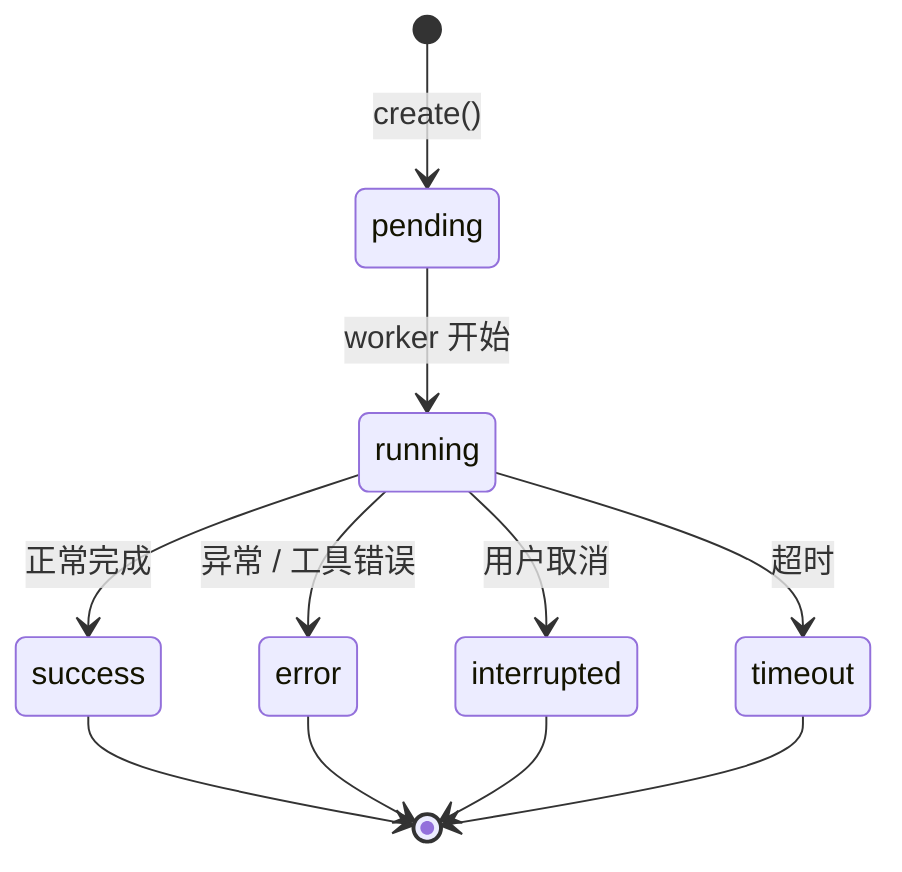
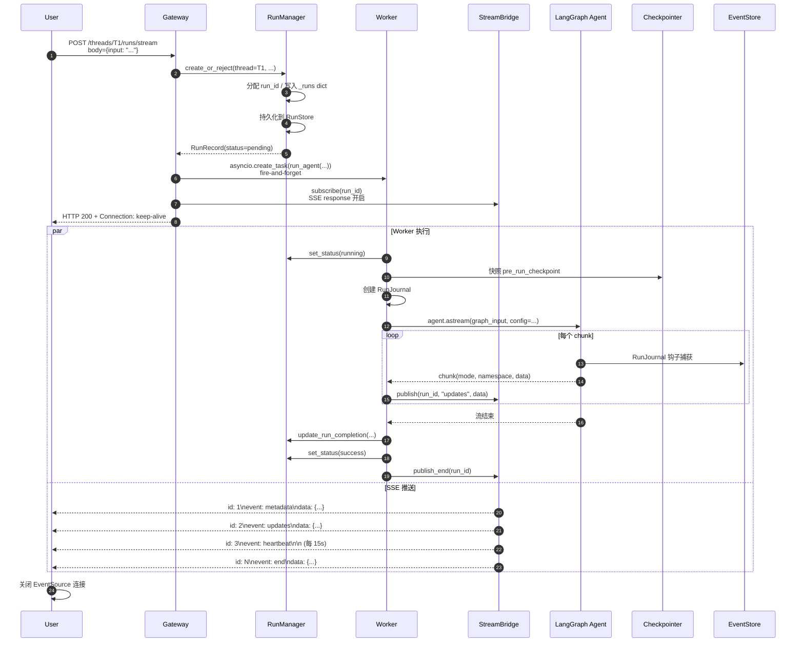

# 13 整体架构 — Worker / RunManager / Gateway / Checkpointer / StreamBridge 全栈

> 面试口径：之前 1-12 章把 DeerFlow 的"主子智能体通信"切面讲透了，但**整个 DeerFlow 远不止这一块**。从用户在前端发 HTTP 请求到 SSE 流式回写，中间还有 Gateway → RunManager → Worker → LangGraph → Checkpointer → StreamBridge → EventStore 完整链路。这一章把这些"基础设施层"模块全部走一遍，让你不只懂"通信"，更懂"DeerFlow 是怎么作为一个完整 Agent 平台运行的"。**这是大厂面试'整体架构'必问环节的标准答案**。

**本章课程目标：**

- 掌握 DeerFlow 全栈 7 层架构（Gateway / RunManager / Worker / LangGraph Agent / Checkpointer / StreamBridge / EventStore）
- 理解每一层的核心职责与关键文件
- 吃透 `run_agent` 函数 700 行的完整流程
- 知道 DeerFlow 借鉴了 LangGraph Platform 的哪些设计 / 自己解决了哪些问题
- 能在面试白板画出完整请求时序图

**学习建议：** 这章信息量最大，建议**对着源码画时序图**。打开 `runtime/runs/worker.py`、`runtime/runs/manager.py`、`runtime/stream_bridge/base.py` 三个文件，按本章 §3 的 8 步逐段定位。画完图后用一句话回答："如果 Gateway 挂了 / Worker 挂了 / Checkpointer 挂了，分别会发生什么？"

---

## 1、本章导读

### 1.1 全栈分层

```
┌─────────────────────────────────────────────────────────────────┐
│ 用户                                                             │
└────────────┬────────────────────────────────────┬───────────────┘
             │ HTTP POST /threads/X/runs/stream   │ SSE 长连接
             ▼                                    ▲
┌─────────────────────────────────────────────────────────────────┐
│ Gateway (FastAPI / gateway/app.py)                               │
│  - HTTP 路由 + 认证 + 限流                                        │
│  - 创建 RunRecord / 启动 Worker / 订阅 StreamBridge              │
└────────┬────────────────────────────┬───────────────────────────┘
         │                            │
         ▼                            ▼
┌──────────────────┐        ┌──────────────────────┐
│ RunManager       │        │ StreamBridge         │
│  - Run 状态机    │        │  - 事件队列（生产/消费分离） │
│  - 持久化        │        │  - SSE 重连支持      │
│  - 取消信号      │        │  - 心跳防超时        │
└──────────────────┘        └──────────────────────┘
         │                            ▲
         │ 启动 background task        │ publish events
         ▼                            │
┌─────────────────────────────────────┴───────────────────────────┐
│ Worker (runtime/runs/worker.py:run_agent)                       │
│  - 创建 RunJournal                                               │
│  - 构造 RuntimeContext                                           │
│  - agent.astream() 驱动 LangGraph 图执行                          │
│  - 把 chunk 翻译成 StreamBridge 事件                             │
│  - 错误处理 / 回滚 checkpoint                                    │
└────────┬────────────────────────────────────┬───────────────────┘
         │                                    │
         ▼                                    ▼
┌──────────────────────┐        ┌────────────────────────┐
│ LangGraph Agent      │        │ RunJournal (callback)  │
│  - StateGraph 编译图 │        │  - 捕获每次 LLM 调用    │
│  - 19 中间件链       │        │  - Token 累加           │
│  - 节点：model + tool│        │  - 写入 EventStore      │
│  - state_schema=ThreadState                                     │
└──────────┬───────────┘        └────────────────────────┘
           │
           ▼
┌──────────────────────┐
│ Checkpointer         │
│  - SQLite/Postgres   │
│  - 状态持久化         │
│  - 跨请求恢复         │
└──────────────────────┘
```

### 1.2 7 层模块速查表

| 层 | 模块 | 文件 | 核心职责 |
| --- | --- | --- | --- |
| 1 | Gateway | `gateway/app.py` | HTTP/SSE 入口、路由、认证 |
| 2 | RunManager | `runtime/runs/manager.py` | Run 生命周期管理 + 持久化 |
| 3 | StreamBridge | `runtime/stream_bridge/base.py` | 事件流生产/消费解耦 |
| 4 | Worker | `runtime/runs/worker.py` | 后台 Agent 驱动 + 错误处理 |
| 5 | LangGraph Agent | `agents/lead_agent/agent.py` | 主智能体图编排 |
| 6 | RunJournal | `runtime/journal.py` | 全量 trace + token 统计 |
| 7 | Checkpointer | `runtime/checkpointer/` | 状态持久化（memory / sqlite / postgres） |
| (附) | EventStore | `runtime/events/store/` | 历史事件回放 |
| (附) | RunStore | `runtime/runs/store/` | Run 元数据持久化 |
| (附) | Store | `runtime/store/` | 跨线程持久存储（用户记忆） |

---

## 2、Gateway 层 — HTTP 入口

### 2.1 职责

- HTTP 路由（`/threads/{tid}/runs/stream`、`/threads/{tid}/state`、`/feedback` 等）
- 用户认证 / 多租户隔离（`user_id` 注入到 context）
- 限流 / 超时 / CORS
- 启动 Worker 后台任务、订阅 StreamBridge 把事件转成 SSE response

### 2.2 关键端点（语义伪代码）

```python
# gateway/app.py 核心端点
@app.post("/threads/{thread_id}/runs/stream")
async def create_run_stream(
    thread_id: str,
    body: CreateRunRequest,
    user: User = Depends(get_current_user),
):
    # 1. 创建 RunRecord（写入 RunManager + 持久化到 RunStore）
    record = await run_manager.create_or_reject(
        thread_id=thread_id,
        assistant_id=body.assistant_id,
        kwargs=body.dict(),
        multitask_strategy=body.multitask_strategy,  # reject/interrupt/rollback/enqueue
        user_id=user.id,
    )
    
    # 2. 把 Worker 作为后台 asyncio.Task 启动
    record.task = asyncio.create_task(
        worker.run_agent(
            bridge=stream_bridge,
            run_manager=run_manager,
            record=record,
            ctx=run_context,
            agent_factory=lead_agent_factory,
            graph_input={"messages": [HumanMessage(body.input)]},
            config={"configurable": {"thread_id": thread_id}},
        )
    )
    
    # 3. 立即返回 SSE 流（订阅 StreamBridge）
    async def event_stream():
        async for event in stream_bridge.subscribe(record.run_id):
            yield f"id: {event.id}\nevent: {event.event}\ndata: {event.data}\n\n"
    
    return StreamingResponse(event_stream(), media_type="text/event-stream")
```

### 2.3 关键设计

| 设计点 | 说明 |
| --- | --- |
| Worker 异步启动 | `asyncio.create_task` fire-and-forget，立即返回 SSE 不阻塞 |
| 生产消费解耦 | Worker 写 StreamBridge，HTTP handler 读 StreamBridge |
| `multitask_strategy` | 同 thread 已有 run 时的策略：拒绝 / 中断旧的 / 排队 |
| `Last-Event-ID` 重连 | 客户端断线后重连时带上最后收到的 event_id，从该位置继续推 |

---

## 3、RunManager 层 — Run 生命周期

### 3.1 RunStatus 状态机



### 3.2 RunRecord 数据结构（关键字段）

```python
@dataclass
class RunRecord:
    run_id: str
    thread_id: str
    assistant_id: str | None
    status: RunStatus
    multitask_strategy: str = "reject"
    metadata: dict = field(default_factory=dict)
    kwargs: dict = field(default_factory=dict)
    
    # 运行时控制
    task: asyncio.Task | None = field(default=None, repr=False)
    abort_event: asyncio.Event = field(default_factory=asyncio.Event, repr=False)
    abort_action: str = "interrupt"   # "interrupt" or "rollback"
    error: str | None = None
    
    # Token 累加（来自 RunJournal）
    total_input_tokens: int = 0
    total_output_tokens: int = 0
    lead_agent_tokens: int = 0
    subagent_tokens: int = 0
    middleware_tokens: int = 0
    
    # 便捷字段
    first_human_message: str | None = None
    last_ai_message: str | None = None
```

### 3.3 RunManager 核心方法

```python
class RunManager:
    def __init__(self, store: RunStore | None = None, ...):
        self._runs: dict[str, RunRecord] = {}      # 内存注册表
        self._lock = asyncio.Lock()                  # 全局锁
        self._store = store                          # 持久化（可选）
        self._persistence_retry_policy = ...         # SQLite 瞬时错误重试
    
    async def create_or_reject(...) -> RunRecord:
        """按 multitask_strategy 创建或拒绝新 Run"""
        ...
    
    async def cancel(self, run_id: str, action: str = "interrupt") -> bool:
        """取消 Run：set abort_event + 在 worker 里被检查"""
        ...
    
    async def reconcile_orphaned_inflight_runs(...):
        """启动时把"上次崩溃留下的 running 状态"修正为 error"""
        ...
```

### 3.4 SQLite 重试策略（生产细节）

```python
# manager.py:34-90
def _is_retryable_persistence_error(exc):
    """判断是否瞬时 SQLite 错误（BUSY / LOCKED）"""
    err_msg = str(exc).lower()
    return "database is locked" in err_msg or "database is busy" in err_msg

class PersistenceRetryPolicy:
    max_attempts: int = 5
    initial_delay: float = 0.05
    backoff_multiplier: float = 2.0
    max_delay: float = 1.0
```

**为什么需要：**
- SQLite 在高并发写入时可能返回 SQLITE_BUSY（其他写者持锁）
- 一次写失败不该让整个 Run 失败 —— 指数退避重试 5 次
- 非瞬时错误（磁盘满 / schema 错）直接抛，不重试

### 3.5 multitask_strategy 四种策略

```python
# 用户在前端连发两条消息时的行为：
"reject":     拒绝新 Run，返回 409 Conflict
"interrupt":  取消旧 Run，启动新 Run（最常用）
"rollback":   取消旧 Run + 回滚到上一个 checkpoint
"enqueue":    排队，等旧 Run 完成后再启动
```

---

## 4、StreamBridge 层 — 事件流总线

### 4.1 抽象协议

```python
# stream_bridge/base.py
@dataclass(frozen=True)
class StreamEvent:
    id: str       # 单调递增 ID（支持 Last-Event-ID 重连）
    event: str    # SSE 事件名 ("metadata" / "updates" / "messages" / "task_running"...)
    data: Any     # 已预序列化的 payload
    ts: float     # 时间戳（用于 TTL）

class StreamBridge(abc.ABC):
    @abstractmethod
    async def publish(self, run_id: str, event: str, data: Any): ...
    
    @abstractmethod
    async def publish_end(self, run_id: str): ...
    
    @abstractmethod
    def subscribe(
        self, run_id: str, *, last_event_id: str | None = None,
        heartbeat_interval: float = 15.0,
    ) -> AsyncIterator[StreamEvent]: ...
```

### 4.2 内存实现（默认）

```python
# stream_bridge/memory.py（伪代码概念）
class InMemoryStreamBridge(StreamBridge):
    def __init__(self, max_buffer_size: int = 1000, ttl_seconds: float = 300):
        self._buffers: dict[str, deque[StreamEvent]] = {}    # run_id -> 事件 buffer
        self._end_flags: dict[str, bool] = {}
        self._waiters: dict[str, list[asyncio.Event]] = {}   # 唤醒消费者
        self._lock = asyncio.Lock()
    
    async def publish(self, run_id, event, data):
        async with self._lock:
            ev = StreamEvent(id=next_id(), event=event, data=data, ts=time.time())
            self._buffers.setdefault(run_id, deque(maxlen=1000)).append(ev)
            # 唤醒所有等待该 run 的消费者
            for waiter in self._waiters.get(run_id, []):
                waiter.set()
    
    async def subscribe(self, run_id, last_event_id=None, ...):
        last_seen = last_event_id
        while True:
            # 1. 拉取 last_event_id 之后的事件
            new_events = [e for e in self._buffers[run_id] if e.id > last_seen]
            for e in new_events:
                yield e
                last_seen = e.id
            
            # 2. 已结束就退出
            if self._end_flags.get(run_id):
                break
            
            # 3. 等待新事件或超时（心跳）
            waiter = asyncio.Event()
            self._waiters[run_id].append(waiter)
            try:
                await asyncio.wait_for(waiter.wait(), timeout=heartbeat_interval)
            except asyncio.TimeoutError:
                yield HEARTBEAT_SENTINEL
```

### 4.3 关键设计：生产消费解耦

```
Worker 生产                   StreamBridge                 SSE 消费
──────────                    ────────────                 ────────
agent.astream → chunk          ┌─────────────┐             SSE response
  publish("updates", ...)  ──▶ │ Buffer per  │ ──▶ subscribe()
  publish("messages", ...)     │  run_id     │       async for event:
  publish_end()                │             │           yield SSE format
                                └─────────────┘
```

**好处：**
- Worker 不需要等 SSE 客户端，发完就走（buffer 缓存）
- SSE 客户端断开重连不丢事件（`Last-Event-ID` + buffer 回放）
- 生产消费速率不匹配也不卡（buffer 有 maxlen 自动丢弃旧的）

### 4.4 心跳机制

```python
HEARTBEAT_SENTINEL = StreamEvent(id="", event="__heartbeat__", data=None)
```

**为什么需要：**
- 长任务（>1 分钟）期间没有真实事件，HTTP 连接可能被 LB / 代理超时关闭
- 每 15 秒发一个心跳事件，保持连接活跃
- 客户端忽略 `__heartbeat__` 事件，但 TCP/HTTP 层认为还活着

---

## 5、Worker 层 — Agent 执行驱动（核心）

### 5.1 RunContext

```python
@dataclass(frozen=True)
class RunContext:
    """单个 Run 所需的基础设施依赖集合."""
    checkpointer: Any                    # LangGraph Checkpointer
    store: Any | None = None             # LangGraph Store（用户记忆）
    event_store: Any | None = None       # RunEventStore（trace 持久化）
    run_events_config: Any | None = None
    thread_store: Any | None = None
    app_config: AppConfig | None = None
```

`RunContext` 把 Worker 需要的所有"基础设施"打包成一个不可变 dataclass —— 依赖注入清晰。

### 5.2 `run_agent` 函数完整流程（worker.py:143-477）

```python
async def run_agent(
    bridge: StreamBridge,
    run_manager: RunManager,
    record: RunRecord,
    *,
    ctx: RunContext,
    agent_factory: Any,
    graph_input: dict,
    config: dict,
    stream_modes: list[str] | None = None,
    ...
) -> None:
    """在后台执行 Agent 并把事件发布到 *bridge*."""
    
    # ── Step 1: 解包基础设施依赖 ──
    checkpointer = ctx.checkpointer
    store = ctx.store
    event_store = ctx.event_store
    
    run_id = record.run_id
    thread_id = record.thread_id
    
    journal = None
    
    try:
        # ── Step 2: 创建 RunJournal ──
        if event_store is not None:
            journal = RunJournal(
                run_id=run_id,
                thread_id=thread_id,
                event_store=event_store,
                track_token_usage=True,
                progress_reporter=lambda snapshot: run_manager.update_run_progress(run_id, **snapshot),
            )
        
        # ── Step 3: 标记 running 状态 ──
        await run_manager.set_status(run_id, RunStatus.running)
        
        # ── Step 4: 快照当前 checkpoint（用于回滚） ──
        if checkpointer is not None:
            try:
                pre_run_checkpoint_id, pre_run_snapshot = await _snapshot_checkpoint(...)
            except Exception:
                snapshot_capture_failed = True
        
        # ── Step 5: 注入 runtime context 到 config ──
        runtime_ctx = _build_runtime_context(thread_id, run_id, config.get("context"), app_config=ctx.app_config)
        _install_runtime_context(config, runtime_ctx)
        
        # ── Step 6: 注入 RunJournal 到 callbacks ──
        if journal is not None:
            existing = config.get("callbacks") or []
            config["callbacks"] = list(existing) + [journal]
        
        # ── Step 7: 工厂创建 Agent 图 ──
        agent = agent_factory(config)
        
        # ── Step 8: 主循环：astream + 翻译 chunk → StreamBridge 事件 ──
        async for stream_mode, namespace, chunk in agent.astream(
            graph_input,
            config=config,
            stream_mode=list(requested_modes),
            subgraphs=stream_subgraphs,
        ):
            # 检查取消信号
            if record.abort_event.is_set():
                if record.abort_action == "rollback" and pre_run_checkpoint_id:
                    await _rollback_to_pre_run_checkpoint(...)
                raise asyncio.CancelledError("User requested abort")
            
            # 翻译为 SSE 事件
            sse_event = _lg_mode_to_sse_event(stream_mode)
            await bridge.publish(run_id, sse_event, _serialize(chunk))
        
        # ── Step 9: 标记成功 + 同步 token 累加 ──
        completion_data = journal.get_completion_data() if journal else {}
        await run_manager.update_run_completion(run_id, **completion_data)
        await run_manager.set_status(run_id, RunStatus.success)
    
    except asyncio.CancelledError:
        # 用户取消 / 上层 cancel
        await run_manager.set_status(run_id, RunStatus.interrupted)
    
    except Exception as e:
        # 其他异常 → error 状态 + 回滚 checkpoint
        if pre_run_checkpoint_id:
            await _rollback_to_pre_run_checkpoint(...)
        await run_manager.set_status(run_id, RunStatus.error, error=str(e))
    
    finally:
        # ── Step 10: 必发"end"事件 + flush journal ──
        await bridge.publish_end(run_id)
        if journal:
            await journal.flush()
```

### 5.3 关键设计细节

#### 设计 1：`agent_factory` 而不是 `agent` 实例

```python
agent = agent_factory(config)  # 每个 run 独立创建图
```

**为什么不缓存复用：**
- LangGraph 图编译时会绑定 config（包含 thread_id / context）—— 不能跨 thread 复用
- 中间件实例可能持有 thread 级状态（如 ToolErrorHandling 的内部计数器）
- 创建成本不高（几 ms），不值得为复用付出"状态混淆"的风险

#### 设计 2：pre_run_checkpoint 快照

```python
pre_run_checkpoint_id, pre_run_snapshot = await _snapshot_checkpoint(...)
```

**用途：**
- 用户启动 Run 后立即取消（abort_action="rollback"）→ 回到 Run 启动前的状态
- 把"半执行的污染"清理掉，避免下次对话状态混乱

**回滚逻辑：**

```python
async def _rollback_to_pre_run_checkpoint(checkpointer, thread_id, snapshot, ...):
    """把 thread 状态恢复到 Run 启动前."""
    await _call_checkpointer_method(
        checkpointer, "aput", "put",
        config={"configurable": {"thread_id": thread_id}},
        checkpoint=snapshot,
        ...
    )
```

#### 设计 3：流式模式翻译

```python
def _lg_mode_to_sse_event(mode: str) -> str:
    return {
        "values": "values",
        "updates": "updates",
        "messages": "messages",
        "custom": "custom",      # task_tool 通过 get_stream_writer 推的事件
        "debug": "debug",
        "tasks": "tasks",
    }.get(mode, "unknown")
```

LangGraph 的 stream_mode（`values` / `updates` / `messages` / `custom`）对应不同的 SSE event name。前端按 event name 路由处理逻辑。

`custom` 模式 = `task_tool` 用 `get_stream_writer()` 推送的 task_running 等事件（见第 3 章）。

---

## 6、Checkpointer 层 — 状态持久化

### 6.1 三种后端

```python
# config.yaml
checkpointer:
  type: "sqlite"                # memory / sqlite / postgres
  connection_string: "store.db"
```

| 后端 | 实现 | 适用场景 |
| --- | --- | --- |
| memory | `InMemorySaver` | 测试 / 无状态部署 |
| sqlite | `SqliteSaver` (langgraph-checkpoint-sqlite) | 单机 / 中小规模 |
| postgres | `PostgresSaver` (langgraph-checkpoint-postgres) | 多实例 / 生产 |

### 6.2 同步 vs 异步

```python
# checkpointer/provider.py    同步（CLI / 工具）
@contextlib.contextmanager
def checkpointer_context() -> Iterator[Checkpointer]:
    ...

# checkpointer/async_provider.py  异步（Gateway / Worker）
@contextlib.asynccontextmanager
async def aio_checkpointer_context() -> AsyncIterator[Checkpointer]:
    ...
```

**为什么需要双版本：**
- LangGraph 提供同步 / 异步两套 API（`save` vs `asave`）
- DeerFlow 的 Worker 在 async 上下文，CLI 工具在 sync 上下文
- 两个 provider 内部逻辑相同，只是同步/异步包装不同

### 6.3 checkpointer 在 DeerFlow 里的角色

```
对话 1：用户问"什么是 LangGraph"
  ↓
Agent 跑完 → state (messages=[...]) 被写入 checkpointer
  ↓
对话 2：用户问"那它和 LangChain 区别"
  ↓
Worker 启动时 LangGraph 自动从 checkpointer 加载 state（按 thread_id）
  ↓
LLM 看到上一条对话 → 可以引用上下文
```

**关键：** thread_id 是会话维度，不是单条消息维度。所有同 thread_id 的请求**共享 state**。

### 6.4 checkpointer + 多 worker

如果 DeerFlow 部署多 worker：
- worker 1 写入 SQLite → 进程内 cache
- worker 2 读取同一 SQLite → 不知道 worker 1 刚刚写了
- **多 worker 必须用 PostgresSaver（共享数据库）**

DeerFlow 推荐单 worker + sticky session（同 thread 进同 worker），简化共享。

---

## 7、EventStore + RunStore + Store 三个存储

容易混淆，这里区分清楚：

| 存储 | 路径 | 存什么 | 用途 |
| --- | --- | --- | --- |
| **Checkpointer** | `runtime/checkpointer/` | LangGraph 的 thread state（messages / sandbox 等） | 跨请求恢复对话状态 |
| **RunStore** | `runtime/runs/store/` | RunRecord 元数据（status / token / created_at） | Run 历史查询 / 进程重启恢复 |
| **EventStore** | `runtime/events/store/` | RunJournal 写入的全量事件 | trace 回放 / 调试 / 飞轮 |
| **Store** | `runtime/store/` | LangGraph Store（跨 thread 持久数据） | 用户长期记忆 |
| **Feedback** | `persistence/feedback/` | 用户 ±1 评分 | 飞轮信号 |

**生命周期对比：**

```
Checkpointer：随 thread 删除而删除
RunStore：    随 thread 删除而删除（关联 thread_id）
EventStore：  通常随 run 完成后保留 N 天（按 retention 配置）
Store：       用户级，跨 thread 持久（如个人偏好）
Feedback：    永久（用于训练数据）
```

---

## 8、完整请求时序（端到端）



---

## 9、本章 ❓→💡 问答

### Q1：DeerFlow 的架构和 LangGraph Platform 有什么区别？

**A：** LangGraph Platform 是 LangChain 官方的托管服务（闭源 SaaS），DeerFlow 是开源框架。共同点：
- 都用 StreamBridge 模式（Queue + StreamManager）做生产消费解耦
- 都支持 Last-Event-ID 重连
- 都用 Checkpointer 持久化 thread state

DeerFlow 自己解决的：
- ✅ 主子智能体通信（task_tool 桥接）—— Platform 没有这个抽象
- ✅ 19 中间件链 —— Platform 是裸 LangGraph
- ✅ Token 三层合并 —— Platform 不识别 subagent 概念
- ✅ 协作式取消 —— Platform 是抢占式
- ✅ 多租户 user_id 隔离 —— Platform 假设单租户

DeerFlow 借鉴 + 扩展 = 开源生产级实现。

### Q2：Gateway → Worker 的"fire-and-forget"会不会导致 worker 异常被吞掉？

**A：** 不会。两层防护：

1. **Worker 内部 try/except**：所有异常都被捕获，转成 RunStatus.error + StreamBridge 推送 error 事件 → 前端能看到
2. **task 监听 done callback**：Gateway 给 `record.task` 注册 callback，task 异常退出时记录日志

```python
# 伪代码
record.task = asyncio.create_task(worker.run_agent(...))
record.task.add_done_callback(lambda t: _on_worker_done(t, run_id))

def _on_worker_done(task, run_id):
    if task.cancelled():
        logger.info(f"Run {run_id} cancelled")
    elif (exc := task.exception()) is not None:
        logger.error(f"Run {run_id} crashed: {exc}", exc_info=exc)
```

### Q3：`reconcile_orphaned_inflight_runs` 是干嘛的？

**A：** 进程崩溃恢复机制。

场景：Worker 进程 OOM 被 kill，留下 RunRecord 状态卡在 `running`（没机会写 success/error）。

启动时 RunManager 扫描 RunStore：
```python
async def reconcile_orphaned_inflight_runs(self):
    """把上次崩溃留下的 'running' 修正为 'error'."""
    rows = await self._store.list_inflight()
    for row in rows:
        await self._store.update_status(
            row["run_id"], 
            RunStatus.error,
            error="Process terminated unexpectedly",
        )
```

**作用：** 防止前端永远显示"运行中"的僵尸状态。

### Q4：StreamBridge 内存实现的 buffer 满了怎么办？

**A：** `deque(maxlen=1000)` —— 满了自动丢弃最旧的事件。

**代价：**
- 客户端如果断线重连时间太长（buffer 已经丢了开头），无法完整回放
- 重连只能拿到"最近 1000 个事件"

**生产建议：** maxlen 设大点（10000）+ TTL 5 分钟。如果要无限回放，把 EventStore（持久化版）作为 fallback：buffer 没找到就去 EventStore 查。

### Q5：多 worker 部署时 StreamBridge 怎么共享？

**A：** 内存版不行（每个 worker 自己的 dict）。生产方案：

1. **Redis Pub/Sub**：Worker publish 到 Redis channel，所有 worker 都能 subscribe
2. **Sticky Session**：同 run_id 永远在同一个 worker，不需要共享 → 当前 DeerFlow 的实际做法
3. **Kafka / NATS**：高吞吐量场景

DeerFlow 当前是 sticky session 路线 + 内存 StreamBridge。优点：实现简单。缺点：单 worker 故障 = 该 run 失败。

---

## 10、本章总结

**7 层架构记忆口诀：**

```
Gateway 接 HTTP，RunManager 管生命；
StreamBridge 解生产消费，Worker 驱动 Agent 跑；
LangGraph 编图执行，RunJournal 记账细；
Checkpointer 存状态，跨请求能续接。
```

**关键文件背下来：**

| 模块 | 文件 | 行数 |
| --- | --- | --- |
| Worker | `runtime/runs/worker.py` | 759 |
| RunManager | `runtime/runs/manager.py` | 764 |
| RunJournal | `runtime/journal.py` | 690 |
| StreamBridge | `runtime/stream_bridge/base.py` + `memory.py` | ~300 |
| Checkpointer | `runtime/checkpointer/{provider, async_provider}.py` | ~200 |

**面试金句：**

> "DeerFlow 全栈 7 层：Gateway → RunManager → StreamBridge → Worker → LangGraph → RunJournal → Checkpointer。
>
> 核心设计有三个特征：① **生产消费解耦**（StreamBridge 让 Worker 不等 SSE 客户端）② **可恢复**（Checkpointer 跨请求 + RunStore 跨重启 + reconcile_orphaned 修脏数据）③ **可观测**（RunJournal 全量 trace + Token 桶级分类）。
>
> 这套架构借鉴了 LangGraph Platform 的核心思路，但**自己解决了主子通信、多租户、Token 合并、协作取消** 4 个 Platform 没解决的工程问题。"

下一章（第 14 章 LangGraph 基础原理）会下钻到 DeerFlow 的"底座" —— LangGraph 的 StateGraph / Middleware 钩子机制 / Send API 是怎么工作的。**这章是"懂 DeerFlow 怎么用 LangGraph"，下章是"懂 LangGraph 本身"**。
