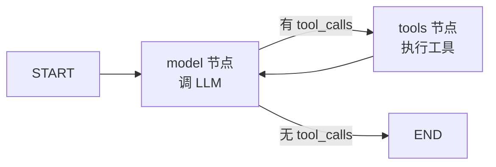
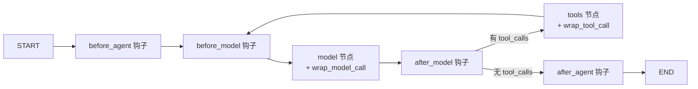
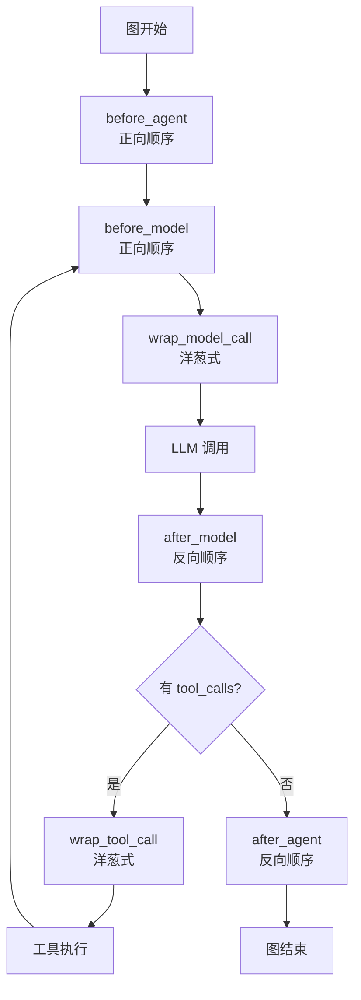

# 14 LangGraph 基础原理 — DeerFlow 的"底座"是怎么转的

> 面试口径：DeerFlow 是建立在 **LangGraph** 之上的，所以**懂 LangGraph 基础是懂 DeerFlow 的前提**。这一章不讲 DeerFlow 自己的代码，讲 LangGraph 的核心机制：① **StateGraph** 状态图编排 ② **AgentState / Reducer** 状态合并语义 ③ **`create_agent`** 高阶 API ④ **Middleware 钩子** 4 个拦截点 ⑤ **`Send` API** 动态分发 ⑥ **Checkpointer + interrupt** 人工审批。读完这章你能回答："DeerFlow 用 LangGraph 做了什么、没做什么 / 为什么不直接用裸 LangGraph"。

**本章课程目标：**

- 掌握 LangGraph 5 个核心概念（StateGraph / AgentState / create_agent / Middleware / Checkpointer）
- 理解 LangGraph **响应式 vs 命令式**编程范式（不是普通 Python 流程）
- 看懂 DeerFlow 为什么自定义 `ThreadState`（继承 AgentState）
- 知道 LangGraph 1.x 的新增 API（`create_agent` 取代 `create_react_agent`、Middleware 替代手写 hooks）

**学习建议：** 这章建议**对照 LangGraph 文档读** —— `https://langchain-ai.github.io/langgraph/`。每读完一节去文档找对应 API 看一眼。本章是"DeerFlow 视角的 LangGraph 教程"，不是 LangGraph 完整教程，重点是**DeerFlow 实际用到的部分**。

---

## 1、本章导读

### 1.1 LangGraph 是什么

> LangGraph = **状态图（StateGraph）+ 节点函数 + Reducer + Checkpointer** 的编排框架。

它解决的问题：**把 LLM 调用 + 工具调用 + 中间件 + 人工审批 编排成可视化、可断点续传、可恢复的流程图**。

vs 传统 Python：
- 传统 Python：流程是命令式的，状态散落在变量里
- LangGraph：流程是声明式的，状态集中在一个 dict 里，节点函数读 → 改 → 返回 dict

### 1.2 LangGraph vs LangChain Chain

| 维度 | LangChain Chain | LangGraph |
| --- | --- | --- |
| 范式 | 串行 pipeline | 状态图（节点 + 边） |
| 状态 | 隐式（chain 输入输出） | 显式（共享 state dict） |
| 分支 | RouterChain（不灵活） | conditional_edges（按 state 决定） |
| 循环 | 不支持 | 支持（边可以指回前面节点） |
| 持久化 | 不支持 | Checkpointer 内置 |
| 人工审批 | 不支持 | interrupt 内置 |
| 流式 | callback 多 | astream + stream_mode 五种 |

**结论：** LangChain Chain 是 1.0 时代，LangGraph 是 2.0+ 标准。新项目应该用 LangGraph。

### 1.3 本章 6 节速查

```
§2 StateGraph 状态图           — 节点 / 边 / 编译
§3 AgentState + Reducer        — 状态合并语义
§4 create_agent 高阶 API       — DeerFlow 用的接口
§5 Middleware 钩子机制         — 4 个拦截点 + 反向调用
§6 Send API + 子图             — 动态分发能力
§7 Checkpointer + interrupt    — 持久化 + 人工审批
```

---

## 2、StateGraph 状态图

### 2.1 基本概念

```python
from langgraph.graph import StateGraph, START, END
from typing import TypedDict

# 1. 定义 state schema
class State(TypedDict):
    messages: list
    counter: int

# 2. 节点函数：state → 部分 state（reducer 合并）
def chat_node(state: State) -> dict:
    response = llm.invoke(state["messages"])
    return {"messages": [response]}  # ← 返回的字段会被合并到 state

def count_node(state: State) -> dict:
    return {"counter": state["counter"] + 1}

# 3. 构建图
builder = StateGraph(State)
builder.add_node("chat", chat_node)
builder.add_node("count", count_node)

# 4. 添加边
builder.add_edge(START, "chat")
builder.add_edge("chat", "count")
builder.add_edge("count", END)

# 5. 编译
graph = builder.compile()

# 6. 调用
result = graph.invoke({"messages": [HumanMessage("hi")], "counter": 0})
```

### 2.2 关键概念

| 概念 | 说明 |
| --- | --- |
| **State** | 全局共享的字典，TypedDict 定义 schema |
| **Node** | 函数 `(state) → dict`，返回的 dict 会被 reducer 合并到 state |
| **Edge** | 节点之间的有向边 |
| **START / END** | 特殊起止节点 |
| **conditional_edges** | 按 state 内容决定下一个节点（路由） |
| **compile()** | 把 builder 转成可执行 graph |

### 2.3 conditional_edges（路由）

```python
def route(state: State) -> str:
    if state["counter"] >= 5:
        return "end"
    return "continue"

builder.add_conditional_edges(
    "count",
    route,
    {"continue": "chat", "end": END},
)
```

**关键：** `route` 函数返回字符串 key，按 mapping 路由到对应节点。

### 2.4 LangGraph 的"图"和普通函数不同

```python
# 命令式（普通 Python）
def main(input):
    x = step1(input)
    if x > 0:
        y = step2(x)
    else:
        y = step3(x)
    return step4(y)
```

```python
# 声明式（LangGraph）
builder.add_node("step1", step1)
builder.add_node("step2", step2)
builder.add_node("step3", step3)
builder.add_node("step4", step4)

builder.add_edge(START, "step1")
builder.add_conditional_edges("step1", lambda s: "step2" if s["x"] > 0 else "step3")
builder.add_edge("step2", "step4")
builder.add_edge("step3", "step4")
builder.add_edge("step4", END)
```

**为什么要这样设计？**

- **可视化**：图可以画出来（DOT / Mermaid）
- **可断点续传**：每个节点完成后写 checkpoint，进程崩溃从挂点继续
- **可中断**：interrupt + human-in-the-loop 内置
- **可流式**：每个节点完成 yield 一次，前端能看到中间状态

**代价：** 编程心智模型变了，要从"调函数"切换到"配图"。

---

## 3、AgentState + Reducer（状态合并语义）

### 3.1 AgentState 基础

`langchain.agents.AgentState` 是 LangGraph 提供的**预定义 state schema**：

```python
from langchain.agents import AgentState

class AgentState(TypedDict):
    messages: Annotated[list[BaseMessage], add_messages]  # ← Reducer
```

**关键：`Annotated[..., add_messages]` 标记了 messages 字段的 Reducer。**

### 3.2 Reducer 是什么

```python
def add_messages(existing: list, new: list) -> list:
    """把 new 合并到 existing。
    特殊行为：
    - 同 message id 替换（用于中间件修改某条消息）
    - 不同 id 追加
    """
    ...
```

**为什么需要 Reducer：**

```python
# 节点 A 返回
return {"messages": [msg_A]}

# 节点 B 返回
return {"messages": [msg_B]}

# 没有 Reducer，会怎么样？
state["messages"] = [msg_B]  # ← 覆盖！msg_A 丢了

# 有 Reducer (add_messages)
state["messages"] = [msg_A, msg_B]  # ← 累加
```

**Reducer 决定字段如何合并** —— 这是 LangGraph 状态语义的核心。

### 3.3 DeerFlow 的 ThreadState（继承 AgentState）

```python
# agents/thread_state.py
from langchain.agents import AgentState

class ThreadState(AgentState):  # 继承 messages 字段
    sandbox: NotRequired[SandboxState]
    thread_data: NotRequired[ThreadDataState]
    title: NotRequired[str | None]
    artifacts: Annotated[list[str], merge_artifacts]
    todos: Annotated[list | None, merge_todos]
    uploaded_files: NotRequired[list]
    viewed_images: Annotated[dict, merge_viewed_images]
    promoted: Annotated[PromotedTools | None, merge_promoted]
```

**自定义 Reducer 实例：**

```python
def merge_artifacts(existing: list[str] | None, new: list[str] | None) -> list[str]:
    """artifacts 列表合并 + 去重."""
    if existing is None:
        return new or []
    if new is None:
        return existing
    return list(dict.fromkeys(existing + new))  # 保序去重


def merge_viewed_images(existing, new):
    """图片字典合并 + 空 dict 表示清空."""
    if new is None:
        return existing or {}
    if len(new) == 0:
        return {}  # 特殊语义：清空
    return {**(existing or {}), **new}


def merge_todos(existing, new):
    """todos：None 表示不更新；其他值（含空列表）表示覆盖."""
    if new is None:
        return existing
    return new
```

**设计要点：每个字段的 Reducer 反映"业务语义"：**

| 字段 | Reducer 行为 | 业务含义 |
| --- | --- | --- |
| messages | append + 同 id 替换 | 对话历史只追加，编辑用 id 替换 |
| artifacts | append + 去重 | 文件列表去重 |
| viewed_images | 空 dict = 清空 | 用完图片要主动清空 |
| todos | None=保持，其他=覆盖 | 节点显式覆盖，否则保留 |

### 3.4 Reducer 的"陷阱"

⚠️ **常见 bug：节点返回 None vs 返回 {}**

```python
# ❌ 错误
def node(state):
    if condition:
        return None  # ← 整个 state 不变？
    return {"messages": [msg]}

# ✅ 正确
def node(state):
    if condition:
        return {}  # ← 显式空 dict，不更新任何字段
    return {"messages": [msg]}
```

LangGraph 严格要求节点返回 dict（或 None 表示"不更新")，弄混了会导致状态被错误重置。

---

## 4、create_agent 高阶 API

### 4.1 LangGraph 1.x 的新接口

```python
from langchain.agents import create_agent

agent = create_agent(
    model,                    # ChatModel 实例
    tools,                    # list[BaseTool]
    middleware=[...],         # list[AgentMiddleware]
    system_prompt="...",      # str | None
    state_schema=ThreadState,  # 可自定义 state 扩展
)

result = await agent.ainvoke({"messages": [HumanMessage("...")]})
```

### 4.2 它内部生成什么图

`create_agent` 等价于自己 builder 写：



加上中间件后是：



### 4.3 vs 旧的 `create_react_agent`

| 维度 | create_react_agent（旧） | create_agent（新） |
| --- | --- | --- |
| 状态扩展 | 不支持 | 支持 `state_schema` |
| 中间件 | 不支持 | 支持 4 个钩子 |
| 自定义节点 | 不支持 | 不直接支持，但可通过中间件 |
| LangGraph 版本 | 0.x | 1.x+ |

DeerFlow 用 `create_agent`：

```python
# agents/lead_agent/agent.py:39
return create_agent(
    model=model,
    tools=tools,
    middleware=middlewares,
    system_prompt=system_prompt,
    state_schema=ThreadState,  # ← 关键：用 DeerFlow 自定义的 schema
)
```

---

## 5、Middleware 钩子机制（核心）

### 5.1 4 个拦截点

```python
class AgentMiddleware(Generic[StateT]):
    # ── 一次性 hooks（图入口/出口）──
    def before_agent(self, state, runtime) -> dict | None: ...
    async def abefore_agent(self, state, runtime) -> dict | None: ...
    
    def after_agent(self, state, runtime) -> dict | None: ...
    async def aafter_agent(self, state, runtime) -> dict | None: ...
    
    # ── 循环 hooks（每轮 LLM 前后）──
    def before_model(self, state, runtime) -> dict | None: ...
    async def abefore_model(self, state, runtime) -> dict | None: ...
    
    def after_model(self, state, runtime) -> dict | None: ...
    async def aafter_model(self, state, runtime) -> dict | None: ...
    
    # ── wrap hooks（包裹调用）──
    def wrap_model_call(self, request, handler) -> Any: ...
    async def awrap_model_call(self, request, handler) -> Any: ...
    
    def wrap_tool_call(self, request, handler) -> Any: ...
    async def awrap_tool_call(self, request, handler) -> Any: ...
```

### 5.2 钩子触发顺序（关键）



**正向 vs 反向：**

| 钩子 | 顺序 | 类比 |
| --- | --- | --- |
| before_agent | 正向（注册顺序） | 洋葱外层先开 |
| before_model | 正向 | 同上 |
| wrap_model_call | 洋葱式（注册的最先包) | 函数装饰器嵌套 |
| after_model | **反向**（注册顺序的逆） | 洋葱外层最后关 |
| wrap_tool_call | 洋葱式 | 同 wrap_model_call |
| after_agent | 反向 | 同 after_model |

**为什么 after_xxx 是反向？**

```python
middlewares = [A, B, C]  # 注册顺序

# before_model 调用顺序（正向）
A.before_model() → B.before_model() → C.before_model() → 模型

# after_model 调用顺序（反向）
模型 → C.after_model() → B.after_model() → A.after_model()
```

这是经典的"洋葱模型" —— A 最先进入，最后退出。这样 A 能"包住"B 的修改，B 能"包住"C 的修改。

### 5.3 wrap_xxx vs before/after_xxx

```python
class MyMiddleware(AgentMiddleware):
    # before_model：state 进，dict 出（不修改 LLM 调用本身）
    def before_model(self, state, runtime) -> dict | None:
        # 比如修改 messages
        return {"messages": [...]}
    
    # wrap_model_call：完全控制 LLM 调用过程
    def wrap_model_call(self, request, handler):
        # 可以修改 request、决定是否调用、修改 response
        modified_request = ...
        response = handler(modified_request)  # 调用下一层
        modified_response = ...
        return modified_response
```

**用法对比：**

| 用 before/after | 用 wrap |
| --- | --- |
| 修改输入消息 | 完全替代 LLM 调用（如 mock 测试） |
| 累加 token 用量 | 重试 / 降级 |
| 检测循环 | 隐藏工具 schema |
| 一般状态修改 | 包裹错误处理 |

DeerFlow 的中间件大部分用 before/after，少数用 wrap（如 LLMErrorHandling、DeferredToolFilter）。

### 5.4 中间件示例（写一个）

```python
class LoggingMiddleware(AgentMiddleware[AgentState]):
    """记录每次 LLM 调用前后的 messages 数."""
    
    def before_model(self, state, runtime):
        logger.info(f"Before LLM: {len(state['messages'])} messages")
        return None  # 不修改 state
    
    def after_model(self, state, runtime):
        last = state["messages"][-1]
        if isinstance(last, AIMessage):
            logger.info(f"After LLM: usage={last.usage_metadata}")
        return None
```

注册：
```python
agent = create_agent(
    model, tools,
    middleware=[LoggingMiddleware()],
)
```

---

## 6、Send API + 子图（动态分发）

### 6.1 Send 是什么

```python
from langgraph.types import Send

def fanout(state):
    """动态返回多个 Send，每个发到不同节点（或同一节点不同输入）."""
    return [
        Send("worker", {"task": "task_1", "data": ...}),
        Send("worker", {"task": "task_2", "data": ...}),
        Send("worker", {"task": "task_3", "data": ...}),
    ]

builder.add_node("dispatcher", fanout)
builder.add_node("worker", worker_node)
```

执行时 LangGraph 会**并行**调用 3 次 `worker`，每次输入不同。

### 6.2 Send vs DeerFlow 的 task_tool

| 维度 | LangGraph Send | DeerFlow task_tool |
| --- | --- | --- |
| fork 数量 | 函数返回时确定 | LLM 在 tool_call 里决定 |
| 节点定义 | 编译期 | 运行时（task_tool 内部 create_agent） |
| 状态共享 | 共享父 state | 隔离（独立 messages） |
| 取消 | LangGraph 整体 cancel | 独立 cancel_event |

**为什么 DeerFlow 没用 Send？** 见第 1 章 §5.1 Q1。简短答：Send 节点编译期固定，DeerFlow 要 LLM 运行时决定 fork 数量。

### 6.3 子图（Subgraph）

```python
# 父图
parent_builder = StateGraph(ParentState)

# 子图
sub_builder = StateGraph(SubState)
sub_builder.add_node("sub_node", sub_node)
subgraph = sub_builder.compile()

# 子图作为父图的一个节点
parent_builder.add_node("sub", subgraph)
```

**子图的状态：**
- ParentState 和 SubState 可以是同一个（共享）或不同（映射 input/output）
- 子图执行时父图的 state 会传进去（按 schema 映射）
- 子图返回的 state 改动会回流到父图

DeerFlow **不用子图**，用 task_tool。原因同上。

---

## 7、Checkpointer + interrupt（持久化 + 人工审批）

### 7.1 Checkpointer 工作原理

```python
from langgraph.checkpoint.sqlite import SqliteSaver

graph = builder.compile(checkpointer=SqliteSaver(...))

config = {"configurable": {"thread_id": "thread_001"}}

# 第一次调用
graph.invoke({"messages": [HumanMessage("hi")]}, config=config)
# state 被持久化到 SQLite

# 第二次调用（同 thread_id）
graph.invoke({"messages": [HumanMessage("how are you")]}, config=config)
# 自动 load 上次的 state，append 新消息
```

**关键：**
- Checkpointer 按 `thread_id` 索引
- 每个节点完成后写 checkpoint（不是每次 invoke）
- 进程崩溃 → 重启后从最近 checkpoint 续跑

### 7.2 interrupt（中断 + 人工审批）

```python
from langgraph.types import interrupt

def approval_node(state):
    # 中断图执行，等待人类输入
    user_decision = interrupt({"question": "确认操作？", "details": ...})
    
    if user_decision == "approved":
        return {"action": "execute"}
    else:
        return {"action": "cancel"}
```

**工作机制：**
- `interrupt(payload)` 把图状态保存到 checkpoint，立即中断执行
- 上层（用户接口）拿到 interrupt 信号 → 展示给用户
- 用户回答后调 `graph.invoke(Command(resume=user_decision), config=...)` 续跑

DeerFlow 的 `ClarificationMiddleware` 就基于 interrupt 实现：

```python
# 简化伪代码
class ClarificationMiddleware:
    def wrap_tool_call(self, request, handler):
        if request.tool_name == "ask_clarification":
            user_answer = interrupt({"question": request.args["question"]})
            return ToolMessage(content=user_answer, ...)
        return handler(request)
```

### 7.3 LangGraph 1.x interrupt 的两种用法

```python
# 用法 1：interrupt_before / interrupt_after（编译期）
graph = builder.compile(
    checkpointer=...,
    interrupt_before=["approval"],  # 进入 approval 前中断
)

# 用法 2：动态 interrupt（运行时）
def some_node(state):
    if needs_human:
        result = interrupt({"prompt": "..."})  # 运行时决定是否中断
```

DeerFlow 用的是用法 2（动态），因为 ask_clarification 是 LLM 决定调用的，编译期不知道何时需要。

---

## 8、本章 ❓→💡 问答

### Q1：DeerFlow 没用 LangGraph 子图，错过了什么？

**A：** 错过了"强 typed 状态机映射"能力。

LangGraph 子图能把父子状态做严格映射：
```python
# 父子 state schema 不同，自动映射
parent_builder.add_node("sub", subgraph, state_mapping={"parent_msgs": "child_input"})
```

DeerFlow 的 task_tool 是"调用工具拿字符串"，没有 state 映射 —— 子 Agent 状态完全隔离。

**取舍：** 失去类型安全，换来 fork 数量的运行时灵活性。

### Q2：LangGraph 1.x 的 Middleware 和 0.x 的手写 hook 有什么区别？

**A：** 0.x 时代手写：
```python
def before_model(state, config):
    ...

graph = create_react_agent(
    model, tools,
    pre_model_hook=before_model,  # 参数式
)
```

1.x Middleware：
```python
class MyMiddleware(AgentMiddleware):
    def before_model(self, state, runtime):
        ...

agent = create_agent(model, tools, middleware=[MyMiddleware()])
```

**区别：**
- 1.x 是类，可以有 `__init__` 参数（配置）和 instance 状态
- 1.x 支持 wrap_model_call（0.x 没有）
- 1.x 有正向/反向调用顺序保证

DeerFlow 是早期 1.x 用户，享受了完整 Middleware 能力。

### Q3：Reducer 函数被调用时机是什么？

**A：** 节点函数返回后**立即**触发：

```
node A returns {"messages": [msg_A]}
    ↓
LangGraph 框架：
    state["messages"] = add_messages(state["messages"], [msg_A])
    ↓
state 进入下一个节点
```

**注意：** Reducer 必须是**纯函数**（不要修改输入参数，返回新对象）。LangGraph 会保留多个版本的 state（用于断点续传），inplace 修改会破坏快照。

### Q4：什么时候应该自定义 state_schema 而不是用默认 AgentState？

**A：** 三个场景：

1. **跨节点共享业务数据**：DeerFlow 的 `sandbox` / `thread_data` —— 主图 / 中间件 / task_tool 都要读
2. **特殊合并语义**：如 `viewed_images` 的"空 dict = 清空"
3. **持久化跨请求数据**：如 `title` —— 一次 run 生成后多次 run 共享

**别滥用：** 临时数据（一个节点用一次）放 state 会膨胀 checkpoint —— 用本地变量更好。

### Q5：interrupt 和 ClarificationMiddleware 的关系？

**A：** ClarificationMiddleware 是 interrupt 的**业务封装**。

LangGraph interrupt 是底层 API：调用 → 中断 → 等 resume → 继续。

DeerFlow 把它包装成"Agent 调 ask_clarification 工具 = 触发 interrupt"，让 LLM 用工具调用语义表达"我需要问用户"。

业务层好处：
- LLM 不需要知道 interrupt 概念，只知道有个 ask_clarification 工具
- system prompt 可以教 LLM 何时用这个工具
- 中间件层统一处理 interrupt，业务节点不需要关心

---

## 9、本章总结

**LangGraph 5 大核心概念速记：**

```
1. StateGraph：声明式图，节点 + 边 + 编译
2. AgentState + Reducer：状态合并语义（add_messages 是默认）
3. create_agent：高阶 API，自动生成 model + tools 循环
4. Middleware：4 个拦截点（before/after_agent/model）+ 2 个 wrap（model_call/tool_call）
5. Checkpointer + interrupt：持久化 + 人工审批
```

**DeerFlow 用 LangGraph 的 4 个关键决策：**

| 决策 | 理由 |
| --- | --- |
| 用 `create_agent` 不用裸 StateGraph | 业务标准 model+tools 循环够用 |
| 自定义 ThreadState 继承 AgentState | 业务字段（sandbox/title/artifacts）需要共享 |
| 用 19 个 Middleware 不用自己写图 | 标准化 + 可组合 + 顺序明确 |
| 不用子图 / Send，用 task_tool | fork 数量要 LLM 运行时决定 |

**面试金句：**

> "DeerFlow 是 LangGraph 1.x 的工程级实现：
> - 用 `create_agent` 简化主智能体编排
> - 用 19 个 `AgentMiddleware` 实现可组合的横切能力
> - 用 `state_schema=ThreadState` 扩展业务字段
> - 用 Checkpointer + thread_id 做跨请求状态持久化
> - 用 interrupt + ClarificationMiddleware 实现人工审批
>
> 唯一没用的是 `Send` API 和子图 —— 因为 fork 数量要 LLM 运行时决定，子任务要状态隔离，所以自己写了 task_tool。"

下一章（第 15 章 工具与沙箱系统）会深入 DeerFlow 的另一大块 —— 工具是怎么注册、过滤、执行的，沙箱有几种、怎么共享，MCP 怎么动态加载。
