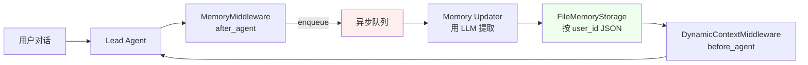

# 18 Memory / Plan Mode / Guardrails — 边角模块全收官

> 面试口径：这是最后一章，补 DeerFlow 三个**重要但不是核心通信**的模块：① **Memory 系统**（用户级长期记忆，LangChain Memory 的进阶版）② **Plan Mode + Todo 系统**（复杂任务规划，源自 Anthropic Claude.ai 的工作模式）③ **Guardrails 系统**（输入/输出守卫，安全前置）。这三个模块都有自己的**中间件 + 配置 + 持久化**，是面试官如果"恰好"问到能加分但不会主动问的细节。**最后这章把 DeerFlow 拼图补完整**。

**本章课程目标：**

- 理解 DeerFlow Memory 系统（FileMemoryStorage / 异步入队 / Updater 模型）
- 掌握 Plan Mode 启用机制 + Todo 中间件工作流
- 知道 Guardrails 怎么定义、什么时候触发、与 Skill 的区别
- 把全 18 章的知识点统一成一张"DeerFlow 全栈地图"

**学习建议：** 这章相对独立，**可以跳着读** —— 只关心你面的公司可能问到的部分。但如果时间够，建议过一遍 §5 的"全栈地图"，把前 17 章的内容串起来。

---

## 1、本章导读

```
DeerFlow 三个边角模块
│
├─ §2 Memory 系统：用户级长期记忆
│       agents/memory/{storage,queue,updater,prompt}.py
│
├─ §3 Plan Mode + Todo：复杂任务规划
│       agents/middlewares/todo_middleware.py
│       agents/lead_agent/agent.py:_create_todo_list_middleware
│
├─ §4 Guardrails 系统：输入/输出守卫
│       guardrails/{middleware,provider,builtin}.py
│
└─ §5 全栈地图：18 章总结
```

---

## 2、Memory 系统

### 2.1 概念定位

**Memory ≠ Checkpointer。** 区别：

| 维度 | Checkpointer | Memory |
| --- | --- | --- |
| 存什么 | LangGraph state（messages + sandbox 等） | 用户级"事实"（提取自对话） |
| 索引 | thread_id | user_id |
| 范围 | 同 thread 内对话历史 | 跨 thread / 跨会话持久 |
| 写入时机 | 每个图节点完成 | Agent 自决（Updater 模型分析） |
| 用途 | 当前会话续接 | 用户偏好 / 历史事实 |

**类比：**
- Checkpointer 是**工作记忆**（你这次会话记得什么）
- Memory 是**长期记忆**（你的助理记得你的偏好和历史）

### 2.2 Memory 数据结构

```python
# agents/memory/storage.py:39
def create_empty_memory() -> dict[str, Any]:
    return {
        "facts": [],         # 用户偏好 / 历史事实
        "summaries": [],     # 历史会话摘要
        "version": 1,
        "updated_at": utc_now_iso_z(),
    }
```

**facts 示例：**
```json
{
  "facts": [
    {"content": "用户偏好简洁回答", "created_at": "2026-06-18T..."},
    {"content": "用户在做 Agent 项目相关研究", "created_at": "2026-06-15T..."},
    {"content": "用户使用 Mac M5", "created_at": "2026-06-10T..."}
  ]
}
```

### 2.3 FileMemoryStorage — 文件存储

```python
# agents/memory/storage.py:100
class FileMemoryStorage(MemoryStorage):
    """按 user_id 把 memory 存为 JSON 文件."""
    
    def __init__(self, base_path: Path):
        self.base_path = base_path  # 如 /data/memory/
    
    def _path_for(self, user_id: str) -> Path:
        return self.base_path / f"{user_id}.json"
    
    async def aload(self, user_id: str) -> dict:
        path = self._path_for(user_id)
        if not path.exists():
            return create_empty_memory()
        return json.loads(path.read_text())
    
    async def asave(self, user_id: str, memory: dict) -> None:
        path = self._path_for(user_id)
        path.parent.mkdir(parents=True, exist_ok=True)
        # 原子写入（temp file + rename）
        tmp = path.with_suffix(".tmp")
        tmp.write_text(json.dumps(memory))
        tmp.replace(path)
```

**关键设计：**
- 每个 user 一个 JSON 文件（路径 = base_path / user_id.json）
- 原子写入（防并发损坏）
- 抽象基类 `MemoryStorage`，未来可换 SQL / Redis 实现

### 2.4 MemoryMiddleware — 异步入队

```python
# agents/middlewares/memory_middleware.py
class MemoryMiddleware(AgentMiddleware[MemoryMiddlewareState]):
    """after_agent 钩子：把对话入队，等异步 Updater 处理."""
    
    async def aafter_agent(self, state, runtime):
        user_id = runtime.context.get("user_id")
        if user_id is None:
            return None  # 没用户标识，不存
        
        # 入队（不阻塞，立即返回）
        from deerflow.agents.memory.queue import enqueue_memory_update
        await enqueue_memory_update(
            user_id=user_id,
            messages=state["messages"],
            agent_name=self.agent_name,
        )
```

**关键：异步入队不阻塞主流程。** Updater 是后台进程，慢慢分析对话提取 facts。

### 2.5 Memory Updater — 智能提取

```python
# agents/memory/updater.py（伪代码）
async def update_memory(user_id: str, messages: list, agent_name: str):
    """异步处理：用 LLM 分析对话，提取/更新 facts."""
    storage = get_memory_storage()
    current = await storage.aload(user_id)
    
    # 用便宜模型分析对话
    extractor = create_chat_model(name="gpt-4o-mini")
    prompt = f"""
分析以下对话，提取需要长期记住的事实（用户偏好、关键信息）：

历史 facts:
{format_facts(current["facts"])}

新对话:
{format_messages(messages)}

输出 JSON：
{{
  "add": ["新事实 1", "新事实 2"],
  "remove": ["要删除的事实 id"],
}}
"""
    response = await extractor.ainvoke(prompt)
    updates = json.loads(response.content)
    
    # 应用更新
    current["facts"] = [f for f in current["facts"] if f["id"] not in updates["remove"]]
    for new_fact in updates["add"]:
        current["facts"].append({"content": new_fact, "created_at": utc_now_iso_z(), "id": str(uuid4())})
    
    await storage.asave(user_id, current)
```

**好处：**
- 主对话不阻塞（用户感觉很快）
- 用便宜模型做提取（不用主模型）
- 能"忘记"过时事实（remove 字段）

### 2.6 Memory 注入到 prompt

通过 `DynamicContextMiddleware` 注入：

```python
# agents/middlewares/dynamic_context_middleware.py（伪代码）
class DynamicContextMiddleware:
    async def abefore_agent(self, state, runtime):
        user_id = runtime.context.get("user_id")
        memory = await get_memory_storage().aload(user_id)
        
        # 注入到第一条 HumanMessage 末尾（保持 system prompt 静态以利 cache）
        first_human = state["messages"][0]
        injected_content = f"""{first_human.content}

<system-reminder>
Today: {today_iso()}

User context (from memory):
{format_facts(memory["facts"])}
</system-reminder>"""
        
        return {"messages": [first_human.model_copy(update={"content": injected_content})]}
```

**为什么塞进 first HumanMessage 而不是 system prompt？**
- system prompt 静态化才能命中 prompt cache（节约 90% input tokens）
- 动态内容（日期 / memory）放 HumanMessage 第一条 —— 反正都要传

### 2.7 Memory 系统全景



---

## 3、Plan Mode + Todo 系统

### 3.1 概念

**Plan Mode** 是 DeerFlow 的"复杂任务规划模式" —— 用户标记某个任务"复杂"时，Agent 会：
1. 先调用 `write_todos` 工具生成 TODO 列表
2. 按 TODO 顺序执行（每完成一个标记 completed）
3. 实时把 TODO 列表返回给前端展示

**灵感来源：** Anthropic Claude.ai 的 "Extended Thinking" 模式 + "Project mode"。

### 3.2 启用条件

```python
# agents/lead_agent/agent.py:444-448
cfg = _get_runtime_config(config)
is_plan_mode = cfg.get("is_plan_mode", False)
todo_list_middleware = _create_todo_list_middleware(is_plan_mode)
if todo_list_middleware is not None:
    middlewares.append(todo_list_middleware)
```

**用户怎么启用：** Gateway API body 里传 `{"is_plan_mode": true}`，前端通常在用户标记"复杂任务"时设置。

### 3.3 TodoMiddleware

```python
# agents/middlewares/todo_middleware.py
class TodoMiddleware(TodoListMiddleware):
    """plan_mode 启用时挂载，给 LLM 提供 write_todos 工具."""
    
    def __init__(self, system_prompt: str, tool_description: str):
        super().__init__(
            system_prompt=system_prompt,
            tool_description=tool_description,
        )
    
    def before_model(self, state, runtime):
        """LLM 调用前：检查是否需要追加 todo 提醒."""
        messages = state.get("messages", [])
        todos = state.get("todos", [])
        
        if not todos:
            return None
        
        # 如果 todo 列表里没出现在最近消息里 → 追加提醒
        if not _todos_in_messages(messages):
            return {"messages": [SystemMessage(content=_format_todos(todos))]}
        
        return None
```

### 3.4 write_todos 工具

```python
# 简化伪代码
@tool("write_todos")
def write_todos(todos: list[dict]) -> str:
    """更新当前任务 todo 列表."""
    # 触发 state["todos"] 字段更新（通过 Reducer merge_todos）
    return f"Updated {len(todos)} todos."
```

**Todo 数据结构：**
```python
class Todo(TypedDict):
    content: str    # 任务描述
    status: str     # "pending" / "in_progress" / "completed"
```

### 3.5 完整工作流

```
用户："帮我做个完整的市场调研报告"（is_plan_mode=true）
        ↓
LLM 看到 system_prompt 里的 plan mode 指令
        ↓
LLM 调用 write_todos：
  - {content: "搜索行业现状", status: "pending"}
  - {content: "对比 5 家竞品", status: "pending"}
  - {content: "整理输出报告", status: "pending"}
        ↓
state["todos"] 更新（merge_todos reducer）
前端实时收到 todos 字段（SSE updates 事件）
        ↓
LLM 第一个任务：调 task() 启动子 Agent 搜索行业
        ↓
子 Agent 完成 → LLM 更新 todos：
  - {content: "搜索行业现状", status: "completed"}
  - {content: "对比 5 家竞品", status: "in_progress"}
        ↓
... 循环直到所有 todo 完成
        ↓
LLM 输出最终报告
```

### 3.6 Token 归因（write_todos 特殊处理）

`TokenUsageMiddleware` 对 write_todos 工具的 token 做精确归因：

```python
# token_usage_middleware.py:53-100
def _build_todo_actions(previous_todos, next_todos):
    """对比新旧 todo 列表，生成动作详单."""
    actions = []
    for index, todo in enumerate(next_todos):
        previous_match = ...
        action_kind = _todo_action_kind(previous_match, todo)
        # action_kind ∈ {"todo_start", "todo_complete", "todo_update"}
        actions.append({"index": index, "kind": action_kind, "content": todo["content"]})
    return actions
```

**用途：** 前端能精确显示"这次 LLM 调用是为了启动哪个 todo / 完成哪个 todo"，而不是笼统的"Update to-do list"。

### 3.7 plan_mode vs 默认模式对比

| 维度 | 默认 | plan_mode |
| --- | --- | --- |
| TodoMiddleware | 不挂载 | 挂载 |
| write_todos 工具 | 不可用 | 可用 |
| LLM 行为 | 直接执行 | 先规划再执行 |
| 适合任务 | 简单（< 3 步） | 复杂（多步 + 依赖） |
| Token 消耗 | 低 | 高（多了规划开销） |

**业务建议：** 默认关闭 plan_mode，用户主动开启或前端按"任务复杂度"自动判断。

---

## 4、Guardrails 系统

### 4.1 Guardrails 是什么

**Guardrails ≠ Skill ≠ Middleware（虽然实现是 Middleware）。** 区别：

| 维度 | Guardrails | Skill | 普通 Middleware |
| --- | --- | --- | --- |
| 时机 | 工具调用前/后 | 加载 system prompt | 各种钩子 |
| 介质 | Provider（同步函数） | Markdown 文件 | Python 类 |
| 用途 | 阻止工具误用 / 检测危险输入 | 教 LLM 怎么做事 | 横切能力（token / 错误处理） |
| 干预力 | 强（可以拒绝工具调用） | 弱（只是建议） | 中（修改 state） |

### 4.2 GuardrailMiddleware

```python
# guardrails/middleware.py:20
class GuardrailMiddleware(AgentMiddleware[AgentState]):
    """在工具调用前后运行所有已启用的 guardrail."""
    
    def __init__(self, providers: list[GuardrailProvider]):
        self.providers = providers
    
    async def awrap_tool_call(self, request, handler):
        # ── pre-call 检查 ──
        for provider in self.providers:
            check_result = await provider.check_input(request)
            if check_result.blocked:
                return ToolMessage(
                    content=f"Guardrail blocked: {check_result.reason}",
                    tool_call_id=request.tool_call_id,
                    status="error",
                )
        
        # 实际工具调用
        result = await handler(request)
        
        # ── post-call 检查 ──
        for provider in self.providers:
            check_result = await provider.check_output(request, result)
            if check_result.blocked:
                return ToolMessage(
                    content=f"Guardrail blocked output: {check_result.reason}",
                    tool_call_id=request.tool_call_id,
                    status="error",
                )
        
        return result
```

### 4.3 GuardrailProvider 抽象

```python
# guardrails/provider.py（简化）
class GuardrailProvider(abc.ABC):
    @abstractmethod
    async def check_input(self, request: ToolCallRequest) -> GuardrailResult: ...
    
    @abstractmethod
    async def check_output(self, request: ToolCallRequest, result: Any) -> GuardrailResult: ...

@dataclass
class GuardrailResult:
    blocked: bool
    reason: str | None = None
    severity: str = "low"  # low / medium / high
```

### 4.4 内置 Guardrails

```python
# guardrails/builtin.py（伪代码）
class DangerousCommandGuardrail(GuardrailProvider):
    """阻止 bash 工具执行危险命令."""
    
    DANGEROUS_PATTERNS = [
        r"rm\s+-rf\s+/",
        r":(){ :|: & };:",  # fork bomb
        r"dd\s+if=.+\s+of=/dev/",
        r"mkfs\.",
        r"sudo\s+",  # 沙箱里通常不允许提权
    ]
    
    async def check_input(self, request):
        if request.tool_name != "bash":
            return GuardrailResult(blocked=False)
        
        command = request.tool_args.get("command", "")
        for pattern in self.DANGEROUS_PATTERNS:
            if re.search(pattern, command):
                return GuardrailResult(
                    blocked=True,
                    reason=f"Dangerous command pattern: {pattern}",
                    severity="high",
                )
        return GuardrailResult(blocked=False)


class PIIGuardrail(GuardrailProvider):
    """检测工具输出中的 PII，禁止泄露给 LLM."""
    
    async def check_output(self, request, result):
        text = self._extract_text(result)
        if self._contains_pii(text):
            return GuardrailResult(
                blocked=True,
                reason="Output contains PII",
                severity="medium",
            )
        return GuardrailResult(blocked=False)
```

### 4.5 配置启用

```yaml
# config.yaml
guardrails:
  enabled: true
  providers:
    - type: "dangerous_command"
      enabled: true
    - type: "pii"
      enabled: true
    - type: "custom"
      module: "myapp.custom_guardrail.MyProvider"
```

### 4.6 Guardrails 与 Sandbox 的关系

**两道防线：**

```
LLM 输出 tool_call(bash, "rm -rf /")
        ↓
GuardrailMiddleware.check_input → DANGEROUS_PATTERNS 命中 → 拒绝（第 1 道）
                                       (如果绕过)
        ↓
Sandbox.execute_command(...)
        ↓
LocalSandbox 路径前缀检查 → 命令在 /tmp/sandbox 内执行（第 2 道）
                                       (即使执行了)
        ↓
影响范围限制在沙箱内（第 3 道）
```

**纵深防御：** Guardrail 是"软"防线（基于规则），Sandbox 是"硬"防线（基于隔离）。两者都需要。

### 4.7 Guardrails vs SafetyFinishReason

容易混淆：

| 维度 | Guardrails | SafetyFinishReason |
| --- | --- | --- |
| 时机 | 工具调用前后 | LLM 调用后 |
| 检测对象 | tool_call 参数 / tool_output | LLM 的 finish_reason |
| 失败行为 | 拒绝工具调用 | 清空 tool_calls |
| 触发源 | 自定义规则 | LLM provider 安全过滤 |

两者**互补**：Guardrails 防工具误用，SafetyFinishReason 处理 LLM 自检结果。

---

## 5、全栈地图：18 章总结

### 5.1 模块全景

```
┌─────────────────────────────────────────────────────────────┐
│                        DeerFlow 全栈                          │
├─────────────────────────────────────────────────────────────┤
│ Layer 1: Gateway (FastAPI HTTP/SSE)                          │
│   └─ §13                                                     │
├─────────────────────────────────────────────────────────────┤
│ Layer 2: 调度层                                                │
│   ├─ RunManager (Run 生命周期 + 持久化)                        │
│   ├─ StreamBridge (生产消费解耦)                               │
│   └─ Worker (run_agent 驱动)                                  │
│   └─ §13                                                     │
├─────────────────────────────────────────────────────────────┤
│ Layer 3: Agent 编排层                                          │
│   ├─ LangGraph create_agent (主 Agent 图)                     │
│   │   └─ §14                                                 │
│   ├─ 19 中间件                                                 │
│   │   └─ §6                                                  │
│   ├─ ThreadState (扩展 AgentState)                            │
│   │   └─ §14                                                 │
│   └─ task_tool (主子通信桥梁)                                  │
│       └─ §3                                                  │
├─────────────────────────────────────────────────────────────┤
│ Layer 4: 子 Agent 执行层                                       │
│   ├─ SubagentExecutor (持久 daemon loop)                      │
│   │   └─ §4                                                  │
│   ├─ SubagentConfig + Registry                                │
│   │   └─ §5                                                  │
│   ├─ SubagentTokenCollector                                   │
│   │   └─ §7                                                  │
│   └─ 协作式取消机制                                            │
│       └─ §8                                                  │
├─────────────────────────────────────────────────────────────┤
│ Layer 5: 工具与沙箱层                                          │
│   ├─ get_available_tools (6 步组装)                           │
│   ├─ Sandbox 抽象 (Local/Aio/Container)                       │
│   ├─ MCP 工具 (DeferredFilter 隐藏)                            │
│   ├─ Skill 系统 (SKILL.md + tool_policy)                      │
│   ├─ Memory 系统                                              │
│   ├─ Plan Mode + Todo                                         │
│   └─ Guardrails                                               │
│   └─ §15 + §18                                                │
├─────────────────────────────────────────────────────────────┤
│ Layer 6: 持久化层                                              │
│   ├─ Checkpointer (memory/sqlite/postgres)                   │
│   ├─ RunStore                                                 │
│   ├─ EventStore                                               │
│   ├─ Store (跨 thread)                                        │
│   ├─ Feedback (用户评分)                                       │
│   └─ FileMemoryStorage (用户记忆)                              │
│   └─ §13 + §18                                                │
├─────────────────────────────────────────────────────────────┤
│ Layer 7: 底层 Python 异步                                      │
│   ├─ GIL + ThreadPool                                         │
│   ├─ contextvars 跨线程                                        │
│   ├─ asyncio.run_coroutine_threadsafe                         │
│   ├─ asyncio.shield                                           │
│   └─ daemon thread + atexit                                   │
│   └─ §16                                                      │
└─────────────────────────────────────────────────────────────┘
```

### 5.2 18 章学习路径

**入门路线（必读）：** 00 → 02 → 03 → 04 → 06 → 10
**深度路线：** + 01 / 05 / 07 / 08 / 09
**资深岗路线：** + 13 / 14 / 15 / 16 / 17 / 18
**进阶选读：** 11（数据飞轮）/ 12（横向对比）

### 5.3 核心知识点一览

| 章 | 一句话核心 |
| --- | --- |
| 01 | DeerFlow 用"工具调用即委派"范式 |
| 02 | 8 步通信序列从用户输入到 ToolMessage 回流 |
| 03 | task_tool 600 行实现配置/执行/轮询/SSE/取消 |
| 04 | SubagentExecutor 持久 daemon loop + 协作取消 |
| 05 | SubagentConfig 三层覆盖 + inherit 模型链 |
| 06 | 19 中间件分布在 4 拦截点 |
| 07 | Token 三层合并按 tool_call_id 索引 |
| 08 | 协作式取消 = threading.Event + chunk 边界 + asyncio.shield |
| 09 | 三层并发防护（Prompt + Middleware + ThreadPool） |
| 10 | 30 道面试题 |
| 11 | 数据飞轮：现状 + 大厂做法补全 |
| 12 | 横向对比：vs CrewAI / AutoGen / LangGraph |
| 13 | 7 层架构（Gateway → Worker → Agent → Checkpointer） |
| 14 | LangGraph 5 大概念 |
| 15 | 工具系统：5 道关卡 + 沙箱抽象 + MCP + Skill |
| 16 | Python 异步底层：GIL / contextvars / asyncio |
| 17 | 生产实践：监控 / 降级 / 成本 / A/B / 故障 |
| 18 | Memory / Plan Mode / Guardrails |

### 5.4 大厂面试通关标准答案模板

> "DeerFlow 是开源 LangGraph 工程级 Agent 框架。我从 7 层来介绍：
>
> 1. **Gateway 层**：FastAPI + SSE，HTTP 入口
> 2. **调度层**：RunManager（生命周期）+ StreamBridge（生产消费解耦）+ Worker（run_agent 驱动）
> 3. **Agent 编排层**：LangGraph `create_agent` + 19 中间件 + 自定义 ThreadState
> 4. **子 Agent 执行层**：通过 `task_tool` 工具触发，SubagentExecutor 在持久 daemon loop 跑独立 Agent
> 5. **工具与沙箱层**：5 道过滤关卡 + Sandbox 抽象（Local/Aio/Container）+ MCP DeferredFilter + Skill 策略
> 6. **持久化层**：5 个独立存储（Checkpointer / RunStore / EventStore / Store / Memory）
> 7. **Python 异步底层**：GIL + ThreadPool + contextvars + run_coroutine_threadsafe + shield
>
> 核心工程亮点：① **持久 daemon loop** 解决 httpx 撕裂问题 ② **协作式取消** 通过 chunk 边界检查 ③ **Token 三层合并** 把子 Agent 用量挂回主 AIMessage ④ **三层并发防护** 防 LLM 任性 ⑤ **多重过滤** 给子 Agent 工具最小权限
>
> 还在做的：数据飞轮（现在有 RunJournal + Feedback + SkillEvolution 三个零件，缺 Rubric/SFT/DPO 闭环）+ 多 provider fallback + Prometheus 监控。"

---

## 6、本章 ❓→💡 问答

### Q1：Memory 和 LangChain 旧的 ConversationBufferMemory 有什么区别？

**A：** 三点：

1. **粒度**：旧 Memory 存"对话历史 buffer"（每次对话都 stash），DeerFlow Memory 存"提取的事实"（智能筛选）
2. **隔离**：旧 Memory 通常 chain 级，DeerFlow 按 user_id
3. **写入时机**：旧 Memory 同步写（每轮），DeerFlow 异步 enqueue + 后台 LLM 提取

DeerFlow 的设计更接近 **Mem0 / Letta** 等"现代 Memory 库"，但用文件存储而非向量 DB（适合中小规模）。

### Q2：Plan Mode 适合什么任务？

**A：** **3 步以上 + 步骤间有依赖** 的任务：

✅ 适合：
- "做个市场调研报告"（搜索 → 分析 → 整理 → 输出）
- "重构一个模块"（分析现状 → 设计方案 → 实施 → 测试）
- "调试一个 bug"（复现 → 定位 → 修复 → 验证）

❌ 不适合：
- "今天天气" → 直接调一次工具
- "翻译这段话" → 直接调 LLM
- "解释 X 概念" → 纯回答，不需要工具

**判断标准：** 任务是否会调超过 3 个工具？是否有"先 X 再 Y"的依赖？是？开 plan mode。

### Q3：Guardrails 和 Skill 的 allowed-tools 是不是重复？

**A：** 不是，**层级不同**：

- Skill `allowed-tools`：Agent 启动时**静态过滤工具列表**（LLM 看不到被排除的工具）
- Guardrails：每次工具调用时**动态检查参数 / 输出**（LLM 能调用，但被拦截）

**类比：**
- Skill = 入职时给你的工卡（哪些门能开）
- Guardrails = 门口的保安（即使你有工卡，进门时还要检查行李）

### Q4：Memory 的 Updater 是同步还是异步？错过怎么办？

**A：** 异步入队，后台处理。错过的可能性：

- 进程重启时队列里的 update 丢失（如果用 in-memory queue）
- 解决：用持久化队列（Redis / RabbitMQ）

DeerFlow 当前用 in-memory queue（参考 `agents/memory/queue.py`），生产部署需要换持久化方案。

**已记忆 vs 未记忆的影响：** 即使 Memory update 丢失，对当前会话无影响（Checkpointer 保留对话历史）。只是"长期偏好"积累慢一点。

### Q5：DeerFlow 的 Memory 系统比 Mem0 / Letta 差在哪？

**A：** 三点：

1. **召回机制**：DeerFlow 全部加载（all facts → prompt），Mem0 是向量检索 top-k
   - 影响：facts 多时 token 浪费
   - 改善：可以加 embedding + 检索

2. **更新策略**：DeerFlow 用 LLM 提取（增/删 facts），Letta 让 Agent 自己写
   - 影响：DeerFlow 更省 token，但不够灵活

3. **成熟度**：Mem0 / Letta 是专业 Memory 项目，DeerFlow 是 Agent 框架附带功能
   - 实战建议：复杂记忆场景用 Mem0 + DeerFlow（叠加用，参考第 12 章 §6.4）

---

## 7、本章总结

**三个边角模块 = DeerFlow 拼图最后一块：**

| 模块 | 解决问题 | 核心机制 |
| --- | --- | --- |
| Memory | 用户级长期记忆 | FileMemoryStorage + 异步 Updater + DynamicContext 注入 |
| Plan Mode + Todo | 复杂任务规划 | TodoMiddleware + write_todos 工具 + state["todos"] |
| Guardrails | 工具误用 / 危险输入 | GuardrailMiddleware + Provider 链式检查 |

**18 章统一记忆口诀：**

> "Gateway 接入 RunManager 管，StreamBridge 解耦 Worker 跑；
> LangGraph 编图 19 中间件，task 委派子 Agent 桥；
> 工具五关沙箱抽，MCP 隐藏 Skill 策略；
> 五个存储各分工，记忆飞轮异步更新；
> GIL ThreadPool 配协程，shield contextvars 跨线程；
> 三层防护稳并发，协作取消 token 桶；
> 监控降级成本控，A/B 故障复盘清。"

---

## 8、最后的最后：关于这套学习文档

这套文档共 **18 章 + 1 阅读必看 = 19 篇**，约 **11000 行**。

**它能帮你做什么：**
- ✅ 在 30 分钟内讲清 DeerFlow 主子智能体通信
- ✅ 在 60 分钟深度面试中扛住 LangGraph / asyncio / Token / 取消等深挖
- ✅ 在大厂资深岗系统设计环节给出有理有据的取舍
- ✅ 应对故障排查面试题

**它不能帮你做什么：**
- ❌ 完全替代你看代码（建议读完每章后**至少跑过对应模块的一段**）
- ❌ 替代真实生产经验（§17 章模板可以用，但要换成你自己的故事最有说服力）
- ❌ 永远不过期（DeerFlow 在演进，半年后行号 / API 可能变）

**面试前最后的建议：**

1. **背 §10 的 30 题** + **§13 §14 §16 的核心机制** —— 这是高频考点
2. **画 §02 的 8 步序列图** + **§13 的全栈架构图** —— 白板能画就能讲
3. **准备 3 个故障故事**（参考 §17 §6）—— 让面试官看到"做过生产"
4. **准备 2 个改进提案**（"DeerFlow 现在没 X，我会怎么补"）—— 显示思考力
5. **承认不会的问题**（"这块我没做过深入研究，但我会从 X 角度去查"）—— 比硬扯加分

读完这 18 章 + 自己跑过 DeerFlow，**大厂 Agent 方向资深岗面试基本不慌**。

祝你面试顺利。
