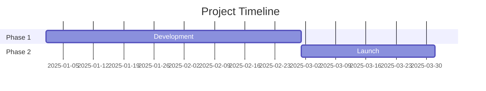
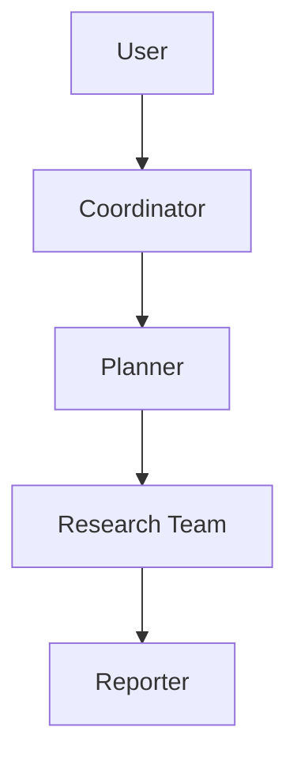
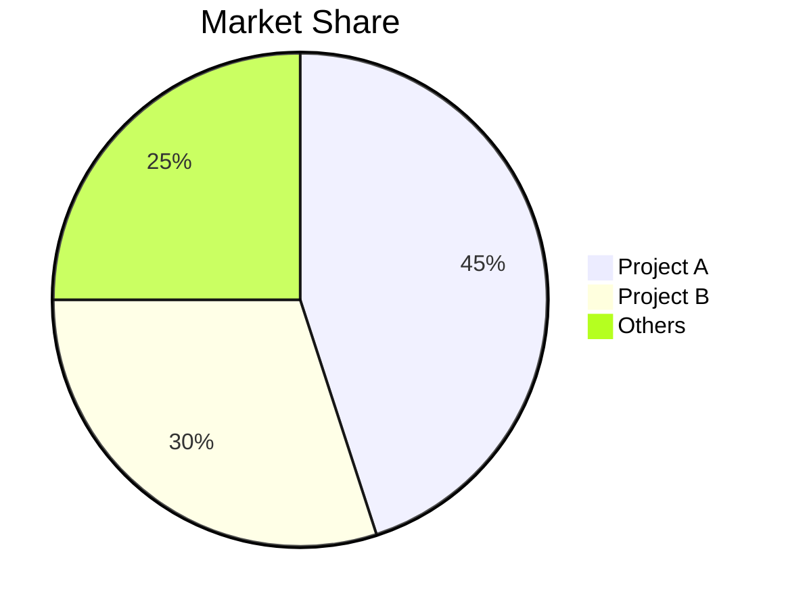

# GitHub 深度研究技能（GitHub Deep Research Skill）

结合 GitHub API、web_search、web_fetch 的多轮研究，输出完整的 Markdown 报告。

## 研究工作流

- 第 1 轮：GitHub API
- 第 2 轮：信息发现（Discovery）
- 第 3 轮：深度调研（Deep Investigation）
- 第 4 轮：深入挖掘（Deep Dive）

## 核心方法论

### 查询策略

**由宽到窄**：从 GitHub API 入手，再做宽泛查询，根据发现逐步收敛。

```
Round 1: GitHub API
Round 2: "{topic} overview"
Round 3: "{topic} architecture", "{topic} vs alternatives"
Round 4: "{topic} issues", "{topic} roadmap", "site:github.com {topic}"
```

**信息源优先级**：

1. 官方文档 / 仓库（最高权重）
2. 技术博客（Medium、Dev.to）
3. 新闻文章（已核实来源）
4. 社区讨论（Reddit、Hacker News）
5. 社交媒体（最低权重，仅用于情绪判断）

### 研究轮次

**第 1 轮 - GitHub API**

直接执行 `scripts/github_api.py`，无需 `read_file()`：

```bash
python /path/to/skill/scripts/github_api.py <owner> <repo> summary
python /path/to/skill/scripts/github_api.py <owner> <repo> readme
python /path/to/skill/scripts/github_api.py <owner> <repo> tree
```

**可用命令（`github_api.py` 的最后一个参数）：**

- summary
- info
- readme
- tree
- languages
- contributors
- commits
- issues
- prs
- releases

**第 2 轮 - 信息发现（3-5 次 web_search）**

- 获取概览并识别关键术语
- 找到官方网站 / 仓库
- 识别主要参与者 / 竞品

**第 3 轮 - 深度调研（5-10 次 web_search + web_fetch）**

- 技术架构细节
- 关键事件时间线
- 社区情绪
- 对高价值 URL 使用 web_fetch 读取完整内容

**第 4 轮 - 深入挖掘**

- 分析提交历史以构建时间线
- 审阅 issue / PR 以梳理功能演进
- 检查贡献者活跃度

## 报告结构

按照 `assets/report_template.md` 中的模板：

1. **元信息块（Metadata Block）** —— 日期、置信度、主题
2. **执行摘要（Executive Summary）** —— 2-3 句话的概览，附关键指标
3. **时间线（Chronological Timeline）** —— 按阶段拆解，附日期
4. **核心分析章节（Key Analysis Sections）** —— 按主题深入
5. **指标与对比（Metrics & Comparisons）** —— 表格、增长图
6. **优势与短板（Strengths & Weaknesses）** —— 平衡的评估
7. **参考来源（Sources）** —— 分类整理的引用
8. **置信度评估（Confidence Assessment）** —— 按置信度给主张分级
9. **方法论（Methodology）** —— 使用的调研方法

### Mermaid 图

在合适处插入图示：

**时间线（甘特图）**：



**架构（流程图）**：



**对比（饼图 / 柱状图）**：



## 置信度评分

根据信息源质量给出置信度：

| 置信度 | 判定标准 |
|------------|----------|
| 高（90% 以上） | 官方文档、GitHub 数据、多个独立来源相互印证 |
| 中（70-89%） | 单一可靠来源、近期文章 |
| 低（50-69%） | 社交媒体、未经核实的说法、过时信息 |

## 输出

报告保存为：`research_{topic}_{YYYYMMDD}.md`

### 排版规范

- 中文内容：使用全角标点（，。：；！？）
- 专业术语：首次出现时附 Wiki / 文档链接
- 表格：用于指标与对比
- 代码块：用于技术示例
- Mermaid：用于架构、时间线、流程

## 最佳实践

1. **从官方源入手** —— 仓库、官方文档、公司博客
2. **用 commit / PR 校验日期** —— 比文章更可靠
3. **多方交叉验证** —— 至少 2 个独立来源
4. **记录冲突信息** —— 不要隐藏矛盾
5. **区分事实与观点** —— 明确标注推测
6. **关键：始终使用内联引用** —— 在每条来自外部来源的论断后立即用 `[citation:Title](URL)` 格式
7. **从搜索结果中抽取 URL** —— web_search 返回 `{title, url, snippet}`，务必使用 url 字段
8. **边查边整理** —— 不要留到最后才综合

### 引用示例

**正确 - 带有内联引用：**

```markdown
The project gained 10,000 stars within 3 months of launch [citation:GitHub Stats](https://github.com/owner/repo).
The architecture uses LangGraph for workflow orchestration [citation:LangGraph Docs](https://langchain.com/langgraph).
```

**错误 - 没有引用：**

```markdown
The project gained 10,000 stars within 3 months of launch.
The architecture uses LangGraph for workflow orchestration.
```
